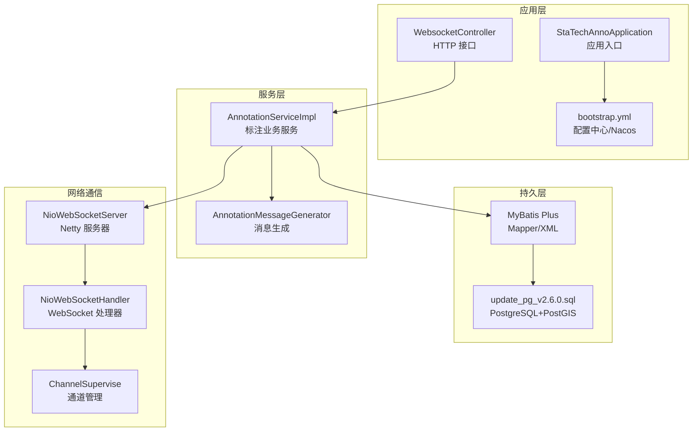
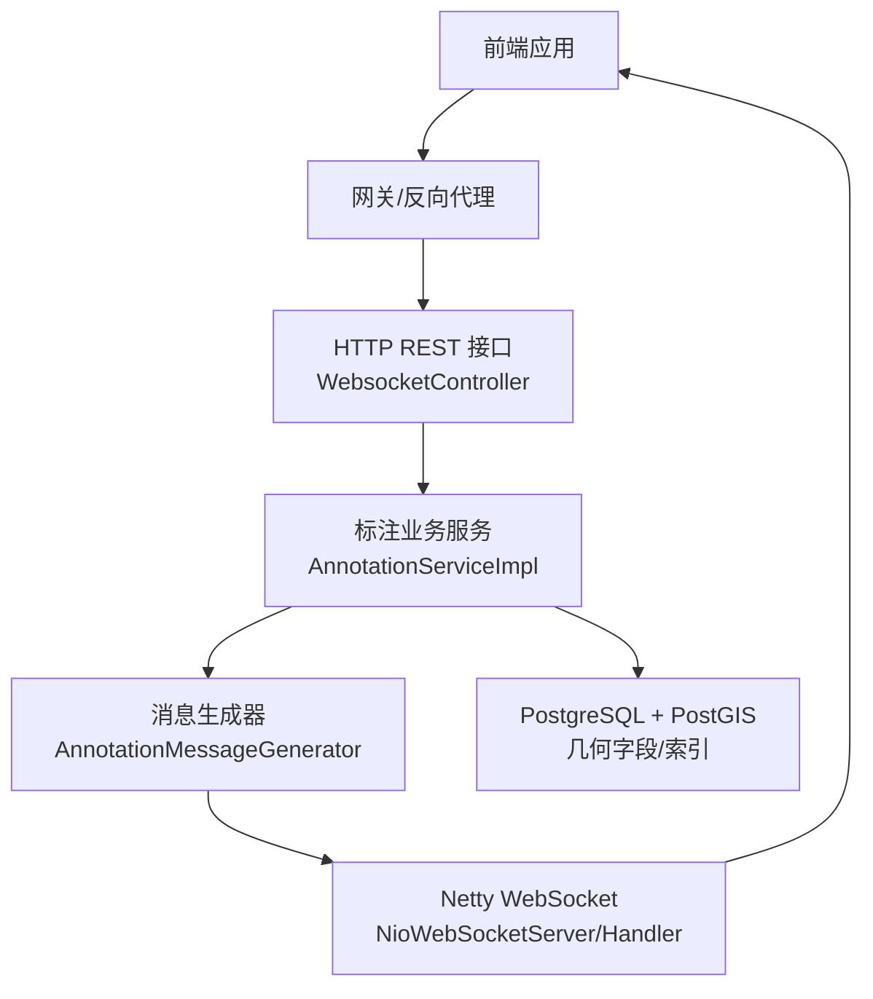
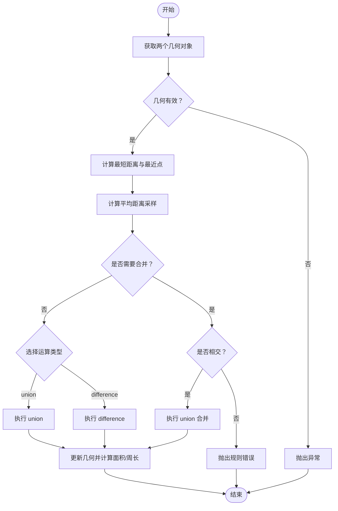
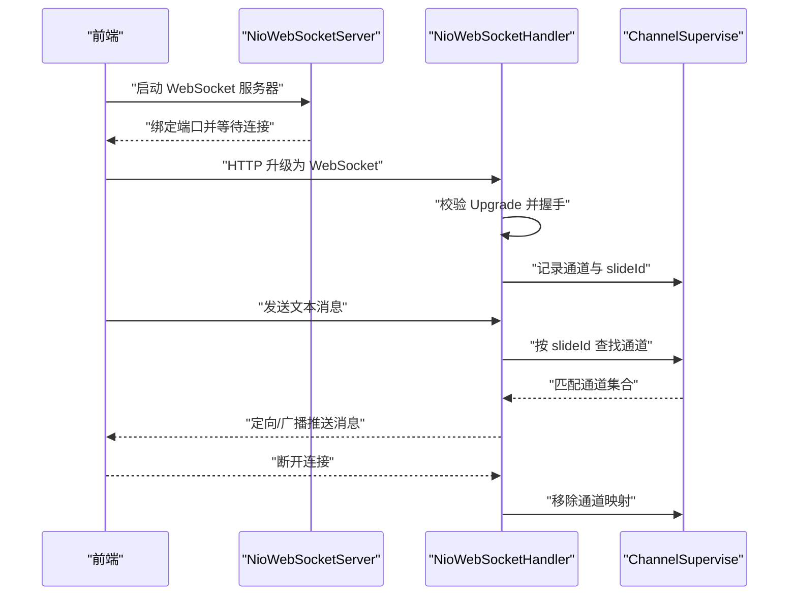
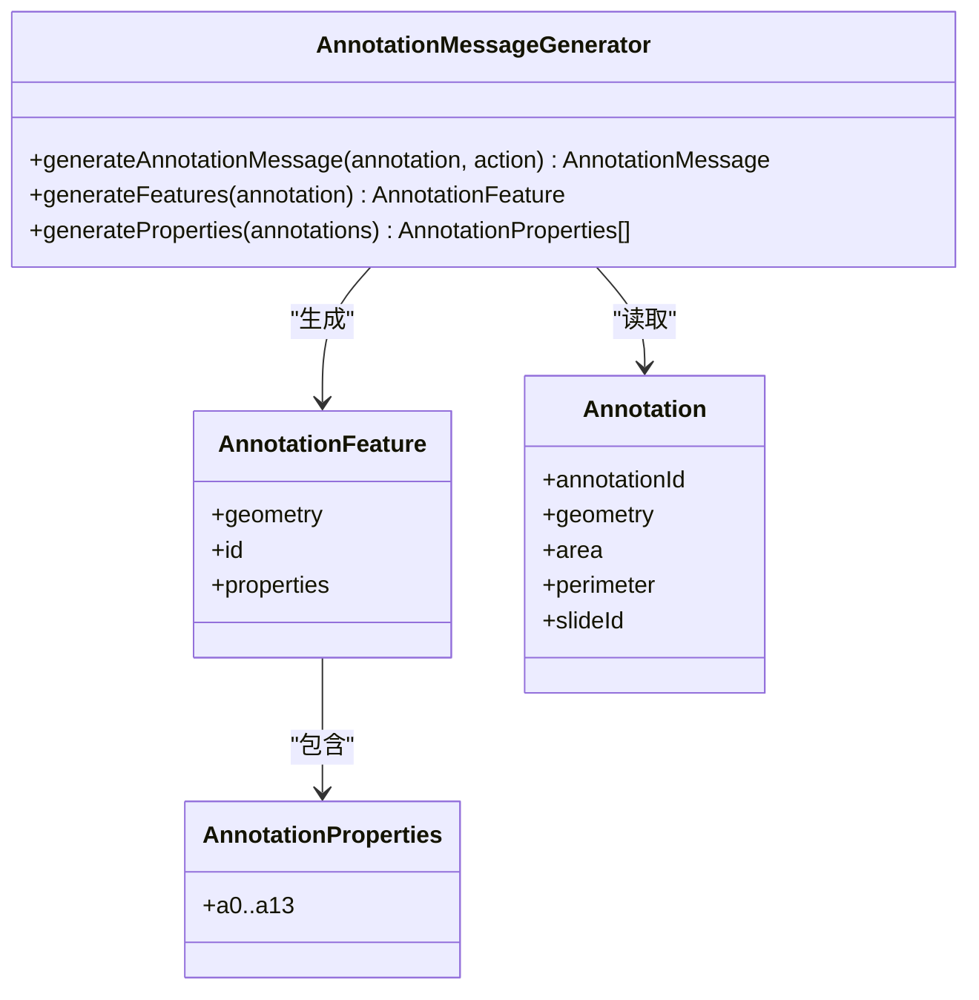
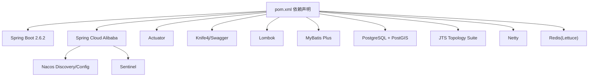

# 技术栈

<cite>
**本文引用的文件**
- [pom.xml](file://pom.xml)
- [bootstrap.yml](file://src/main/resources/bootstrap.yml)
- [StaTechAnnoApplication.java](file://src/main/java/cn/staitech/annotation/StaTechAnnoApplication.java)
- [README.md](file://README.md)
- [lombok.config](file://lombok.config)
- [NioWebSocketServer.java](file://src/main/java/cn/staitech/annotation/netty/websocket/NioWebSocketServer.java)
- [NioWebSocketHandler.java](file://src/main/java/cn/staitech/annotation/netty/websocket/NioWebSocketHandler.java)
- [ChannelSupervise.java](file://src/main/java/cn/staitech/annotation/netty/global/ChannelSupervise.java)
- [WebsocketController.java](file://src/main/java/cn/staitech/annotation/controller/WebsocketController.java)
- [AnnotationServiceImpl.java](file://src/main/java/cn/staitech/annotation/service/impl/AnnotationServiceImpl.java)
- [AnnotationMessageGenerator.java](file://src/main/java/cn/staitech/annotation/utils/annotation/AnnotationMessageGenerator.java)
- [Annotation.java](file://src/main/java/cn/staitech/annotation/domain/Annotation.java)
- [InitializinConfig.java](file://src/main/java/cn/staitech/annotation/config/InitializinConfig.java)
- [update_pg_v2.6.0.sql](file://sql/update_pg_v2.6.0.sql)
- [AnnotationMapper.xml](file://src/main/resources/mapper/AnnotationMapper.xml)
- [Constant.java](file://src/main/java/cn/staitech/annotation/constant/Constant.java)
</cite>

## 目录
1. [简介](#简介)
2. [项目结构](#项目结构)
3. [核心组件](#核心组件)
4. [架构总览](#架构总览)
5. [详细组件分析](#详细组件分析)
6. [依赖分析](#依赖分析)
7. [性能考虑](#性能考虑)
8. [故障排查指南](#故障排查指南)
9. [结论](#结论)
10. [附录](#附录)

## 简介
本技术栈文档面向医学图像标注系统，系统采用 Spring Boot 2.6.2 与 Spring Cloud Alibaba 技术组合，结合 Netty WebSocket 实现实时标注消息推送，使用 JTS Topology Suite 与 PostGIS 进行空间几何运算与存储，通过 Knife4j/Swagger 提供接口文档能力，并借助 Lombok 等工具提升开发效率。本文从整体架构、组件职责、数据流与处理逻辑、依赖关系与集成方式等方面进行系统化梳理，帮助读者快速理解并高效维护该系统。

## 项目结构
项目采用标准 Maven 多模块风格，核心模块为标注业务模块，包含应用入口、配置、控制器、服务、持久层、工具类、消息模型与 Netty WebSocket 实现等层次化组织。关键目录与文件如下：
- 应用入口与配置：StaTechAnnoApplication、bootstrap.yml
- 控制器：WebsocketController
- 服务层：AnnotationServiceImpl 及其子服务接口
- 持久层：MyBatis Plus 映射与 XML
- 数据模型：Annotation 等实体
- 工具类：AnnotationMessageGenerator、UndoRedo 等
- Netty WebSocket：NioWebSocketServer、NioWebSocketHandler、ChannelSupervise
- 数据库脚本：PostgreSQL + PostGIS 初始化与索引
- 开发工具：Lombok、Knife4j/Swagger

图表来源
- [StaTechAnnoApplication.java:1-51](file://src/main/java/cn/staitech/annotation/StaTechAnnoApplication.java#L1-L51)
- [bootstrap.yml:1-42](file://src/main/resources/bootstrap.yml#L1-L42)
- [WebsocketController.java:1-41](file://src/main/java/cn/staitech/annotation/controller/WebsocketController.java#L1-L41)
- [AnnotationServiceImpl.java:1-724](file://src/main/java/cn/staitech/annotation/service/impl/AnnotationServiceImpl.java#L1-L724)
- [AnnotationMessageGenerator.java:1-349](file://src/main/java/cn/staitech/annotation/utils/annotation/AnnotationMessageGenerator.java#L1-L349)
- [NioWebSocketServer.java:1-44](file://src/main/java/cn/staitech/annotation/netty/websocket/NioWebSocketServer.java#L1-L44)
- [NioWebSocketHandler.java:1-197](file://src/main/java/cn/staitech/annotation/netty/websocket/NioWebSocketHandler.java#L1-L197)
- [ChannelSupervise.java:1-45](file://src/main/java/cn/staitech/annotation/netty/global/ChannelSupervise.java#L1-L45)
- [update_pg_v2.6.0.sql:1-245](file://sql/update_pg_v2.6.0.sql#L1-L245)

章节来源
- [pom.xml:1-265](file://pom.xml#L1-L265)
- [bootstrap.yml:1-42](file://src/main/resources/bootstrap.yml#L1-L42)
- [StaTechAnnoApplication.java:1-51](file://src/main/java/cn/staitech/annotation/StaTechAnnoApplication.java#L1-L51)
- [README.md:1-95](file://README.md#L1-L95)

## 核心组件
- 应用入口与装配
  - 启动类启用服务发现、异步、事务、MyBatis Plus 分页拦截器、Swagger、Feign 客户端等能力，扫描指定包下的 Mapper。
  - 章节来源
    - [StaTechAnnoApplication.java:25-50](file://src/main/java/cn/staitech/annotation/StaTechAnnoApplication.java#L25-L50)

- 配置与环境
  - 通过 bootstrap.yml 配置 Nacos 服务注册与配置中心、共享配置、Knife4j 文档开关、国际化消息源等。
  - 章节来源
    - [bootstrap.yml:5-42](file://src/main/resources/bootstrap.yml#L5-L42)

- 微服务与中间件
  - 依赖 Spring Cloud Alibaba Nacos Discovery/Config、Sentinel、Actuator，以及自研通用模块（安全、Redis、Swagger、核心工具）。
  - 章节来源
    - [pom.xml:19-134](file://pom.xml#L19-L134)

- 开发工具与文档
  - Lombok 简化 POJO；Knife4j/Swagger 提供在线接口文档；国际化消息源配置。
  - 章节来源
    - [pom.xml:72-91](file://pom.xml#L72-L91)
    - [lombok.config:1-2](file://lombok.config#L1-L2)
    - [bootstrap.yml:9-14](file://src/main/resources/bootstrap.yml#L9-L14)

- 数据库与空间能力
  - PostgreSQL + PostGIS，使用 MyBatis Plus 与 XML 映射；数据库初始化脚本定义几何字段与索引。
  - 章节来源
    - [pom.xml:107-116](file://pom.xml#L107-L116)
    - [update_pg_v2.6.0.sql:1-245](file://sql/update_pg_v2.6.0.sql#L1-L245)
    - [AnnotationMapper.xml:1-9](file://src/main/resources/mapper/AnnotationMapper.xml#L1-L9)

- 网络通信与实时推送
  - Netty WebSocket 服务器与处理器，基于通道组与滑窗维度进行消息分发。
  - 章节来源
    - [pom.xml:82-85](file://pom.xml#L82-L85)
    - [NioWebSocketServer.java:14-44](file://src/main/java/cn/staitech/annotation/netty/websocket/NioWebSocketServer.java#L14-L44)
    - [NioWebSocketHandler.java:29-197](file://src/main/java/cn/staitech/annotation/netty/websocket/NioWebSocketHandler.java#L29-L197)
    - [ChannelSupervise.java:17-45](file://src/main/java/cn/staitech/annotation/netty/global/ChannelSupervise.java#L17-L45)

- 地理空间处理
  - JTS Topology Suite 与 PostGIS 结合，提供几何采样、距离计算、几何合并与布尔运算等。
  - 章节来源
    - [pom.xml:94-105](file://pom.xml#L94-L105)
    - [AnnotationServiceImpl.java:62-113](file://src/main/java/cn/staitech/annotation/service/impl/AnnotationServiceImpl.java#L62-L113)
    - [AnnotationServiceImpl.java:140-181](file://src/main/java/cn/staitech/annotation/service/impl/AnnotationServiceImpl.java#L140-L181)

- 消息与事件
  - AnnotationMessageGenerator 将标注实体转换为前端可消费的 GeoJSON 特征消息，结合 Undo/Redo 管理器实现历史回放。
  - 章节来源
    - [AnnotationMessageGenerator.java:40-50](file://src/main/java/cn/staitech/annotation/utils/annotation/AnnotationMessageGenerator.java#L40-L50)
    - [AnnotationServiceImpl.java:625-701](file://src/main/java/cn/staitech/annotation/service/impl/AnnotationServiceImpl.java#L625-L701)

## 架构总览
系统采用“HTTP REST + WebSocket 实时推送”的双通道架构：HTTP 用于请求响应式接口，WebSocket 用于标注变更的实时广播。服务层通过 MyBatis Plus 访问 PostgreSQL + PostGIS，空间几何由 JTS 处理，消息经 Netty 推送至前端。

图表来源
- [WebsocketController.java:20-41](file://src/main/java/cn/staitech/annotation/controller/WebsocketController.java#L20-L41)
- [AnnotationServiceImpl.java:44-724](file://src/main/java/cn/staitech/annotation/service/impl/AnnotationServiceImpl.java#L44-L724)
- [AnnotationMessageGenerator.java:37-349](file://src/main/java/cn/staitech/annotation/utils/annotation/AnnotationMessageGenerator.java#L37-L349)
- [NioWebSocketServer.java:12-44](file://src/main/java/cn/staitech/annotation/netty/websocket/NioWebSocketServer.java#L12-L44)
- [NioWebSocketHandler.java:27-197](file://src/main/java/cn/staitech/annotation/netty/websocket/NioWebSocketHandler.java#L27-L197)
- [update_pg_v2.6.0.sql:2-52](file://sql/update_pg_v2.6.0.sql#L2-L52)

## 详细组件分析

### 组件A：标注服务与空间几何处理
- 职责
  - 提供标注的增删改、合并预览、布尔运算、面积/周长计算、距离计算与最近点查找。
  - 基于 JTS 的几何采样与平均距离计算，结合 PostGIS 几何字段进行空间运算。
- 关键流程
  - 距离计算：获取两个几何对象，使用 DistanceOp 计算最短距离与最近点，同时计算平均距离采样。
  - 几何合并：仅当几何相交时执行 union 合并，否则抛出规则错误。
  - 布尔运算：支持 union 与 difference，更新后的几何重新计算面积与周长。
- 性能与复杂度
  - 采样策略控制计算复杂度，避免大规模几何直接计算带来的性能问题。
- 错误处理
  - 对空几何、无效操作、规则不满足等情况进行明确异常提示。

图表来源
- [AnnotationServiceImpl.java:122-181](file://src/main/java/cn/staitech/annotation/service/impl/AnnotationServiceImpl.java#L122-L181)
- [AnnotationServiceImpl.java:521-535](file://src/main/java/cn/staitech/annotation/service/impl/AnnotationServiceImpl.java#L521-L535)
- [AnnotationServiceImpl.java:538-571](file://src/main/java/cn/staitech/annotation/service/impl/AnnotationServiceImpl.java#L538-L571)

章节来源
- [AnnotationServiceImpl.java:62-181](file://src/main/java/cn/staitech/annotation/service/impl/AnnotationServiceImpl.java#L62-L181)
- [AnnotationServiceImpl.java:504-571](file://src/main/java/cn/staitech/annotation/service/impl/AnnotationServiceImpl.java#L504-L571)

### 组件B：WebSocket 实时推送
- 职责
  - Netty WebSocket 服务器监听端口，建立与前端的长连接；处理器负责握手、心跳、消息分发与通道管理。
  - ChannelSupervise 维护按滑窗维度的通道映射，实现定向消息推送。
- 关键流程
  - 握手阶段根据 URI 判断连接类型并记录 slideId；
  - 收到消息后群发或定向推送；
  - 断开连接时清理通道映射。

图表来源
- [NioWebSocketServer.java:14-44](file://src/main/java/cn/staitech/annotation/netty/websocket/NioWebSocketServer.java#L14-L44)
- [NioWebSocketHandler.java:94-197](file://src/main/java/cn/staitech/annotation/netty/websocket/NioWebSocketHandler.java#L94-L197)
- [ChannelSupervise.java:17-45](file://src/main/java/cn/staitech/annotation/netty/global/ChannelSupervise.java#L17-L45)

章节来源
- [NioWebSocketServer.java:14-44](file://src/main/java/cn/staitech/annotation/netty/websocket/NioWebSocketServer.java#L14-L44)
- [NioWebSocketHandler.java:94-197](file://src/main/java/cn/staitech/annotation/netty/websocket/NioWebSocketHandler.java#L94-L197)
- [ChannelSupervise.java:17-45](file://src/main/java/cn/staitech/annotation/netty/global/ChannelSupervise.java#L17-L45)

### 组件C：消息生成与前端特征
- 职责
  - 将标注实体转换为前端可消费的 Feature 结构，包含几何、属性与用户/标签信息。
  - 支持脏器标签与结构标签两类属性映射。
- 关键流程
  - 生成 AnnotationFeature 与 AnnotationProperties；
  - 通过远程服务查询用户与标签字典，填充属性字段；
  - 加密审计标记注入，确保敏感信息保护。

图表来源
- [AnnotationMessageGenerator.java:40-202](file://src/main/java/cn/staitech/annotation/utils/annotation/AnnotationMessageGenerator.java#L40-L202)
- [Annotation.java:23-113](file://src/main/java/cn/staitech/annotation/domain/Annotation.java#L23-L113)

章节来源
- [AnnotationMessageGenerator.java:40-202](file://src/main/java/cn/staitech/annotation/utils/annotation/AnnotationMessageGenerator.java#L40-L202)
- [Annotation.java:23-113](file://src/main/java/cn/staitech/annotation/domain/Annotation.java#L23-L113)

### 组件D：应用入口与配置
- 职责
  - 启用服务发现、Swagger、Feign 客户端、异步、事务与 MyBatis Plus 分页拦截器；
  - 初始化国际化消息源；
  - 通过 bootstrap.yml 与 Nacos 集成，加载共享配置。
- 章节来源
  - [StaTechAnnoApplication.java:25-50](file://src/main/java/cn/staitech/annotation/StaTechAnnoApplication.java#L25-L50)
  - [bootstrap.yml:20-42](file://src/main/resources/bootstrap.yml#L20-L42)

## 依赖分析
- 框架与中间件
  - Spring Boot 2.6.2：统一依赖管理与自动装配；
  - Spring Cloud Alibaba：Nacos 服务发现与配置中心、Sentinel 流控、OpenFeign；
  - Actuator：健康检查与运维指标；
  - Knife4j/Swagger：接口文档增强；
  - Lombok：POJO 简化；
  - 自研通用模块：安全、Redis、Swagger、核心工具。
- 数据与空间
  - PostgreSQL + PostGIS：几何字段与空间索引；
  - MyBatis Plus：分页与 XML 映射；
  - JTS Topology Suite：几何运算与距离计算；
  - PostGIS JDBC 扩展：JDBC 层面的空间能力。
- 网络通信
  - Netty：高性能 WebSocket 服务器与处理器；
  - Redis：连接验证与缓存（通过 lettuce 连接工厂）。

图表来源
- [pom.xml:19-134](file://pom.xml#L19-L134)

章节来源
- [pom.xml:19-134](file://pom.xml#L19-L134)
- [InitializinConfig.java:15-31](file://src/main/java/cn/staitech/annotation/config/InitializinConfig.java#L15-L31)

## 性能考虑
- 空间计算优化
  - 通过几何采样降低大规模几何的距离与合并计算成本；
  - 仅在相交条件下执行合并，避免无效运算。
- 数据访问优化
  - MyBatis Plus 分页拦截器减少大结果集传输；
  - PostgreSQL 几何字段建立索引，加速空间查询。
- 实时推送优化
  - ChannelSupervise 使用并发映射与通道组，减少锁竞争；
  - 按 slideId 维度定向推送，避免全量广播。
- 开发效率
  - Lombok 减少样板代码；
  - Knife4j/Swagger 提升接口联调效率。

## 故障排查指南
- WebSocket 连接失败
  - 检查 Netty 服务器端口与防火墙放通；
  - 确认握手请求头 Upgrade 字段正确；
  - 核对 URI 中 slideId 参数与通道映射。
  - 章节来源
    - [NioWebSocketServer.java:16-31](file://src/main/java/cn/staitech/annotation/netty/websocket/NioWebSocketServer.java#L16-L31)
    - [NioWebSocketHandler.java:167-194](file://src/main/java/cn/staitech/annotation/netty/websocket/NioWebSocketHandler.java#L167-L194)
    - [WebsocketController.java:24-37](file://src/main/java/cn/staitech/annotation/controller/WebsocketController.java#L24-L37)

- 空间几何运算异常
  - 确认几何对象非空且类型匹配；
  - 检查相交条件与布尔运算参数；
  - 核对分辨率常量与面积/周长换算。
  - 章节来源
    - [AnnotationServiceImpl.java:140-181](file://src/main/java/cn/staitech/annotation/service/impl/AnnotationServiceImpl.java#L140-L181)
    - [AnnotationServiceImpl.java:538-571](file://src/main/java/cn/staitech/annotation/service/impl/AnnotationServiceImpl.java#L538-L571)
    - [Constant.java:30-31](file://src/main/java/cn/staitech/annotation/constant/Constant.java#L30-L31)

- 数据库连接与空间字段
  - 确认 PostgreSQL 与 PostGIS 版本兼容；
  - 校验几何字段类型与索引是否存在；
  - 检查初始化脚本执行情况。
  - 章节来源
    - [update_pg_v2.6.0.sql:2-52](file://sql/update_pg_v2.6.0.sql#L2-L52)
    - [Annotation.java:62-63](file://src/main/java/cn/staitech/annotation/domain/Annotation.java#L62-L63)

- Redis 连接验证
  - 确认 Lettuce 连接工厂启用 validateConnection；
  - 检查 Redis 服务可用性与网络连通。
  - 章节来源
    - [InitializinConfig.java:23-28](file://src/main/java/cn/staitech/annotation/config/InitializinConfig.java#L23-L28)

## 结论
本系统以 Spring Boot 2.6.2 为核心，结合 Spring Cloud Alibaba 实现服务治理与配置中心，利用 Netty WebSocket 提供实时标注推送，通过 JTS 与 PostGIS 完成高精度空间计算与存储，配合 Knife4j/Swagger 与 Lombok 提升开发与运维效率。整体架构清晰、组件职责明确、扩展性强，适合在医学图像标注场景下稳定演进。

## 附录
- 端口与环境
  - 应用端口、Nacos、RabbitMQ、Redis、数据库等端口参考 README。
  - 章节来源
    - [README.md:5-59](file://README.md#L5-L59)