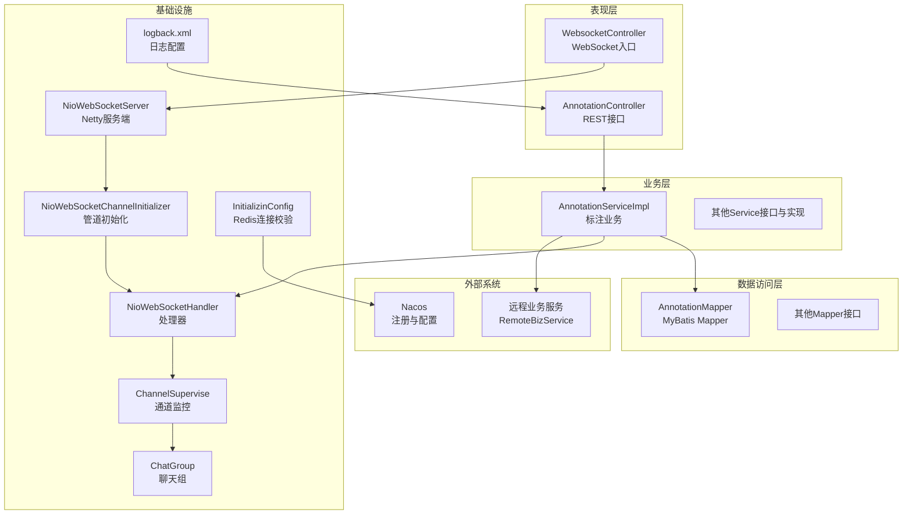
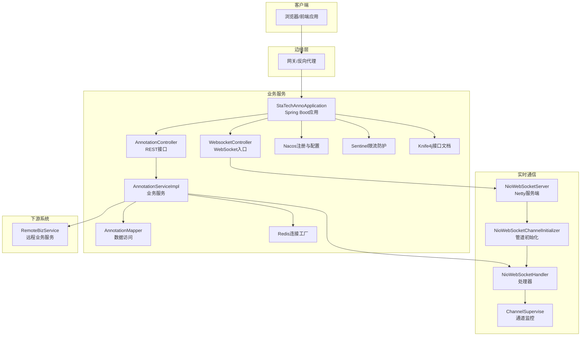
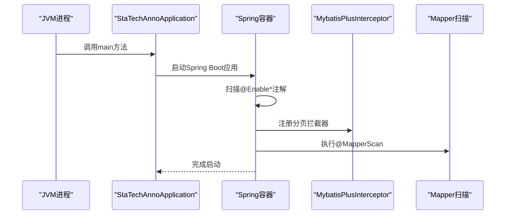
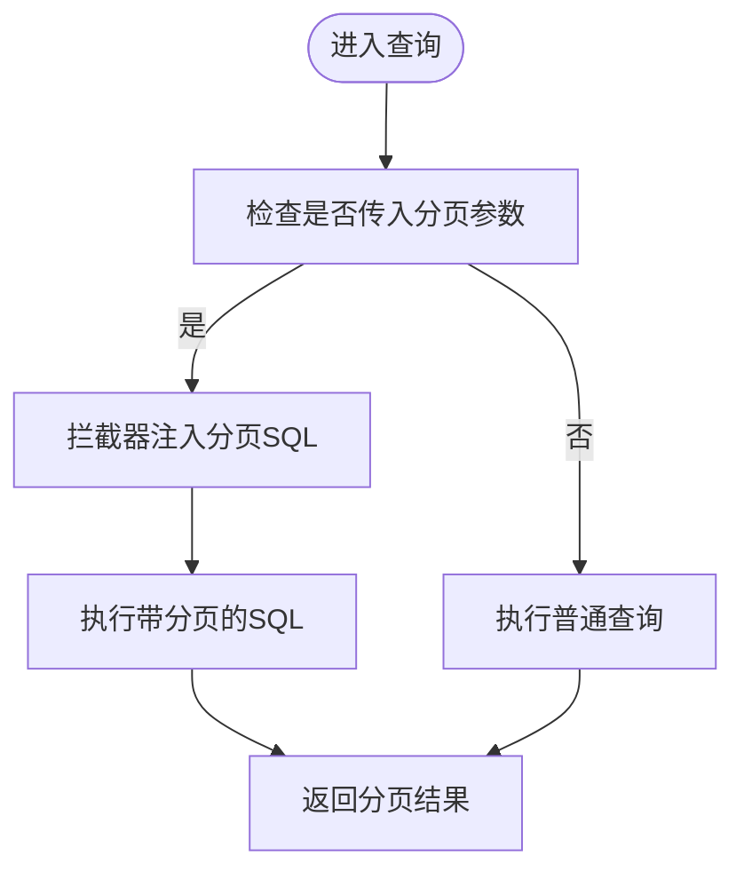
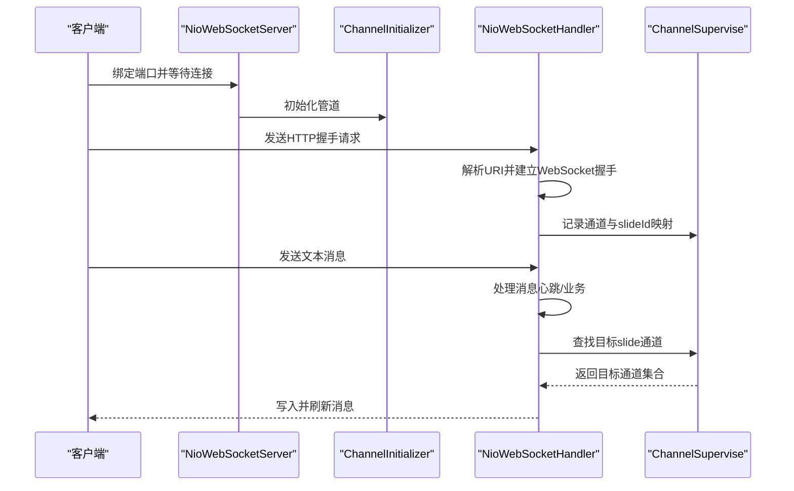
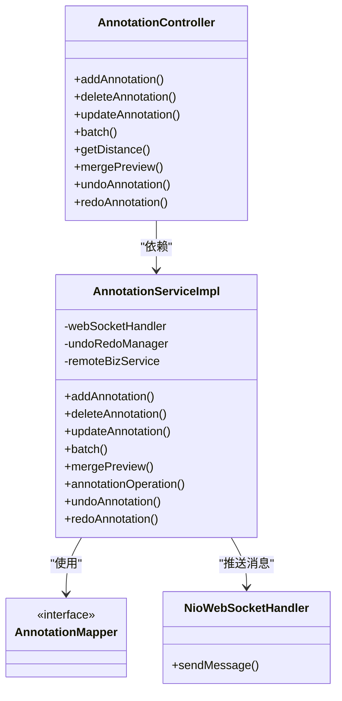
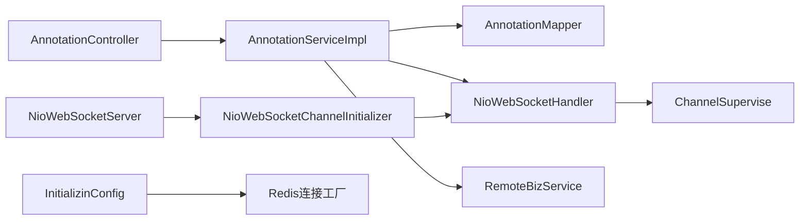

# 架构设计

<cite>
**本文引用的文件**
- [StaTechAnnoApplication.java](file://src/main/java/cn/staitech/annotation/StaTechAnnoApplication.java)
- [bootstrap.yml](file://src/main/resources/bootstrap.yml)
- [pom.xml](file://pom.xml)
- [NioWebSocketServer.java](file://src/main/java/cn/staitech/annotation/netty/websocket/NioWebSocketServer.java)
- [NioWebSocketChannelInitializer.java](file://src/main/java/cn/staitech/annotation/netty/websocket/NioWebSocketChannelInitializer.java)
- [NioWebSocketHandler.java](file://src/main/java/cn/staitech/annotation/netty/websocket/NioWebSocketHandler.java)
- [ChannelSupervise.java](file://src/main/java/cn/staitech/annotation/netty/global/ChannelSupervise.java)
- [ChatGroup.java](file://src/main/java/cn/staitech/annotation/netty/global/ChatGroup.java)
- [WebsocketController.java](file://src/main/java/cn/staitech/annotation/controller/WebsocketController.java)
- [AnnotationController.java](file://src/main/java/cn/staitech/annotation/controller/AnnotationController.java)
- [AnnotationServiceImpl.java](file://src/main/java/cn/staitech/annotation/service/impl/AnnotationServiceImpl.java)
- [AnnotationMapper.java](file://src/main/java/cn/staitech/annotation/mapper/AnnotationMapper.java)
- [InitializinConfig.java](file://src/main/java/cn/staitech/annotation/config/InitializinConfig.java)
- [logback.xml](file://src/main/resources/logback.xml)
- [README.md](file://README.md)
</cite>

## 目录
1. [引言](#引言)
2. [项目结构](#项目结构)
3. [核心组件](#核心组件)
4. [架构总览](#架构总览)
5. [详细组件分析](#详细组件分析)
6. [依赖关系分析](#依赖关系分析)
7. [性能考量](#性能考量)
8. [故障排查指南](#故障排查指南)
9. [结论](#结论)
10. [附录](#附录)

## 引言
本文件面向医学图像标注系统，提供从分层架构到微服务集成、从Spring Boot启动到Netty WebSocket实时通信的完整架构设计说明。重点阐述系统如何通过表现层（REST API）、业务层（服务与领域模型）、数据访问层（MyBatis Plus）实现清晰职责分离；如何结合Nacos服务发现与配置中心、Sentinel限流防护、Knife4j接口文档增强等微服务能力；以及为何选择Netty替代传统Servlet容器以支撑高并发WebSocket连接与低延迟消息推送。

## 项目结构
系统采用标准Spring Boot工程布局，按功能域划分包结构：
- config：应用级初始化配置
- controller：REST接口层
- service/impl：业务服务层
- mapper：数据访问层（MyBatis Mapper）
- netty：基于Netty的WebSocket服务端
- utils：工具类与消息生成器
- vo/domain：视图对象与领域模型
- resources：配置与映射XML

**图表来源**
- [AnnotationController.java:1-251](file://src/main/java/cn/staitech/annotation/controller/AnnotationController.java#L1-L251)
- [WebsocketController.java:1-41](file://src/main/java/cn/staitech/annotation/controller/WebsocketController.java#L1-L41)
- [AnnotationServiceImpl.java:1-724](file://src/main/java/cn/staitech/annotation/service/impl/AnnotationServiceImpl.java#L1-L724)
- [AnnotationMapper.java:1-19](file://src/main/java/cn/staitech/annotation/mapper/AnnotationMapper.java#L1-L19)
- [NioWebSocketServer.java:1-44](file://src/main/java/cn/staitech/annotation/netty/websocket/NioWebSocketServer.java#L1-L44)
- [NioWebSocketChannelInitializer.java:1-30](file://src/main/java/cn/staitech/annotation/netty/websocket/NioWebSocketChannelInitializer.java#L1-L30)
- [NioWebSocketHandler.java:1-197](file://src/main/java/cn/staitech/annotation/netty/websocket/NioWebSocketHandler.java#L1-L197)
- [ChannelSupervise.java:1-45](file://src/main/java/cn/staitech/annotation/netty/global/ChannelSupervise.java#L1-L45)
- [ChatGroup.java:1-11](file://src/main/java/cn/staitech/annotation/netty/global/ChatGroup.java#L1-L11)
- [InitializinConfig.java:1-31](file://src/main/java/cn/staitech/annotation/config/InitializinConfig.java#L1-L31)

**章节来源**
- [StaTechAnnoApplication.java:1-51](file://src/main/java/cn/staitech/annotation/StaTechAnnoApplication.java#L1-L51)
- [bootstrap.yml:1-42](file://src/main/resources/bootstrap.yml#L1-L42)
- [pom.xml:1-265](file://pom.xml#L1-L265)

## 核心组件
- Spring Boot应用启动与配置
  - 启动类启用服务发现、异步、事务、MyBatis Plus分页拦截器、Swagger增强、自定义安全注解等能力。
  - 默认时区设置为“亚洲/上海”，确保日志与业务时间一致性。
- MyBatis Plus分页插件
  - 在启动类中注册分页拦截器，为所有查询提供统一的分页能力，避免重复实现。
- Netty WebSocket实时通信
  - 自定义Netty服务端，基于NIO事件循环组，提供高性能长连接。
  - 管道中包含HTTP编解码器、聚合器、Chunked写入器与自定义WebSocket处理器。
  - 处理器负责握手、心跳、消息广播与按切片ID定向推送。
- 业务层与数据访问层
  - 控制器负责REST API入口，服务层封装业务规则与远程调用，Mapper对接数据库。
  - 服务层在标注增删改后通过WebSocket处理器向客户端推送消息。
- Redis连接校验
  - 初始化阶段对Lettuce连接工厂开启连接有效性校验，提升缓存稳定性。
- 日志与可观测性
  - Logback按模块与级别配置输出，结合Nacos客户端日志便于问题定位。

**章节来源**
- [StaTechAnnoApplication.java:19-51](file://src/main/java/cn/staitech/annotation/StaTechAnnoApplication.java#L19-L51)
- [bootstrap.yml:1-42](file://src/main/resources/bootstrap.yml#L1-L42)
- [pom.xml:19-134](file://pom.xml#L19-L134)
- [NioWebSocketServer.java:1-44](file://src/main/java/cn/staitech/annotation/netty/websocket/NioWebSocketServer.java#L1-L44)
- [NioWebSocketChannelInitializer.java:1-30](file://src/main/java/cn/staitech/annotation/netty/websocket/NioWebSocketChannelInitializer.java#L1-L30)
- [NioWebSocketHandler.java:1-197](file://src/main/java/cn/staitech/annotation/netty/websocket/NioWebSocketHandler.java#L1-L197)
- [ChannelSupervise.java:1-45](file://src/main/java/cn/staitech/annotation/netty/global/ChannelSupervise.java#L1-L45)
- [AnnotationController.java:1-251](file://src/main/java/cn/staitech/annotation/controller/AnnotationController.java#L1-L251)
- [AnnotationServiceImpl.java:1-724](file://src/main/java/cn/staitech/annotation/service/impl/AnnotationServiceImpl.java#L1-L724)
- [AnnotationMapper.java:1-19](file://src/main/java/cn/staitech/annotation/mapper/AnnotationMapper.java#L1-L19)
- [InitializinConfig.java:1-31](file://src/main/java/cn/staitech/annotation/config/InitializinConfig.java#L1-L31)
- [logback.xml:1-101](file://src/main/resources/logback.xml#L1-L101)

## 架构总览
系统采用分层架构与微服务集成相结合的设计：
- 分层架构
  - 表现层：REST接口控制器，负责请求接入与响应封装。
  - 业务层：服务实现承载领域逻辑、远程调用与消息推送。
  - 数据访问层：Mapper与MyBatis Plus协同，提供高效的数据持久化。
- 微服务特性
  - 通过Nacos实现服务注册与配置中心，支持动态配置与服务治理。
  - Sentinel用于流量防护与熔断降级，保障系统稳定性。
  - Knife4j增强接口文档，提升联调效率。
- 实时通信
  - Netty提供WebSocket服务端，独立于Spring MVC容器，降低延迟并提高吞吐。

**图表来源**
- [StaTechAnnoApplication.java:19-51](file://src/main/java/cn/staitech/annotation/StaTechAnnoApplication.java#L19-L51)
- [AnnotationController.java:1-251](file://src/main/java/cn/staitech/annotation/controller/AnnotationController.java#L1-L251)
- [WebsocketController.java:1-41](file://src/main/java/cn/staitech/annotation/controller/WebsocketController.java#L1-L41)
- [AnnotationServiceImpl.java:1-724](file://src/main/java/cn/staitech/annotation/service/impl/AnnotationServiceImpl.java#L1-L724)
- [AnnotationMapper.java:1-19](file://src/main/java/cn/staitech/annotation/mapper/AnnotationMapper.java#L1-L19)
- [NioWebSocketServer.java:1-44](file://src/main/java/cn/staitech/annotation/netty/websocket/NioWebSocketServer.java#L1-L44)
- [NioWebSocketChannelInitializer.java:1-30](file://src/main/java/cn/staitech/annotation/netty/websocket/NioWebSocketChannelInitializer.java#L1-L30)
- [NioWebSocketHandler.java:1-197](file://src/main/java/cn/staitech/annotation/netty/websocket/NioWebSocketHandler.java#L1-L197)
- [ChannelSupervise.java:1-45](file://src/main/java/cn/staitech/annotation/netty/global/ChannelSupervise.java#L1-L45)

## 详细组件分析

### Spring Boot应用启动流程
- 启动类启用的功能
  - 服务发现与注册：@EnableDiscoveryClient
  - 异步执行：@EnableAsync
  - 事务管理：@EnableTransactionManagement
  - MyBatis Mapper扫描：@MapperScan
  - Swagger增强：@EnableCustomSwagger2
  - 自定义安全注解：@EnableCustomConfig、@EnableRyFeignClients
- 分页插件配置
  - 在启动类中注册MybatisPlusInterceptor并添加PaginationInnerInterceptor，全局生效。
- 默认时区设置
  - 将默认时区设为“亚洲/上海”，保证日志与业务时间一致。

**图表来源**
- [StaTechAnnoApplication.java:19-51](file://src/main/java/cn/staitech/annotation/StaTechAnnoApplication.java#L19-L51)

**章节来源**
- [StaTechAnnoApplication.java:19-51](file://src/main/java/cn/staitech/annotation/StaTechAnnoApplication.java#L19-L51)

### MyBatis Plus分页插件配置
- 插件作用
  - 为所有分页查询提供统一的物理分页能力，减少重复代码与SQL差异。
- 配置位置
  - 在启动类中通过@Bean声明MybatisPlusInterceptor，并添加PaginationInnerInterceptor。
- 使用建议
  - 控制器层尽量使用分页参数传递，避免一次性加载大量数据。

**图表来源**
- [StaTechAnnoApplication.java:44-49](file://src/main/java/cn/staitech/annotation/StaTechAnnoApplication.java#L44-L49)

**章节来源**
- [StaTechAnnoApplication.java:44-49](file://src/main/java/cn/staitech/annotation/StaTechAnnoApplication.java#L44-L49)

### WebSocket实时通信架构
- Netty服务端
  - 使用NioEventLoopGroup作为boss与worker线程池，ServerBootstrap绑定端口并阻塞等待连接。
  - 通过CommandLineRunner在应用启动后立即启动WebSocket服务。
- 管道初始化
  - 添加LoggingHandler、HttpServerCodec、HttpObjectAggregator、ChunkedWriteHandler与自定义NioWebSocketHandler。
- 处理器逻辑
  - 握手：根据URI解析切片ID并建立WebSocket握手。
  - 心跳：处理Ping帧并返回Pong帧。
  - 广播：将消息写入ChannelGroup实现全量广播。
  - 定向：根据切片ID在CHANNEL_MAP中筛选目标通道并发送。
- 通道监控
  - ChannelSupervise维护ChannelGroup与按切片ID的通道映射，支持按slide维度定向推送。
  - ChatGroup提供另一种通道映射场景（示例用途）。

**图表来源**
- [NioWebSocketServer.java:19-41](file://src/main/java/cn/staitech/annotation/netty/websocket/NioWebSocketServer.java#L19-L41)
- [NioWebSocketChannelInitializer.java:13-28](file://src/main/java/cn/staitech/annotation/netty/websocket/NioWebSocketChannelInitializer.java#L13-L28)
- [NioWebSocketHandler.java:94-196](file://src/main/java/cn/staitech/annotation/netty/websocket/NioWebSocketHandler.java#L94-L196)
- [ChannelSupervise.java:17-44](file://src/main/java/cn/staitech/annotation/netty/global/ChannelSupervise.java#L17-L44)

**章节来源**
- [NioWebSocketServer.java:1-44](file://src/main/java/cn/staitech/annotation/netty/websocket/NioWebSocketServer.java#L1-L44)
- [NioWebSocketChannelInitializer.java:1-30](file://src/main/java/cn/staitech/annotation/netty/websocket/NioWebSocketChannelInitializer.java#L1-L30)
- [NioWebSocketHandler.java:1-197](file://src/main/java/cn/staitech/annotation/netty/websocket/NioWebSocketHandler.java#L1-L197)
- [ChannelSupervise.java:1-45](file://src/main/java/cn/staitech/annotation/netty/global/ChannelSupervise.java#L1-L45)
- [ChatGroup.java:1-11](file://src/main/java/cn/staitech/annotation/netty/global/ChatGroup.java#L1-L11)

### 业务层与数据访问层
- 控制器
  - 提供标注的增删改查、批量操作、距离计算、轮廓合并预览、撤销/重做等接口。
  - 使用Swagger注解与日志审计注解，增强接口可读性与合规性。
- 服务实现
  - 负责业务规则、远程服务调用、几何计算（JTS）、撤销/重做栈管理、WebSocket消息推送。
  - 在增删改完成后，构造标注消息并通过WebSocket处理器推送至客户端。
- 数据访问
  - Mapper继承BaseMapper，配合MyBatis Plus实现通用CRUD。
  - 服务层在事务内执行复杂业务，确保数据一致性。

**图表来源**
- [AnnotationController.java:1-251](file://src/main/java/cn/staitech/annotation/controller/AnnotationController.java#L1-L251)
- [AnnotationServiceImpl.java:1-724](file://src/main/java/cn/staitech/annotation/service/impl/AnnotationServiceImpl.java#L1-L724)
- [AnnotationMapper.java:1-19](file://src/main/java/cn/staitech/annotation/mapper/AnnotationMapper.java#L1-L19)
- [NioWebSocketHandler.java:38-68](file://src/main/java/cn/staitech/annotation/netty/websocket/NioWebSocketHandler.java#L38-L68)

**章节来源**
- [AnnotationController.java:1-251](file://src/main/java/cn/staitech/annotation/controller/AnnotationController.java#L1-L251)
- [AnnotationServiceImpl.java:1-724](file://src/main/java/cn/staitech/annotation/service/impl/AnnotationServiceImpl.java#L1-L724)
- [AnnotationMapper.java:1-19](file://src/main/java/cn/staitech/annotation/mapper/AnnotationMapper.java#L1-L19)

### 技术决策与权衡
- 选择Netty而非传统Servlet容器的原因
  - 非阻塞I/O与事件驱动模型，适合高并发、低延迟的WebSocket场景。
  - 独立于Spring MVC容器，避免HTTP请求线程池竞争，降低上下文切换开销。
  - 灵活的ChannelPipeline定制，便于在握手、心跳、消息编解码等环节精细化控制。
- WebSocket连接管理策略
  - 使用ChannelSupervise维护ChannelGroup与按slideId的映射，支持定向推送与广播。
  - 处理器对Ping/Pong帧进行响应，维持长连接稳定。
  - 通过日志与监控指标评估连接数与消息吞吐，必要时调整线程池大小与背压策略。
- 微服务集成
  - Nacos提供服务注册与配置中心，支持多环境动态配置与服务发现。
  - Sentinel提供限流与熔断，保护下游依赖与核心链路。
  - Knife4j增强接口文档，提升联调效率与接口可测试性。

**章节来源**
- [NioWebSocketServer.java:1-44](file://src/main/java/cn/staitech/annotation/netty/websocket/NioWebSocketServer.java#L1-L44)
- [NioWebSocketHandler.java:1-197](file://src/main/java/cn/staitech/annotation/netty/websocket/NioWebSocketHandler.java#L1-L197)
- [ChannelSupervise.java:1-45](file://src/main/java/cn/staitech/annotation/netty/global/ChannelSupervise.java#L1-L45)
- [bootstrap.yml:20-41](file://src/main/resources/bootstrap.yml#L20-L41)
- [pom.xml:19-134](file://pom.xml#L19-L134)

## 依赖关系分析
- 外部依赖
  - Spring Cloud Alibaba：Nacos注册与配置、Sentinel限流。
  - Netty：WebSocket服务端实现。
  - JTS：几何计算与空间分析。
  - PostgreSQL与PostGIS：地理空间数据存储。
- 内部依赖
  - 控制器依赖服务实现；服务实现依赖Mapper、WebSocket处理器、远程业务服务。
  - WebSocket处理器依赖通道监控与消息序列化。

**图表来源**
- [AnnotationController.java:1-251](file://src/main/java/cn/staitech/annotation/controller/AnnotationController.java#L1-L251)
- [AnnotationServiceImpl.java:1-724](file://src/main/java/cn/staitech/annotation/service/impl/AnnotationServiceImpl.java#L1-L724)
- [AnnotationMapper.java:1-19](file://src/main/java/cn/staitech/annotation/mapper/AnnotationMapper.java#L1-L19)
- [NioWebSocketServer.java:1-44](file://src/main/java/cn/staitech/annotation/netty/websocket/NioWebSocketServer.java#L1-L44)
- [NioWebSocketChannelInitializer.java:1-30](file://src/main/java/cn/staitech/annotation/netty/websocket/NioWebSocketChannelInitializer.java#L1-L30)
- [NioWebSocketHandler.java:1-197](file://src/main/java/cn/staitech/annotation/netty/websocket/NioWebSocketHandler.java#L1-L197)
- [ChannelSupervise.java:1-45](file://src/main/java/cn/staitech/annotation/netty/global/ChannelSupervise.java#L1-L45)
- [InitializinConfig.java:1-31](file://src/main/java/cn/staitech/annotation/config/InitializinConfig.java#L1-L31)

**章节来源**
- [pom.xml:19-134](file://pom.xml#L19-L134)

## 性能考量
- WebSocket连接与消息推送
  - 使用ChannelGroup进行广播，使用按slideId的映射实现定向推送，避免全量遍历。
  - 处理器对消息进行序列化失败与未知异常进行日志记录，便于定位性能瓶颈。
- 几何计算
  - 使用JTS进行几何运算，注意在批量操作时控制几何复杂度，避免高时间复杂度运算。
- 缓存与连接校验
  - Redis连接工厂开启连接有效性校验，减少无效连接带来的资源浪费。
- 日志与可观测性
  - Logback按模块与级别输出，结合Nacos客户端日志，便于问题快速定位。

**章节来源**
- [NioWebSocketHandler.java:38-68](file://src/main/java/cn/staitech/annotation/netty/websocket/NioWebSocketHandler.java#L38-L68)
- [AnnotationServiceImpl.java:68-113](file://src/main/java/cn/staitech/annotation/service/impl/AnnotationServiceImpl.java#L68-L113)
- [InitializinConfig.java:23-29](file://src/main/java/cn/staitech/annotation/config/InitializinConfig.java#L23-L29)
- [logback.xml:85-100](file://src/main/resources/logback.xml#L85-L100)

## 故障排查指南
- WebSocket无法连接
  - 检查端口是否正确暴露与防火墙放行（系统文档明确端口为9998）。
  - 确认NioWebSocketServer已启动且未抛出异常。
  - 核对WebsocketController返回的WebSocket地址与实际端口一致。
- 消息未推送或推送不准确
  - 检查NioWebSocketHandler是否正确解析URI并建立slideId映射。
  - 确认ChannelSupervise中存在对应slideId的通道。
  - 关注序列化异常日志，修复消息格式问题。
- 业务接口异常
  - 查看AnnotationController与AnnotationServiceImpl的日志，定位远程服务调用与几何计算异常。
  - 检查事务回滚与撤销/重做栈状态，确保数据一致性。
- 配置与注册问题
  - 检查bootstrap.yml中的Nacos配置是否正确，确认应用已注册到Nacos并可发现。

**章节来源**
- [README.md:4-50](file://README.md#L4-L50)
- [NioWebSocketServer.java:19-41](file://src/main/java/cn/staitech/annotation/netty/websocket/NioWebSocketServer.java#L19-L41)
- [WebsocketController.java:24-37](file://src/main/java/cn/staitech/annotation/controller/WebsocketController.java#L24-L37)
- [NioWebSocketHandler.java:94-196](file://src/main/java/cn/staitech/annotation/netty/websocket/NioWebSocketHandler.java#L94-L196)
- [ChannelSupervise.java:17-44](file://src/main/java/cn/staitech/annotation/netty/global/ChannelSupervise.java#L17-L44)
- [AnnotationController.java:1-251](file://src/main/java/cn/staitech/annotation/controller/AnnotationController.java#L1-L251)
- [AnnotationServiceImpl.java:1-724](file://src/main/java/cn/staitech/annotation/service/impl/AnnotationServiceImpl.java#L1-L724)
- [bootstrap.yml:20-41](file://src/main/resources/bootstrap.yml#L20-L41)

## 结论
本系统通过清晰的分层架构与微服务集成，实现了REST接口与WebSocket实时通信的统一接入。Spring Boot启动流程与MyBatis Plus分页插件提供了稳定的基础设施；Netty WebSocket服务端在高并发场景下具备更好的性能与可控性。结合Nacos、Sentinel与Knife4j，系统在可扩展性、可观测性与运维效率方面具备良好基础。后续可在连接池参数、消息队列引入、限流策略细化等方面持续优化。

## 附录
- 端口与环境
  - 应用端口：9998（系统文档明确）
  - Nacos配置：通过bootstrap.yml中的server-addr、namespace、group等参数配置
- Docker与外部服务
  - RabbitMQ可通过Docker方式启动，便于本地联调与测试

**章节来源**
- [README.md:4-50](file://README.md#L4-L50)
- [bootstrap.yml:20-41](file://src/main/resources/bootstrap.yml#L20-L41)