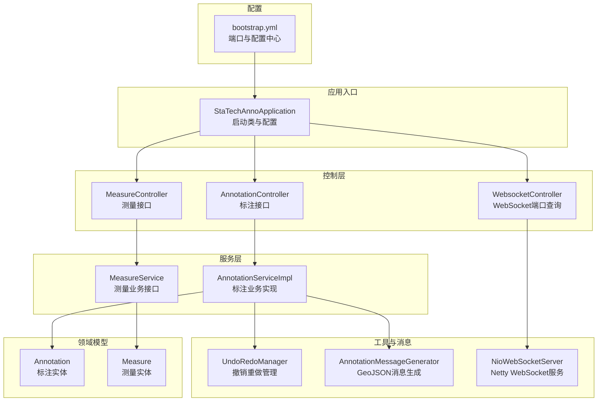
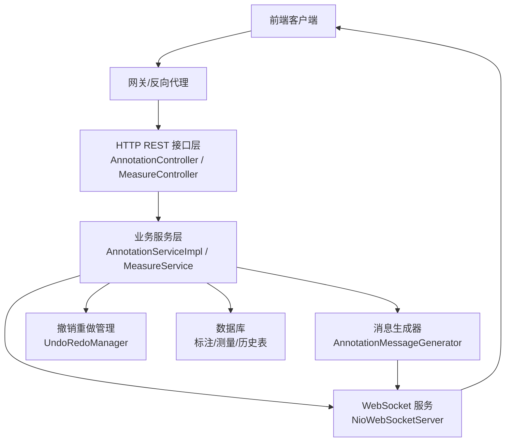
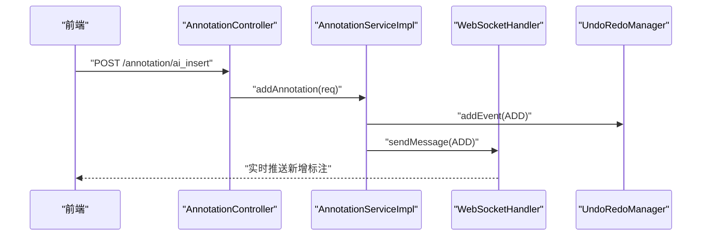
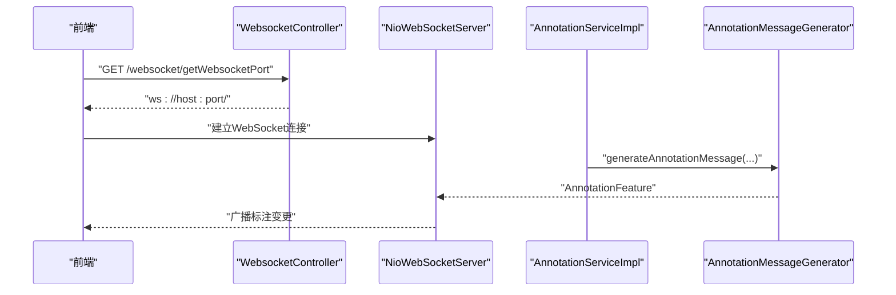
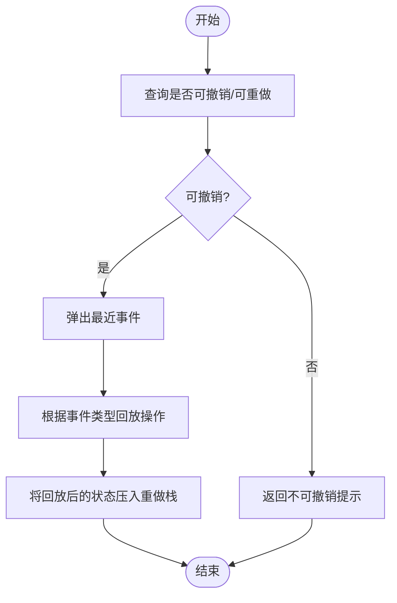
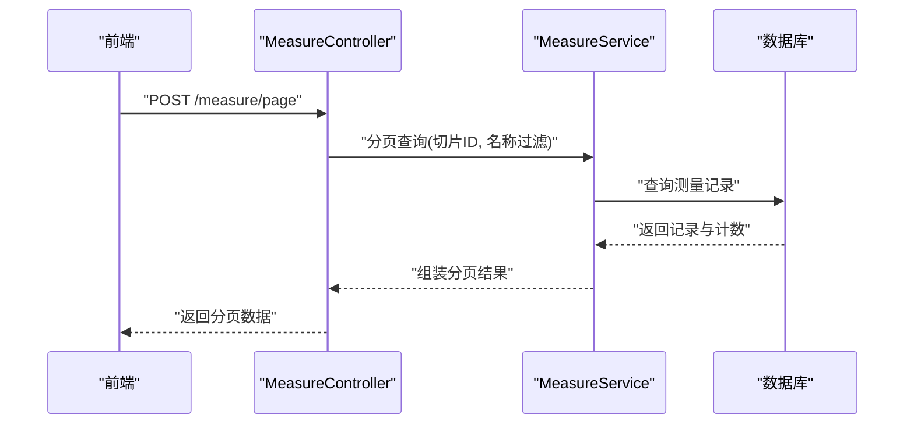
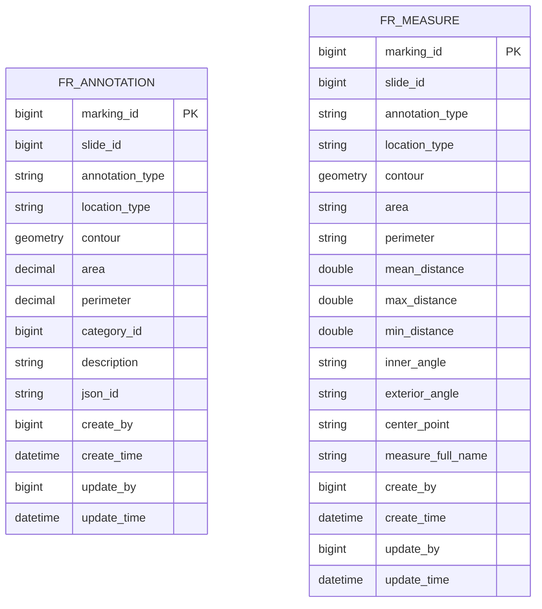
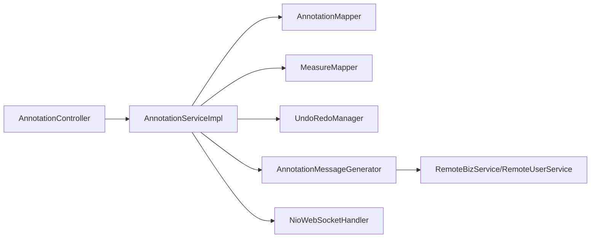

# 系统介绍

<cite>
**本文引用的文件**
- [README.md](file://README.md)
- [StaTechAnnoApplication.java](file://src/main/java/cn/staitech/annotation/StaTechAnnoApplication.java)
- [AnnotationController.java](file://src/main/java/cn/staitech/annotation/controller/AnnotationController.java)
- [MeasureController.java](file://src/main/java/cn/staitech/annotation/controller/MeasureController.java)
- [WebsocketController.java](file://src/main/java/cn/staitech/annotation/controller/WebsocketController.java)
- [UndoRedoManager.java](file://src/main/java/cn/staitech/annotation/utils/annotation/UndoRedoManager.java)
- [NioWebSocketServer.java](file://src/main/java/cn/staitech/annotation/netty/websocket/NioWebSocketServer.java)
- [Annotation.java](file://src/main/java/cn/staitech/annotation/domain/Annotation.java)
- [Measure.java](file://src/main/java/cn/staitech/annotation/domain/Measure.java)
- [AnnotationMessageGenerator.java](file://src/main/java/cn/staitech/annotation/utils/annotation/AnnotationMessageGenerator.java)
- [AnnotationServiceImpl.java](file://src/main/java/cn/staitech/annotation/service/impl/AnnotationServiceImpl.java)
- [AnnotationFeature.java](file://src/main/java/cn/staitech/annotation/netty/message/AnnotationFeature.java)
- [AnnotationAddReq.java](file://src/main/java/cn/staitech/annotation/vo/anno/AnnotationAddReq.java)
- [MeasureAddVo.java](file://src/main/java/cn/staitech/annotation/vo/measure/MeasureAddVo.java)
- [bootstrap.yml](file://src/main/resources/bootstrap.yml)
</cite>

## 目录
1. [引言](#引言)
2. [项目结构](#项目结构)
3. [核心组件](#核心组件)
4. [架构总览](#架构总览)
5. [详细组件分析](#详细组件分析)
6. [依赖分析](#依赖分析)
7. [性能考虑](#性能考虑)
8. [故障排查指南](#故障排查指南)
9. [结论](#结论)
10. [附录](#附录)

## 引言
本系统面向医学图像（尤其是病理切片）标注与测量场景，提供高精度、可协作、可回溯的标注能力。其核心目标是在保证标注质量的同时，显著提升标注效率，支撑病理科医生、医学研究人员进行大规模、标准化的组织结构标注与几何测量工作。

系统在病理图片标注领域的价值与意义体现在：
- 提升标注一致性与可比性：通过统一的标签体系与几何属性输出，减少主观差异。
- 降低重复劳动：支持批量操作、复制粘贴、轮廓合并预览等，加速标注流程。
- 增强标注安全性：完善的撤销/重做机制，保障标注过程可回溯、可恢复。
- 促进团队协作：基于 WebSocket 的实时通信，支持多人在同一切片上协同标注。
- 量化分析支持：内置几何测量能力，支持距离、面积、周长等指标的统计与导出。

## 项目结构
后端采用 Spring Boot 微服务风格，结合 Netty 实现 WebSocket 服务，控制器层负责对外接口，服务层承载业务逻辑，工具类负责消息生成与撤销重做管理，领域模型映射数据库表结构。

**图表来源**
- [StaTechAnnoApplication.java:1-51](file://src/main/java/cn/staitech/annotation/StaTechAnnoApplication.java#L1-L51)
- [AnnotationController.java:1-251](file://src/main/java/cn/staitech/annotation/controller/AnnotationController.java#L1-L251)
- [MeasureController.java:1-118](file://src/main/java/cn/staitech/annotation/controller/MeasureController.java#L1-L118)
- [WebsocketController.java:1-41](file://src/main/java/cn/staitech/annotation/controller/WebsocketController.java#L1-L41)
- [AnnotationServiceImpl.java:1-724](file://src/main/java/cn/staitech/annotation/service/impl/AnnotationServiceImpl.java#L1-L724)
- [UndoRedoManager.java:1-97](file://src/main/java/cn/staitech/annotation/utils/annotation/UndoRedoManager.java#L1-L97)
- [AnnotationMessageGenerator.java:1-349](file://src/main/java/cn/staitech/annotation/utils/annotation/AnnotationMessageGenerator.java#L1-L349)
- [NioWebSocketServer.java:1-44](file://src/main/java/cn/staitech/annotation/netty/websocket/NioWebSocketServer.java#L1-L44)
- [Annotation.java:1-187](file://src/main/java/cn/staitech/annotation/domain/Annotation.java#L1-L187)
- [Measure.java:1-256](file://src/main/java/cn/staitech/annotation/domain/Measure.java#L1-L256)
- [bootstrap.yml:1-42](file://src/main/resources/bootstrap.yml#L1-L42)

**章节来源**
- [StaTechAnnoApplication.java:1-51](file://src/main/java/cn/staitech/annotation/StaTechAnnoApplication.java#L1-L51)
- [bootstrap.yml:1-42](file://src/main/resources/bootstrap.yml#L1-L42)

## 核心组件
- 标注控制器与服务
  - AnnotationController：提供标注的增删改、批量操作、合并/裁剪、距离计算、撤销/重做、筛差数据查询等接口。
  - AnnotationServiceImpl：实现标注的几何运算（合并、差集）、面积/周长换算、脏器标签联动、撤销重做事件入栈、WebSocket 推送等。
- 测量控制器与实体
  - MeasureController：提供测量的分页查询、GeoJSON 导出、截图占位等接口。
  - Measure：存储测量相关的几何与统计字段（面积、周长、角度、半径、点数等）。
- 撤销重做管理
  - UndoRedoManager：以“用户ID+切片ID”为维度维护可序列化的撤销重做栈，支持定时清理与按需查询状态。
- WebSocket 通信
  - NioWebSocketServer：基于 Netty 启动 WebSocket 服务，用于标注变更的实时推送。
  - WebsocketController：提供前端连接所需的 WebSocket 地址与端口。
- 消息生成与传输
  - AnnotationMessageGenerator：将标注/筛差数据转换为 GeoJSON Feature，附加属性与加密标记，供前端渲染与审计。
  - AnnotationFeature：消息载体，包含几何、属性、描述、加密标记等。
- 领域模型
  - Annotation：标注实体，包含几何、标签、类型、切片ID、创建/更新信息等。
  - Measure：测量实体，包含几何、统计量、类型、名称等。

**章节来源**
- [AnnotationController.java:1-251](file://src/main/java/cn/staitech/annotation/controller/AnnotationController.java#L1-L251)
- [AnnotationServiceImpl.java:1-724](file://src/main/java/cn/staitech/annotation/service/impl/AnnotationServiceImpl.java#L1-L724)
- [MeasureController.java:1-118](file://src/main/java/cn/staitech/annotation/controller/MeasureController.java#L1-L118)
- [Measure.java:1-256](file://src/main/java/cn/staitech/annotation/domain/Measure.java#L1-L256)
- [UndoRedoManager.java:1-97](file://src/main/java/cn/staitech/annotation/utils/annotation/UndoRedoManager.java#L1-L97)
- [NioWebSocketServer.java:1-44](file://src/main/java/cn/staitech/annotation/netty/websocket/NioWebSocketServer.java#L1-L44)
- [WebsocketController.java:1-41](file://src/main/java/cn/staitech/annotation/controller/WebsocketController.java#L1-L41)
- [AnnotationMessageGenerator.java:1-349](file://src/main/java/cn/staitech/annotation/utils/annotation/AnnotationMessageGenerator.java#L1-L349)
- [AnnotationFeature.java:1-33](file://src/main/java/cn/staitech/annotation/netty/message/AnnotationFeature.java#L1-L33)
- [Annotation.java:1-187](file://src/main/java/cn/staitech/annotation/domain/Annotation.java#L1-L187)

## 架构总览
系统采用“HTTP REST + WebSocket 实时推送”的双通道架构：
- HTTP 控制器负责请求处理与业务编排；
- WebSocket 服务负责标注变更的即时广播；
- 撤销重做管理器在内存中维护历史快照，确保可回溯；
- 消息生成器将标注/筛差数据转换为前端友好的 GeoJSON 结构。

**图表来源**
- [AnnotationController.java:1-251](file://src/main/java/cn/staitech/annotation/controller/AnnotationController.java#L1-L251)
- [MeasureController.java:1-118](file://src/main/java/cn/staitech/annotation/controller/MeasureController.java#L1-L118)
- [AnnotationServiceImpl.java:1-724](file://src/main/java/cn/staitech/annotation/service/impl/AnnotationServiceImpl.java#L1-L724)
- [NioWebSocketServer.java:1-44](file://src/main/java/cn/staitech/annotation/netty/websocket/NioWebSocketServer.java#L1-L44)
- [AnnotationMessageGenerator.java:1-349](file://src/main/java/cn/staitech/annotation/utils/annotation/AnnotationMessageGenerator.java#L1-L349)
- [UndoRedoManager.java:1-97](file://src/main/java/cn/staitech/annotation/utils/annotation/UndoRedoManager.java#L1-L97)

## 详细组件分析

### 标注管理（AI辅助标注、批量操作、几何运算）
- AI辅助标注
  - 提供“AI插入/更新/删除”接口，便于与前端AI模型集成，快速生成初始标注。
- 批量操作
  - 支持批量更新与删除，聚合撤销重做事件，统一入栈，提升批量处理效率。
- 几何运算
  - 支持合并预览与实际合并/差集运算，要求相交且满足规则，避免非法拓扑。
- 面积/周长换算
  - 基于常量换算系数，将几何度量转换为实际物理单位，便于科研与报告。
- 脏器标签联动
  - 当标注类型为粗轮廓时，同步维护“脏器唯一性”，避免重复添加/删除。

**图表来源**
- [AnnotationController.java:62-69](file://src/main/java/cn/staitech/annotation/controller/AnnotationController.java#L62-L69)
- [AnnotationServiceImpl.java:184-238](file://src/main/java/cn/staitech/annotation/service/impl/AnnotationServiceImpl.java#L184-L238)
- [UndoRedoManager.java:42-45](file://src/main/java/cn/staitech/annotation/utils/annotation/UndoRedoManager.java#L42-L45)

**章节来源**
- [AnnotationController.java:62-110](file://src/main/java/cn/staitech/annotation/controller/AnnotationController.java#L62-L110)
- [AnnotationServiceImpl.java:503-571](file://src/main/java/cn/staitech/annotation/service/impl/AnnotationServiceImpl.java#L503-L571)

### 实时协作标注（WebSocket）
- WebSocket 服务由 Netty 提供，启动端口从配置读取。
- 控制器提供查询 WebSocket 地址的接口，便于前端建立连接。
- 业务变更通过消息生成器封装为 GeoJSON 特征，经 WebSocket 推送给所有在线用户。

**图表来源**
- [WebsocketController.java:28-37](file://src/main/java/cn/staitech/annotation/controller/WebsocketController.java#L28-L37)
- [NioWebSocketServer.java:19-41](file://src/main/java/cn/staitech/annotation/netty/websocket/NioWebSocketServer.java#L19-L41)
- [AnnotationMessageGenerator.java:40-50](file://src/main/java/cn/staitech/annotation/utils/annotation/AnnotationMessageGenerator.java#L40-L50)

**章节来源**
- [WebsocketController.java:1-41](file://src/main/java/cn/staitech/annotation/controller/WebsocketController.java#L1-L41)
- [NioWebSocketServer.java:1-44](file://src/main/java/cn/staitech/annotation/netty/websocket/NioWebSocketServer.java#L1-L44)
- [AnnotationMessageGenerator.java:1-349](file://src/main/java/cn/staitech/annotation/utils/annotation/AnnotationMessageGenerator.java#L1-L349)

### 撤销/重做机制
- 以“用户ID+切片ID”为键，维护可序列化的撤销重做栈。
- 支持撤销/重做单次操作与批量操作；支持查询可撤销/可重做状态；每日定时清空历史。
- 业务层在新增、更新、删除时生成对应事件，入栈并广播。

**图表来源**
- [UndoRedoManager.java:48-85](file://src/main/java/cn/staitech/annotation/utils/annotation/UndoRedoManager.java#L48-L85)
- [AnnotationServiceImpl.java:677-717](file://src/main/java/cn/staitech/annotation/service/impl/AnnotationServiceImpl.java#L677-L717)

**章节来源**
- [UndoRedoManager.java:1-97](file://src/main/java/cn/staitech/annotation/utils/annotation/UndoRedoManager.java#L1-L97)
- [AnnotationServiceImpl.java:625-717](file://src/main/java/cn/staitech/annotation/service/impl/AnnotationServiceImpl.java#L625-L717)

### 几何测量（距离、面积、周长等）
- 支持标注间最小距离与平均距离计算，返回最近点对与统计值。
- 支持测量数据的分页查询、导出与前端展示。
- 测量实体包含多种几何与统计字段，便于多维分析。

**图表来源**
- [MeasureController.java:42-68](file://src/main/java/cn/staitech/annotation/controller/MeasureController.java#L42-L68)
- [Measure.java:1-256](file://src/main/java/cn/staitech/annotation/domain/Measure.java#L1-L256)

**章节来源**
- [MeasureController.java:1-118](file://src/main/java/cn/staitech/annotation/controller/MeasureController.java#L1-L118)
- [AnnotationServiceImpl.java:140-181](file://src/main/java/cn/staitech/annotation/service/impl/AnnotationServiceImpl.java#L140-L181)

### 数据模型（标注与测量）
标注与测量均以 GeoJSON Feature 形式在系统内流转，便于前端可视化与审计。

**图表来源**
- [Annotation.java:23-112](file://src/main/java/cn/staitech/annotation/domain/Annotation.java#L23-L112)
- [Measure.java:20-151](file://src/main/java/cn/staitech/annotation/domain/Measure.java#L20-L151)

**章节来源**
- [Annotation.java:1-187](file://src/main/java/cn/staitech/annotation/domain/Annotation.java#L1-L187)
- [Measure.java:1-256](file://src/main/java/cn/staitech/annotation/domain/Measure.java#L1-L256)

## 依赖分析
- 组件耦合
  - 控制器仅依赖服务接口，服务实现依赖消息生成器、撤销重做管理器与数据库访问层，保持清晰的分层。
- 外部依赖
  - Netty 提供 WebSocket 服务；JTS 用于几何运算；MyBatis Plus 用于数据持久化；Spring Cloud Nacos 用于配置中心。
- 可能的循环依赖
  - 未发现直接循环依赖；消息生成器通过远程服务查询标签与用户信息，属于横向调用，不构成循环。

**图表来源**
- [AnnotationController.java:45-48](file://src/main/java/cn/staitech/annotation/controller/AnnotationController.java#L45-L48)
- [AnnotationServiceImpl.java:49-60](file://src/main/java/cn/staitech/annotation/service/impl/AnnotationServiceImpl.java#L49-L60)
- [AnnotationMessageGenerator.java:114-126](file://src/main/java/cn/staitech/annotation/utils/annotation/AnnotationMessageGenerator.java#L114-L126)

**章节来源**
- [AnnotationController.java:1-251](file://src/main/java/cn/staitech/annotation/controller/AnnotationController.java#L1-L251)
- [AnnotationServiceImpl.java:1-724](file://src/main/java/cn/staitech/annotation/service/impl/AnnotationServiceImpl.java#L1-L724)

## 性能考虑
- 撤销重做栈大小限制：通过常量控制历史深度，避免内存膨胀。
- 定时清理：午夜清空所有撤销重做记录，释放内存。
- 几何采样：计算平均距离时对几何进行等距采样，平衡精度与性能。
- 批量操作：聚合事件一次性入栈，减少多次交互成本。
- WebSocket 广播：仅推送必要的标注特征，避免冗余数据。

**章节来源**
- [UndoRedoManager.java:88-94](file://src/main/java/cn/staitech/annotation/utils/annotation/UndoRedoManager.java#L88-L94)
- [AnnotationServiceImpl.java:68-113](file://src/main/java/cn/staitech/annotation/service/impl/AnnotationServiceImpl.java#L68-L113)
- [AnnotationServiceImpl.java:574-623](file://src/main/java/cn/staitech/annotation/service/impl/AnnotationServiceImpl.java#L574-L623)

## 故障排查指南
- 无法连接 WebSocket
  - 检查 Netty 端口配置与防火墙放行；确认 WebsocketController 返回的地址正确。
- 撤销/重做不可用
  - 检查撤销重做状态查询接口；确认当日是否被定时任务清空。
- 标注面积/周长异常
  - 检查几何换算常量与输入几何有效性；确认几何类型与分辨率设置。
- 批量操作失败
  - 查看批量响应中的状态与错误信息，定位具体失败项并重试。

**章节来源**
- [WebsocketController.java:28-37](file://src/main/java/cn/staitech/annotation/controller/WebsocketController.java#L28-L37)
- [UndoRedoManager.java:88-94](file://src/main/java/cn/staitech/annotation/utils/annotation/UndoRedoManager.java#L88-L94)
- [AnnotationServiceImpl.java:374-381](file://src/main/java/cn/staitech/annotation/service/impl/AnnotationServiceImpl.java#L374-L381)
- [AnnotationServiceImpl.java:574-623](file://src/main/java/cn/staitech/annotation/service/impl/AnnotationServiceImpl.java#L574-L623)

## 结论
本系统围绕病理图像标注与测量场景，提供了从几何建模、AI辅助、批量处理到实时协作与可回溯的完整能力闭环。通过模块化设计与清晰的分层架构，既满足了初学者快速上手的需求，也为复杂业务场景下的扩展与优化奠定了坚实基础。

## 附录
- 端口与配置
  - 应用端口：9998
  - WebSocket 端口：由配置文件注入（Netty 端口）
  - 配置中心：Nacos（服务注册与共享配置）

**章节来源**
- [bootstrap.yml:2-4](file://src/main/resources/bootstrap.yml#L2-L4)
- [NioWebSocketServer.java:16-17](file://src/main/java/cn/staitech/annotation/netty/websocket/NioWebSocketServer.java#L16-L17)
- [bootstrap.yml:20-41](file://src/main/resources/bootstrap.yml#L20-L41)