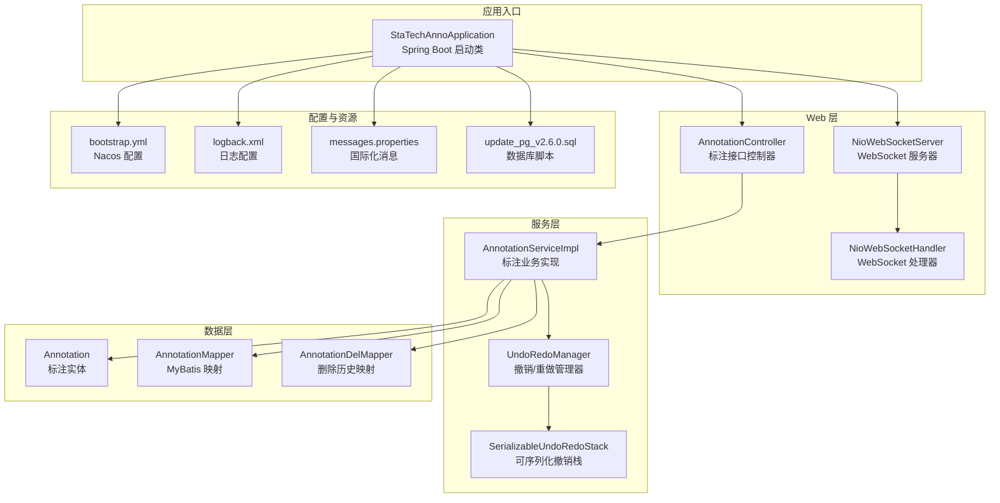
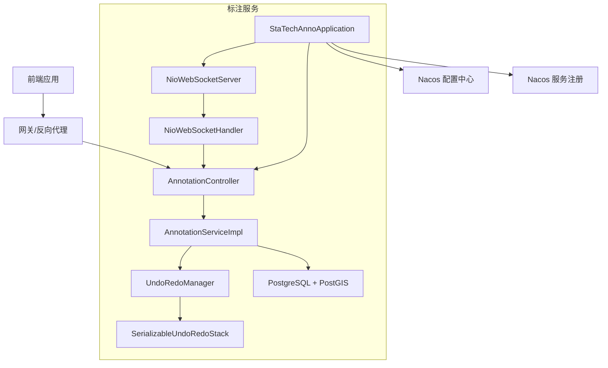
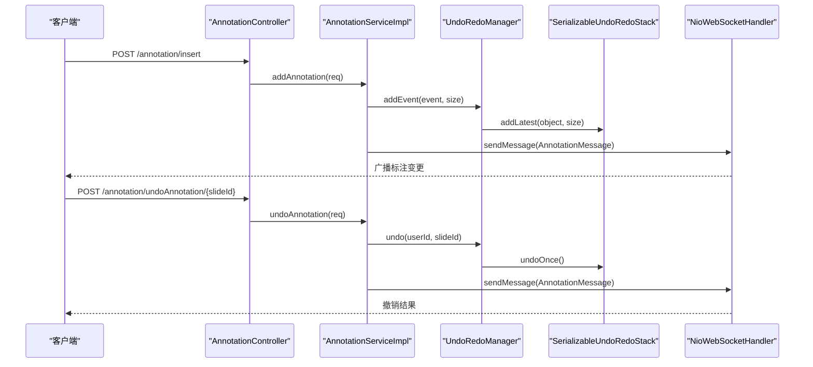
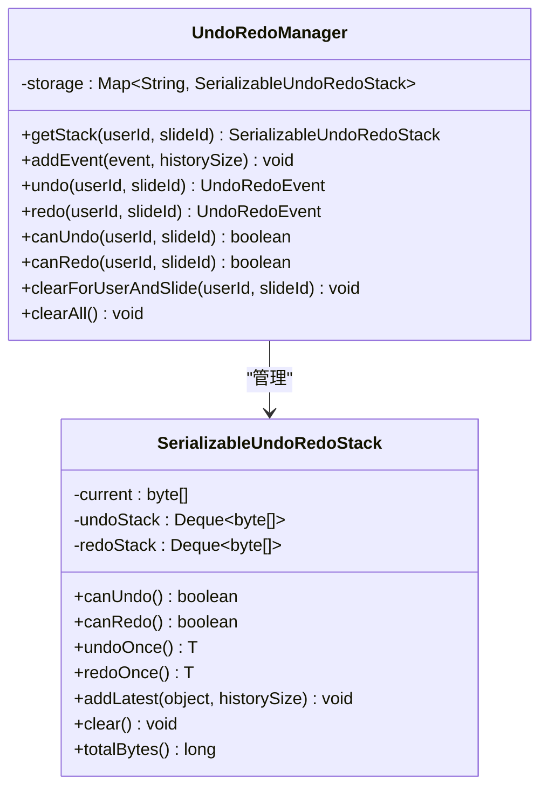
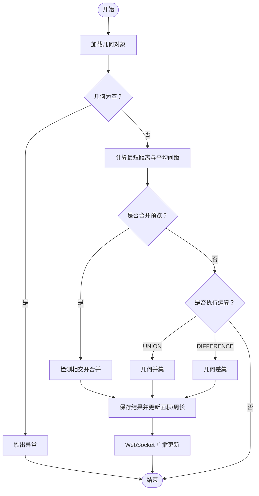
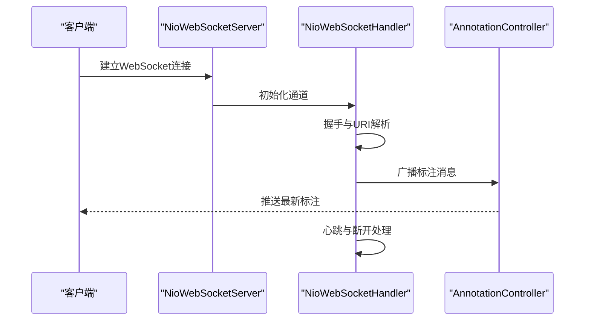
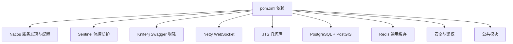

# 项目概述

<cite>
**本文引用的文件**
- [README.md](file://README.md)
- [StaTechAnnoApplication.java](file://src/main/java/cn/staitech/annotation/StaTechAnnoApplication.java)
- [pom.xml](file://pom.xml)
- [bootstrap.yml](file://src/main/resources/bootstrap.yml)
- [AnnotationController.java](file://src/main/java/cn/staitech/annotation/controller/AnnotationController.java)
- [NioWebSocketServer.java](file://src/main/java/cn/staitech/annotation/netty/websocket/NioWebSocketServer.java)
- [NioWebSocketHandler.java](file://src/main/java/cn/staitech/annotation/netty/websocket/NioWebSocketHandler.java)
- [UndoRedoManager.java](file://src/main/java/cn/staitech/annotation/utils/annotation/UndoRedoManager.java)
- [SerializableUndoRedoStack.java](file://src/main/java/cn/staitech/annotation/utils/annotation/SerializableUndoRedoStack.java)
- [Annotation.java](file://src/main/java/cn/staitech/annotation/domain/Annotation.java)
- [AnnotationServiceImpl.java](file://src/main/java/cn/staitech/annotation/service/impl/AnnotationServiceImpl.java)
- [update_pg_v2.6.0.sql](file://sql/update_pg_v2.6.0.sql)
- [messages.properties](file://src/main/resources/i18n/messages.properties)
- [logback.xml](file://src/main/resources/logback.xml)
</cite>

## 目录
1. [简介](#简介)
2. [项目结构](#项目结构)
3. [核心组件](#核心组件)
4. [架构总览](#架构总览)
5. [详细组件分析](#详细组件分析)
6. [依赖分析](#依赖分析)
7. [性能考虑](#性能考虑)
8. [故障排查指南](#故障排查指南)
9. [结论](#结论)
10. [附录](#附录)

## 简介
本项目是一个面向病理图片的医学图像标注系统，服务于AI辅助标注、实时协作、撤销/重做、几何运算与测量等核心能力。系统采用Spring Boot + Spring Cloud Alibaba 技术栈，结合Netty实现WebSocket实时通信，支撑高并发下的标注数据同步与交互。

- 核心目标
  - 提供稳定可靠的标注平台，支持AI生成标注与人工绘制标注的混合工作流
  - 实现实时协作标注，多人可同时在线编辑同一切片
  - 提供完善的撤销/重做机制，保障标注过程的可控与可追溯
  - 提供几何运算与测量能力，支持标注合并、裁剪、间距计算等高级功能

- 应用价值
  - 提升病理医生标注效率与一致性
  - 通过AI辅助降低人工标注成本
  - 支撑大规模多中心协作标注场景
  - 为后续AI模型训练与质量评估提供高质量标注数据

## 项目结构
项目采用标准的Spring Boot工程结构，按领域分层组织代码，包含控制器、服务、持久层、Netty WebSocket、工具类与国际化资源等模块。

**图表来源**
- [StaTechAnnoApplication.java:34-50](file://src/main/java/cn/staitech/annotation/StaTechAnnoApplication.java#L34-L50)
- [AnnotationController.java:43-251](file://src/main/java/cn/staitech/annotation/controller/AnnotationController.java#L43-L251)
- [NioWebSocketServer.java:14-44](file://src/main/java/cn/staitech/annotation/netty/websocket/NioWebSocketServer.java#L14-L44)
- [NioWebSocketHandler.java:29-197](file://src/main/java/cn/staitech/annotation/netty/websocket/NioWebSocketHandler.java#L29-L197)
- [AnnotationServiceImpl.java:46-724](file://src/main/java/cn/staitech/annotation/service/impl/AnnotationServiceImpl.java#L46-L724)
- [UndoRedoManager.java:19-97](file://src/main/java/cn/staitech/annotation/utils/annotation/UndoRedoManager.java#L19-L97)
- [SerializableUndoRedoStack.java:18-246](file://src/main/java/cn/staitech/annotation/utils/annotation/SerializableUndoRedoStack.java#L18-L246)
- [Annotation.java:25-187](file://src/main/java/cn/staitech/annotation/domain/Annotation.java#L25-L187)
- [bootstrap.yml:1-42](file://src/main/resources/bootstrap.yml#L1-L42)
- [logback.xml:1-101](file://src/main/resources/logback.xml#L1-L101)
- [messages.properties:1-328](file://src/main/resources/i18n/messages.properties#L1-L328)
- [update_pg_v2.6.0.sql:1-245](file://sql/update_pg_v2.6.0.sql#L1-L245)

**章节来源**
- [StaTechAnnoApplication.java:34-50](file://src/main/java/cn/staitech/annotation/StaTechAnnoApplication.java#L34-L50)
- [bootstrap.yml:1-42](file://src/main/resources/bootstrap.yml#L1-L42)

## 核心组件
- 应用启动与配置
  - 启动类启用Spring Util、安全配置、Swagger、Feign客户端、服务发现、异步与事务管理，并配置MyBatis Plus分页拦截器
  - 配置文件启用Knife4j、国际化、Nacos注册与配置中心、共享配置加载

- 标注控制器
  - 提供标注的增删改查、AI标注、批量操作、几何合并/裁剪、距离计算、撤销/重做等接口

- WebSocket 实时通信
  - Netty WebSocket 服务器监听指定端口，处理器负责握手、心跳、消息广播与按切片分发

- 撤销/重做机制
  - 基于用户ID与切片ID隔离的撤销栈，支持序列化存储与内存清理策略

- 数据模型与持久化
  - 标注实体包含几何字段、标签、类型、切片ID等，配合PostgreSQL + PostGIS几何类型存储

**章节来源**
- [AnnotationController.java:43-251](file://src/main/java/cn/staitech/annotation/controller/AnnotationController.java#L43-L251)
- [NioWebSocketServer.java:14-44](file://src/main/java/cn/staitech/annotation/netty/websocket/NioWebSocketServer.java#L14-L44)
- [NioWebSocketHandler.java:29-197](file://src/main/java/cn/staitech/annotation/netty/websocket/NioWebSocketHandler.java#L29-L197)
- [UndoRedoManager.java:19-97](file://src/main/java/cn/staitech/annotation/utils/annotation/UndoRedoManager.java#L19-L97)
- [SerializableUndoRedoStack.java:18-246](file://src/main/java/cn/staitech/annotation/utils/annotation/SerializableUndoRedoStack.java#L18-L246)
- [Annotation.java:25-187](file://src/main/java/cn/staitech/annotation/domain/Annotation.java#L25-L187)

## 架构总览
系统采用前后端分离架构，后端通过REST API与WebSocket提供标注与协作能力。技术选型强调微服务生态与高性能实时通信。

**图表来源**
- [StaTechAnnoApplication.java:34-50](file://src/main/java/cn/staitech/annotation/StaTechAnnoApplication.java#L34-L50)
- [AnnotationController.java:43-251](file://src/main/java/cn/staitech/annotation/controller/AnnotationController.java#L43-L251)
- [NioWebSocketServer.java:14-44](file://src/main/java/cn/staitech/annotation/netty/websocket/NioWebSocketServer.java#L14-L44)
- [NioWebSocketHandler.java:29-197](file://src/main/java/cn/staitech/annotation/netty/websocket/NioWebSocketHandler.java#L29-L197)
- [UndoRedoManager.java:19-97](file://src/main/java/cn/staitech/annotation/utils/annotation/UndoRedoManager.java#L19-L97)
- [SerializableUndoRedoStack.java:18-246](file://src/main/java/cn/staitech/annotation/utils/annotation/SerializableUndoRedoStack.java#L18-L246)

**章节来源**
- [pom.xml:19-134](file://pom.xml#L19-L134)
- [bootstrap.yml:1-42](file://src/main/resources/bootstrap.yml#L1-L42)

## 详细组件分析

### 标注控制器与业务流程
标注控制器提供完整的标注生命周期管理，包括AI标注、人工标注、批量操作、几何运算与撤销/重做。

**图表来源**
- [AnnotationController.java:50-251](file://src/main/java/cn/staitech/annotation/controller/AnnotationController.java#L50-L251)
- [AnnotationServiceImpl.java:184-238](file://src/main/java/cn/staitech/annotation/service/impl/AnnotationServiceImpl.java#L184-L238)
- [UndoRedoManager.java:50-61](file://src/main/java/cn/staitech/annotation/utils/annotation/UndoRedoManager.java#L50-L61)
- [SerializableUndoRedoStack.java:87-135](file://src/main/java/cn/staitech/annotation/utils/annotation/SerializableUndoRedoStack.java#L87-L135)
- [NioWebSocketHandler.java:38-68](file://src/main/java/cn/staitech/annotation/netty/websocket/NioWebSocketHandler.java#L38-L68)

**章节来源**
- [AnnotationController.java:43-251](file://src/main/java/cn/staitech/annotation/controller/AnnotationController.java#L43-L251)
- [AnnotationServiceImpl.java:677-717](file://src/main/java/cn/staitech/annotation/service/impl/AnnotationServiceImpl.java#L677-L717)

### 撤销/重做机制
撤销/重做管理器按用户与切片维度维护独立的历史栈，支持序列化存储与内存清理策略，确保高并发下的稳定性。

**图表来源**
- [UndoRedoManager.java:19-97](file://src/main/java/cn/staitech/annotation/utils/annotation/UndoRedoManager.java#L19-L97)
- [SerializableUndoRedoStack.java:18-246](file://src/main/java/cn/staitech/annotation/utils/annotation/SerializableUndoRedoStack.java#L18-L246)

**章节来源**
- [UndoRedoManager.java:19-97](file://src/main/java/cn/staitech/annotation/utils/annotation/UndoRedoManager.java#L19-L97)
- [SerializableUndoRedoStack.java:18-246](file://src/main/java/cn/staitech/annotation/utils/annotation/SerializableUndoRedoStack.java#L18-L246)

### 几何运算与测量
标注服务支持几何合并预览、相交/差集运算、距离计算与平均间距采样，结合PostGIS几何类型实现精确的空间分析。

**图表来源**
- [AnnotationServiceImpl.java:140-181](file://src/main/java/cn/staitech/annotation/service/impl/AnnotationServiceImpl.java#L140-L181)
- [AnnotationServiceImpl.java:503-571](file://src/main/java/cn/staitech/annotation/service/impl/AnnotationServiceImpl.java#L503-L571)

**章节来源**
- [AnnotationServiceImpl.java:68-113](file://src/main/java/cn/staitech/annotation/service/impl/AnnotationServiceImpl.java#L68-L113)
- [AnnotationServiceImpl.java:503-571](file://src/main/java/cn/staitech/annotation/service/impl/AnnotationServiceImpl.java#L503-L571)

### WebSocket 实时协作
WebSocket 服务器负责建立长连接、处理握手与心跳、按切片ID分发消息，确保标注变更能实时同步至所有在线用户。

**图表来源**
- [NioWebSocketServer.java:19-41](file://src/main/java/cn/staitech/annotation/netty/websocket/NioWebSocketServer.java#L19-L41)
- [NioWebSocketHandler.java:167-196](file://src/main/java/cn/staitech/annotation/netty/websocket/NioWebSocketHandler.java#L167-L196)
- [AnnotationController.java:226-248](file://src/main/java/cn/staitech/annotation/controller/AnnotationController.java#L226-L248)

**章节来源**
- [NioWebSocketServer.java:14-44](file://src/main/java/cn/staitech/annotation/netty/websocket/NioWebSocketServer.java#L14-L44)
- [NioWebSocketHandler.java:29-197](file://src/main/java/cn/staitech/annotation/netty/websocket/NioWebSocketHandler.java#L29-L197)

## 依赖分析
系统依赖Spring Cloud Alibaba生态与Netty，结合MyBatis Plus与PostgreSQL，形成高可用、可扩展的标注平台。

**图表来源**
- [pom.xml:19-134](file://pom.xml#L19-L134)

**章节来源**
- [pom.xml:19-134](file://pom.xml#L19-L134)

## 性能考虑
- 撤销/重做内存管理
  - 可序列化撤销栈在内存紧张时主动清理历史，避免OOM风险
  - 历史深度受配置限制，建议结合业务规模调优

- WebSocket 并发
  - 基于Netty的事件循环模型，适合高并发低延迟的实时通信
  - 建议按切片维度分组，减少广播范围

- 数据库与几何运算
  - PostgreSQL + PostGIS 提供高效的空间索引与运算
  - 建议为切片ID与标注类型建立索引，提升查询性能

- 日志与可观测性
  - Logback 分级输出与按文件名分拣，便于问题定位
  - Nacos 配置中心集中管理，支持动态切换

**章节来源**
- [SerializableUndoRedoStack.java:144-173](file://src/main/java/cn/staitech/annotation/utils/annotation/SerializableUndoRedoStack.java#L144-L173)
- [logback.xml:1-101](file://src/main/resources/logback.xml#L1-L101)
- [update_pg_v2.6.0.sql:20-24](file://sql/update_pg_v2.6.0.sql#L20-L24)

## 故障排查指南
- 端口与网络
  - 确认防火墙开放必要端口（如9998、9000-9300、3306、6379等）
  - Docker 启动 RabbitMQ 时检查端口映射与管理界面访问

- WebSocket 连接
  - 检查服务器启动日志与握手URI解析
  - 关注心跳与断开事件，排查客户端异常断线

- 撤销/重做异常
  - 查看撤销栈序列化/反序列化日志
  - 检查历史深度与内存占用情况

- 国际化与提示
  - 消息资源文件缺失会导致提示信息异常，需确认i18n目录与命名

**章节来源**
- [README.md:5-95](file://README.md#L5-L95)
- [NioWebSocketHandler.java:167-196](file://src/main/java/cn/staitech/annotation/netty/websocket/NioWebSocketHandler.java#L167-L196)
- [messages.properties:1-328](file://src/main/resources/i18n/messages.properties#L1-L328)

## 结论
本项目围绕病理图片标注场景，构建了具备AI辅助、实时协作、撤销/重做与几何运算能力的标注平台。通过Spring Boot + Spring Cloud Alibaba 的现代化技术栈与Netty的高性能实时通信，系统在可扩展性、稳定性与易用性方面均具备良好表现。建议在生产环境中结合业务规模进一步优化撤销栈深度、数据库索引与WebSocket连接池配置。

## 附录

### 快速开始指南
- 环境要求
  - Java 版本：符合项目构建要求
  - 数据库：PostgreSQL + PostGIS（按SQL脚本初始化表结构）
  - 中间件：Nacos（服务注册与配置）、Redis（可选）、RabbitMQ（可选）

- 依赖安装
  - Maven 依赖：Nacos、Sentinel、Knife4j、Netty、JTS、PostgreSQL、EasyExcel、公共模块等
  - 本地运行前确保依赖仓库可达（阿里云Maven镜像、OSGeo仓库）

- 基本配置
  - application.yml：设置端口、国际化、Nacos地址与分组、共享配置
  - logback.xml：调整日志输出路径与级别
  - i18n：messages.properties、messages_en.properties、messages_zh.properties

- 启动步骤
  - 启动 Nacos 与数据库
  - 导入 SQL 脚本初始化表结构
  - 运行启动类，访问 Knife4j 文档与业务接口
  - 通过 WebSocket 客户端连接标注通道，验证实时协作

**章节来源**
- [pom.xml:136-264](file://pom.xml#L136-L264)
- [bootstrap.yml:1-42](file://src/main/resources/bootstrap.yml#L1-L42)
- [logback.xml:1-101](file://src/main/resources/logback.xml#L1-L101)
- [messages.properties:1-328](file://src/main/resources/i18n/messages.properties#L1-L328)
- [update_pg_v2.6.0.sql:1-245](file://sql/update_pg_v2.6.0.sql#L1-L245)