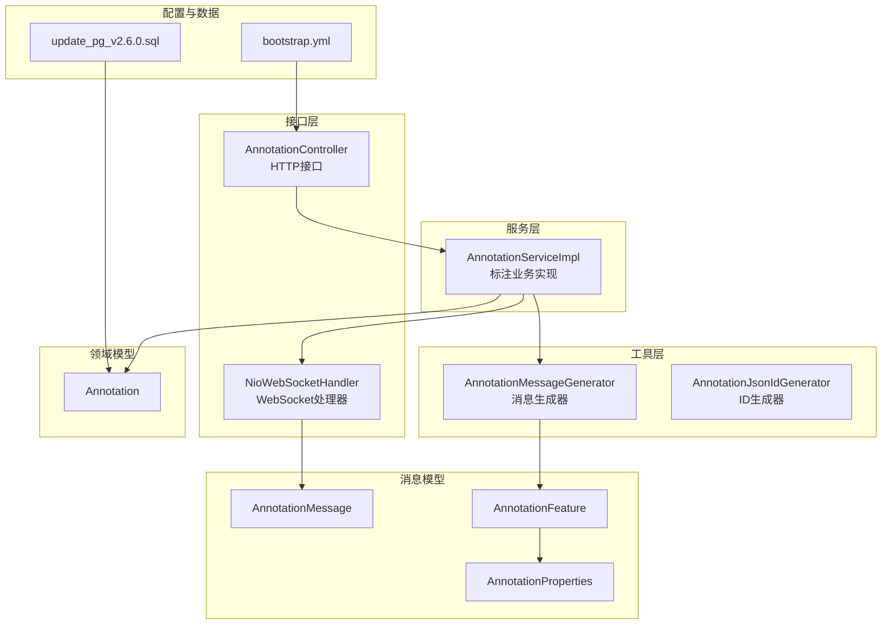
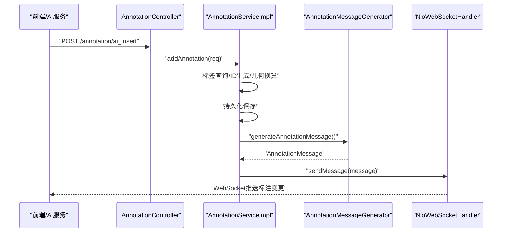
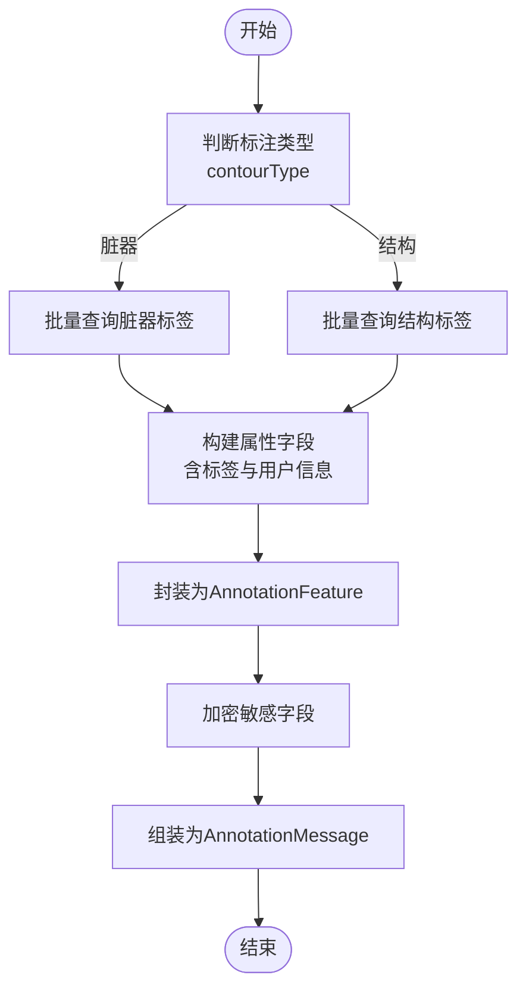
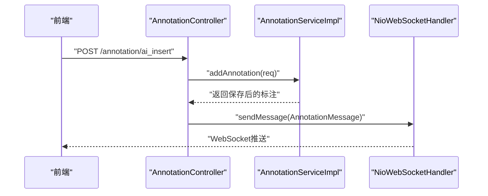
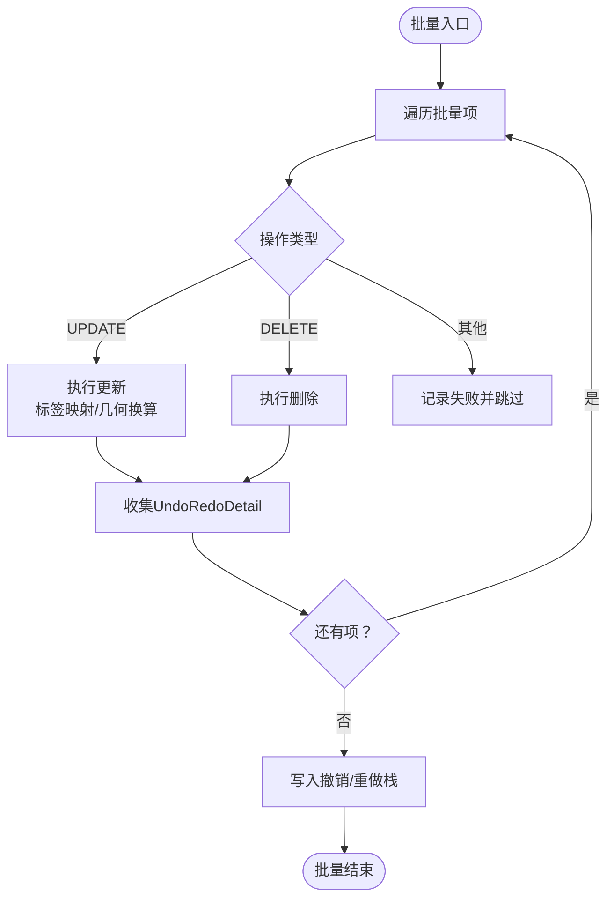
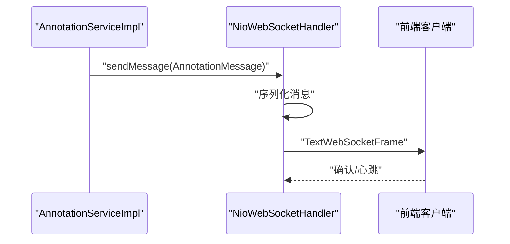
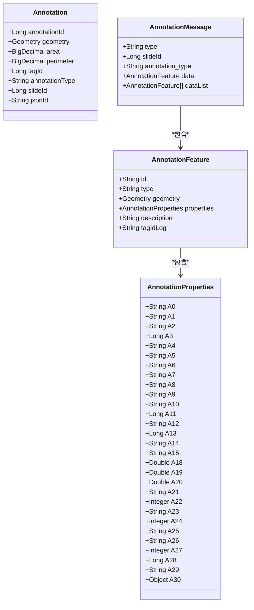
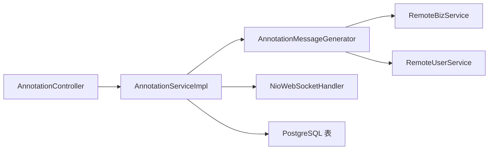

# AI辅助标注集成

<cite>
**本文引用的文件**   
- [AnnotationMessageGenerator.java](file://src/main/java/cn/staitech/annotation/utils/annotation/AnnotationMessageGenerator.java)
- [AnnotationMessage.java](file://src/main/java/cn/staitech/annotation/netty/message/AnnotationMessage.java)
- [AnnotationFeature.java](file://src/main/java/cn/staitech/annotation/netty/message/AnnotationFeature.java)
- [AnnotationProperties.java](file://src/main/java/cn/staitech/annotation/netty/message/AnnotationProperties.java)
- [Annotation.java](file://src/main/java/cn/staitech/annotation/domain/Annotation.java)
- [AnnotationServiceImpl.java](file://src/main/java/cn/staitech/annotation/service/impl/AnnotationServiceImpl.java)
- [AnnotationController.java](file://src/main/java/cn/staitech/annotation/controller/AnnotationController.java)
- [NioWebSocketHandler.java](file://src/main/java/cn/staitech/annotation/netty/websocket/NioWebSocketHandler.java)
- [AIAnnotationAddReq.java](file://src/main/java/cn/staitech/annotation/vo/anno/AIAnnotationAddReq.java)
- [Constant.java](file://src/main/java/cn/staitech/annotation/constant/Constant.java)
- [AnnotationJsonIdGenerator.java](file://src/main/java/cn/staitech/annotation/utils/annotation/AnnotationJsonIdGenerator.java)
- [AnnotationBatchReq.java](file://src/main/java/cn/staitech/annotation/vo/anno/AnnotationBatchReq.java)
- [bootstrap.yml](file://src/main/resources/bootstrap.yml)
- [update_pg_v2.6.0.sql](file://sql/update_pg_v2.6.0.sql)
</cite>

## 目录
1. [简介](#简介)
2. [项目结构](#项目结构)
3. [核心组件](#核心组件)
4. [架构总览](#架构总览)
5. [详细组件分析](#详细组件分析)
6. [依赖分析](#依赖分析)
7. [性能考虑](#性能考虑)
8. [故障排查指南](#故障排查指南)
9. [结论](#结论)
10. [附录](#附录)

## 简介
本文件面向医学图像标注系统中的AI辅助标注能力，围绕AI标注数据的生成机制、与人工标注的集成策略、自动化处理流程、扩展性设计、质量控制机制以及开发者集成指南展开，帮助读者从代码层面理解并高效落地AI标注能力。

## 项目结构
该模块采用分层架构：控制器层负责HTTP接口与WebSocket通道管理；服务层承载标注业务逻辑与批量处理；工具层提供消息生成与ID生成；消息层定义WebSocket传输的数据结构；领域层映射数据库表结构；配置与SQL脚本提供运行环境与数据结构支撑。

图示来源
- [AnnotationController.java:43-251](file://src/main/java/cn/staitech/annotation/controller/AnnotationController.java#L43-L251)
- [AnnotationServiceImpl.java:46-724](file://src/main/java/cn/staitech/annotation/service/impl/AnnotationServiceImpl.java#L46-L724)
- [AnnotationMessageGenerator.java:38-349](file://src/main/java/cn/staitech/annotation/utils/annotation/AnnotationMessageGenerator.java#L38-L349)
- [NioWebSocketHandler.java:29-197](file://src/main/java/cn/staitech/annotation/netty/websocket/NioWebSocketHandler.java#L29-L197)
- [AnnotationMessage.java:14-27](file://src/main/java/cn/staitech/annotation/netty/message/AnnotationMessage.java#L14-L27)
- [AnnotationFeature.java:14-32](file://src/main/java/cn/staitech/annotation/netty/message/AnnotationFeature.java#L14-L32)
- [AnnotationProperties.java:12-74](file://src/main/java/cn/staitech/annotation/netty/message/AnnotationProperties.java#L12-L74)
- [Annotation.java:25-187](file://src/main/java/cn/staitech/annotation/domain/Annotation.java#L25-L187)
- [bootstrap.yml:1-42](file://src/main/resources/bootstrap.yml#L1-L42)
- [update_pg_v2.6.0.sql:2-104](file://sql/update_pg_v2.6.0.sql#L2-L104)

章节来源
- [AnnotationController.java:43-251](file://src/main/java/cn/staitech/annotation/controller/AnnotationController.java#L43-L251)
- [AnnotationServiceImpl.java:46-724](file://src/main/java/cn/staitech/annotation/service/impl/AnnotationServiceImpl.java#L46-L724)
- [AnnotationMessageGenerator.java:38-349](file://src/main/java/cn/staitech/annotation/utils/annotation/AnnotationMessageGenerator.java#L38-L349)
- [NioWebSocketHandler.java:29-197](file://src/main/java/cn/staitech/annotation/netty/websocket/NioWebSocketHandler.java#L29-L197)
- [AnnotationMessage.java:14-27](file://src/main/java/cn/staitech/annotation/netty/message/AnnotationMessage.java#L14-L27)
- [AnnotationFeature.java:14-32](file://src/main/java/cn/staitech/annotation/netty/message/AnnotationFeature.java#L14-L32)
- [AnnotationProperties.java:12-74](file://src/main/java/cn/staitech/annotation/netty/message/AnnotationProperties.java#L12-L74)
- [Annotation.java:25-187](file://src/main/java/cn/staitech/annotation/domain/Annotation.java#L25-L187)
- [bootstrap.yml:1-42](file://src/main/resources/bootstrap.yml#L1-L42)
- [update_pg_v2.6.0.sql:2-104](file://sql/update_pg_v2.6.0.sql#L2-L104)

## 核心组件
- 消息生成器：负责将标注实体转换为GeoJSON风格的Feature消息，统一属性字段与几何体封装，支持脏器标签与结构标签两类标签体系，并加密敏感字段。
- 控制器：提供AI标注专用接口（新增、更新、删除），并复用人工标注的通用接口，实现统一的业务入口。
- 服务实现：承载标注的增删改、批量处理、几何运算、撤销/重做、脏器联动等核心逻辑。
- WebSocket处理器：按切片维度向订阅客户端推送标注变更消息，确保前端实时同步。
- 数据模型：标注实体包含几何、面积、周长、标签、类型、创建/更新信息等，支撑AI标注的存储与传输。
- 常量与ID生成：定义标注类型、操作类型、分辨率换算等常量，以及AI/筛差等ID生成策略。

章节来源
- [AnnotationMessageGenerator.java:38-349](file://src/main/java/cn/staitech/annotation/utils/annotation/AnnotationMessageGenerator.java#L38-L349)
- [AnnotationController.java:51-131](file://src/main/java/cn/staitech/annotation/controller/AnnotationController.java#L51-L131)
- [AnnotationServiceImpl.java:184-724](file://src/main/java/cn/staitech/annotation/service/impl/AnnotationServiceImpl.java#L184-L724)
- [NioWebSocketHandler.java:38-68](file://src/main/java/cn/staitech/annotation/netty/websocket/NioWebSocketHandler.java#L38-L68)
- [Annotation.java:25-187](file://src/main/java/cn/staitech/annotation/domain/Annotation.java#L25-L187)
- [Constant.java:9-80](file://src/main/java/cn/staitech/annotation/constant/Constant.java#L9-L80)
- [AnnotationJsonIdGenerator.java:9-53](file://src/main/java/cn/staitech/annotation/utils/annotation/AnnotationJsonIdGenerator.java#L9-L53)

## 架构总览
AI标注通过HTTP接口接收AI模型输出的标注数据，服务层完成标签映射、几何换算、ID生成与持久化，随后由消息生成器封装为标准消息并通过WebSocket推送到前端。同时，系统支持批量处理与撤销/重做，保证大规模标注场景下的可控性与可回溯性。

图示来源
- [AnnotationController.java:62-69](file://src/main/java/cn/staitech/annotation/controller/AnnotationController.java#L62-L69)
- [AnnotationServiceImpl.java:189-238](file://src/main/java/cn/staitech/annotation/service/impl/AnnotationServiceImpl.java#L189-L238)
- [AnnotationMessageGenerator.java:40-50](file://src/main/java/cn/staitech/annotation/utils/annotation/AnnotationMessageGenerator.java#L40-L50)
- [NioWebSocketHandler.java:38-68](file://src/main/java/cn/staitech/annotation/netty/websocket/NioWebSocketHandler.java#L38-L68)

## 详细组件分析

### 组件A：AI标注消息生成与传输（AnnotationMessageGenerator）
- 功能职责
  - 将标注实体转换为标准消息结构，包含类型、切片ID、标注类型、单条或列表数据。
  - 支持脏器标签与结构标签两类标签体系，动态查询标签与用户信息，构建属性字段。
  - 对几何体进行加密处理，保障传输安全。
- 关键流程
  - 单条标注：生成AnnotationFeature与AnnotationProperties，封装为AnnotationMessage。
  - 批量标注：根据contourType区分脏器/结构标签，批量查询标签与用户映射，统一生成Features列表。
  - 筛差数据：针对筛差标注生成专用Feature集合。
- 性能与复杂度
  - 标签查询与用户映射采用一次批量查询+内存映射，避免重复RPC调用。
  - 几何体与属性构造为O(n)线性处理，适合批量场景。
- 安全与合规
  - 属性字段加密标记，结合审计组件防止敏感信息泄露。

图示来源
- [AnnotationMessageGenerator.java:61-88](file://src/main/java/cn/staitech/annotation/utils/annotation/AnnotationMessageGenerator.java#L61-L88)
- [AnnotationMessageGenerator.java:154-202](file://src/main/java/cn/staitech/annotation/utils/annotation/AnnotationMessageGenerator.java#L154-L202)
- [AnnotationMessageGenerator.java:333-346](file://src/main/java/cn/staitech/annotation/utils/annotation/AnnotationMessageGenerator.java#L333-L346)

章节来源
- [AnnotationMessageGenerator.java:38-349](file://src/main/java/cn/staitech/annotation/utils/annotation/AnnotationMessageGenerator.java#L38-L349)

### 组件B：AI标注接口与控制器（AnnotationController）
- 接口设计
  - AI专用接口：/annotation/ai_insert、/annotation/ai_update、/annotation/ai_delete、/annotation/ai_stickup。
  - 与人工标注共享通用接口，便于统一调度与前端适配。
- 数据绑定
  - AI新增请求体使用AIAnnotationAddReq，包含几何、标签、切片ID、标注类型等字段。
- 实时推送
  - 控制器调用服务层后，通过WebSocket向目标切片推送标注变更消息。

图示来源
- [AnnotationController.java:62-69](file://src/main/java/cn/staitech/annotation/controller/AnnotationController.java#L62-L69)
- [AnnotationController.java:141-153](file://src/main/java/cn/staitech/annotation/controller/AnnotationController.java#L141-L153)
- [AnnotationServiceImpl.java:236-237](file://src/main/java/cn/staitech/annotation/service/impl/AnnotationServiceImpl.java#L236-L237)
- [NioWebSocketHandler.java:38-68](file://src/main/java/cn/staitech/annotation/netty/websocket/NioWebSocketHandler.java#L38-L68)

章节来源
- [AnnotationController.java:51-131](file://src/main/java/cn/staitech/annotation/controller/AnnotationController.java#L51-L131)
- [AIAnnotationAddReq.java:24-118](file://src/main/java/cn/staitech/annotation/vo/anno/AIAnnotationAddReq.java#L24-L118)

### 组件C：标注服务与批量处理（AnnotationServiceImpl）
- 核心能力
  - 新增/更新/删除标注：完成标签映射、ID生成、几何换算、持久化与事件记录。
  - 批量处理：支持批量更新与删除，统一记录撤销/重做栈，提升操作效率。
  - 撤销/重做：基于栈式事件管理，支持按用户与切片维度恢复历史状态。
  - 几何运算：提供合并预览、相交/差集运算等几何处理能力。
- 脏器联动
  - 当标注为脏器且标签发生变化时，自动调用远程服务添加或删除对应脏器。
- 性能优化
  - 采样点计算平均距离，降低几何比较成本。
  - 批量查询标签与用户，减少RPC次数。

图示来源
- [AnnotationServiceImpl.java:574-623](file://src/main/java/cn/staitech/annotation/service/impl/AnnotationServiceImpl.java#L574-L623)
- [AnnotationBatchReq.java:15-31](file://src/main/java/cn/staitech/annotation/vo/anno/AnnotationBatchReq.java#L15-L31)

章节来源
- [AnnotationServiceImpl.java:574-724](file://src/main/java/cn/staitech/annotation/service/impl/AnnotationServiceImpl.java#L574-L724)
- [AnnotationBatchReq.java:15-31](file://src/main/java/cn/staitech/annotation/vo/anno/AnnotationBatchReq.java#L15-L31)

### 组件D：WebSocket实时同步（NioWebSocketHandler）
- 功能职责
  - 建立WebSocket连接，按切片维度维护通道映射。
  - 将标注消息序列化后推送给目标切片的所有活跃连接。
- 错误处理
  - 序列化失败或通道无效时进行日志记录与忽略，保证系统稳定性。

图示来源
- [NioWebSocketHandler.java:38-68](file://src/main/java/cn/staitech/annotation/netty/websocket/NioWebSocketHandler.java#L38-L68)

章节来源
- [NioWebSocketHandler.java:29-197](file://src/main/java/cn/staitech/annotation/netty/websocket/NioWebSocketHandler.java#L29-L197)

### 组件E：数据模型与消息结构（Annotation、AnnotationMessage、AnnotationFeature、AnnotationProperties）
- 数据模型
  - 标注实体包含几何、面积、周长、标签、类型、创建/更新信息等，支撑AI标注的存储与传输。
- 消息结构
  - AnnotationMessage：包含type、slideId、annotation_type与data/dataList。
  - AnnotationFeature：包含id、type、geometry、properties与描述字段。
  - AnnotationProperties：统一的属性容器，涵盖A0-A30编号字段，用于承载标签、尺寸、时间、用户等信息。
- 设计要点
  - 属性字段编号化，便于前后端约定与扩展。
  - 几何体采用JTS库支持，便于后续几何运算。

图示来源
- [Annotation.java:25-187](file://src/main/java/cn/staitech/annotation/domain/Annotation.java#L25-L187)
- [AnnotationMessage.java:14-27](file://src/main/java/cn/staitech/annotation/netty/message/AnnotationMessage.java#L14-L27)
- [AnnotationFeature.java:14-32](file://src/main/java/cn/staitech/annotation/netty/message/AnnotationFeature.java#L14-L32)
- [AnnotationProperties.java:12-74](file://src/main/java/cn/staitech/annotation/netty/message/AnnotationProperties.java#L12-L74)

章节来源
- [Annotation.java:25-187](file://src/main/java/cn/staitech/annotation/domain/Annotation.java#L25-L187)
- [AnnotationMessage.java:14-27](file://src/main/java/cn/staitech/annotation/netty/message/AnnotationMessage.java#L14-L27)
- [AnnotationFeature.java:14-32](file://src/main/java/cn/staitech/annotation/netty/message/AnnotationFeature.java#L14-L32)
- [AnnotationProperties.java:12-74](file://src/main/java/cn/staitech/annotation/netty/message/AnnotationProperties.java#L12-L74)

### 组件F：AI标注与人工标注的集成策略
- 标注类型
  - 通过annotation_type字段区分AI与人工标注，统一走同一套消息与存储结构。
- 标注优先级
  - 可在业务层引入置信度字段（如A18-A20），在消息中携带，前端据此决定是否提示人工复核。
- 冲突处理
  - 当AI与人工标注在同一区域出现冲突时，可通过几何运算（相交/差集）或人工选择进行合并/剔除。
- 版本管理
  - 建议在消息中增加版本号字段（如A28），配合后端幂等处理与前端渲染缓存。

章节来源
- [Constant.java:44-58](file://src/main/java/cn/staitech/annotation/constant/Constant.java#L44-L58)
- [AnnotationProperties.java:49-74](file://src/main/java/cn/staitech/annotation/netty/message/AnnotationProperties.java#L49-L74)
- [AnnotationServiceImpl.java:538-571](file://src/main/java/cn/staitech/annotation/service/impl/AnnotationServiceImpl.java#L538-L571)

### 组件G：自动化处理流程（批量、状态同步、版本管理）
- 批量处理
  - 提供批量更新与删除接口，统一记录撤销/重做事件，便于回滚。
- 状态同步
  - 通过WebSocket按切片推送标注变更，前端可按slideId订阅，实现多端一致。
- 版本管理
  - 建议在消息属性中增加版本号与时间戳字段，结合后端幂等写入策略，避免重复处理。

章节来源
- [AnnotationServiceImpl.java:574-623](file://src/main/java/cn/staitech/annotation/service/impl/AnnotationServiceImpl.java#L574-L623)
- [NioWebSocketHandler.java:56-67](file://src/main/java/cn/staitech/annotation/netty/websocket/NioWebSocketHandler.java#L56-L67)
- [AnnotationProperties.java:69-74](file://src/main/java/cn/staitech/annotation/netty/message/AnnotationProperties.java#L69-L74)

### 组件H：扩展性设计（插件架构、模型接口、第三方集成）
- 插件化
  - 可在消息生成器中抽象“标签映射器”与“属性装配器”，通过SPI或配置切换不同实现。
- 模型接口
  - 通过RemoteBizService与RemoteUserService抽象第三方服务，便于替换与扩展。
- 第三方集成
  - 标签查询与用户查询均通过远程服务完成，便于对接外部标签库与权限中心。

章节来源
- [AnnotationMessageGenerator.java:114-126](file://src/main/java/cn/staitech/annotation/utils/annotation/AnnotationMessageGenerator.java#L114-L126)
- [AnnotationMessageGenerator.java:257-274](file://src/main/java/cn/staitech/annotation/utils/annotation/AnnotationMessageGenerator.java#L257-L274)
- [AnnotationMessageGenerator.java:316-328](file://src/main/java/cn/staitech/annotation/utils/annotation/AnnotationMessageGenerator.java#L316-L328)

### 组件I：质量控制机制（置信度、人工审核、自动修正）
- 置信度评估
  - 建议在AIAnnotationAddReq中增加置信度字段，并在消息属性中映射至A18-A20区间。
- 人工审核
  - 前端可依据置信度阈值自动提示审核，或在冲突检测时强制进入审核流程。
- 自动修正
  - 结合几何运算（相交/差集）与标签一致性检查，对低置信度区域进行自动修正或降级处理。

章节来源
- [AIAnnotationAddReq.java:24-118](file://src/main/java/cn/staitech/annotation/vo/anno/AIAnnotationAddReq.java#L24-L118)
- [AnnotationProperties.java:49-74](file://src/main/java/cn/staitech/annotation/netty/message/AnnotationProperties.java#L49-L74)
- [AnnotationServiceImpl.java:538-571](file://src/main/java/cn/staitech/annotation/service/impl/AnnotationServiceImpl.java#L538-L571)

## 依赖分析
- 组件耦合
  - 控制器依赖服务层；服务层依赖消息生成器与WebSocket处理器；消息生成器依赖远程服务与审计组件。
- 外部依赖
  - JTS几何库用于几何运算；Netty用于WebSocket通信；Spring上下文用于Bean注入与远程服务调用。
- 数据依赖
  - 数据库存储标注与删除历史，索引覆盖annotation_type与slide_id，满足高频查询与筛选需求。

图示来源
- [AnnotationController.java:45-48](file://src/main/java/cn/staitech/annotation/controller/AnnotationController.java#L45-L48)
- [AnnotationServiceImpl.java:49-60](file://src/main/java/cn/staitech/annotation/service/impl/AnnotationServiceImpl.java#L49-L60)
- [AnnotationMessageGenerator.java:114-126](file://src/main/java/cn/staitech/annotation/utils/annotation/AnnotationMessageGenerator.java#L114-L126)
- [update_pg_v2.6.0.sql:20-23](file://sql/update_pg_v2.6.0.sql#L20-L23)

章节来源
- [AnnotationController.java:45-48](file://src/main/java/cn/staitech/annotation/controller/AnnotationController.java#L45-L48)
- [AnnotationServiceImpl.java:49-60](file://src/main/java/cn/staitech/annotation/service/impl/AnnotationServiceImpl.java#L49-L60)
- [AnnotationMessageGenerator.java:114-126](file://src/main/java/cn/staitech/annotation/utils/annotation/AnnotationMessageGenerator.java#L114-L126)
- [update_pg_v2.6.0.sql:20-23](file://sql/update_pg_v2.6.0.sql#L20-L23)

## 性能考虑
- 批量查询与映射
  - 标签与用户信息采用一次性批量查询并建立内存映射，避免多次RPC调用。
- 几何运算
  - 采样点计算平均距离，降低复杂几何比较成本；仅在必要时进行几何合并与运算。
- 序列化与推送
  - WebSocket消息序列化失败时快速失败并记录日志，避免阻塞主线程。
- 存储索引
  - annotation_type与slide_id建立索引，提升查询与筛选性能。

章节来源
- [AnnotationMessageGenerator.java:257-274](file://src/main/java/cn/staitech/annotation/utils/annotation/AnnotationMessageGenerator.java#L257-L274)
- [AnnotationServiceImpl.java:68-113](file://src/main/java/cn/staitech/annotation/service/impl/AnnotationServiceImpl.java#L68-L113)
- [NioWebSocketHandler.java:44-54](file://src/main/java/cn/staitech/annotation/netty/websocket/NioWebSocketHandler.java#L44-L54)
- [update_pg_v2.6.0.sql:20-23](file://sql/update_pg_v2.6.0.sql#L20-L23)

## 故障排查指南
- WebSocket推送失败
  - 检查目标切片通道是否建立；确认消息序列化是否成功；查看日志中错误堆栈。
- 标签映射缺失
  - 确认RemoteBizService返回码与数据完整性；检查标签ID是否正确传入。
- 几何运算异常
  - 检查输入几何类型与相交条件；必要时在前端进行容错提示。
- 批量处理部分失败
  - 查看响应中的状态与错误信息，定位具体失败项并重试或修复。

章节来源
- [NioWebSocketHandler.java:44-54](file://src/main/java/cn/staitech/annotation/netty/websocket/NioWebSocketHandler.java#L44-L54)
- [AnnotationMessageGenerator.java:257-274](file://src/main/java/cn/staitech/annotation/utils/annotation/AnnotationMessageGenerator.java#L257-L274)
- [AnnotationServiceImpl.java:607-614](file://src/main/java/cn/staitech/annotation/service/impl/AnnotationServiceImpl.java#L607-L614)

## 结论
本系统通过标准化的消息结构与统一的服务层，实现了AI标注与人工标注的无缝集成。借助批量处理、撤销/重做与WebSocket实时推送，满足了大规模标注场景下的效率与一致性需求。未来可在置信度评估、冲突检测与自动修正方面进一步增强，以提升AI标注的可靠性与用户体验。

## 附录
- 开发者集成指南
  - 接口：使用/annotation/ai_insert、/annotation/ai_update、/annotation/ai_delete进行AI标注管理。
  - 消息：遵循AnnotationMessage/AnnotationFeature/AnnotationProperties结构，确保属性字段编号与几何体完整。
  - 标签：通过RemoteBizService查询结构/脏器标签，确保标签ID与颜色、名称正确映射。
  - ID生成：使用AnnotationJsonIdGenerator生成唯一ID，避免冲突。
- 性能优化建议
  - 批量处理时尽量合并请求，减少RPC次数。
  - 对高频查询建立合适索引，避免全表扫描。
  - WebSocket消息尽量轻量化，避免大体积数据频繁推送。
- 故障排查清单
  - 确认WebSocket通道建立与消息序列化成功。
  - 核对标签与用户映射是否完整。
  - 检查几何运算前置条件与输入类型。

章节来源
- [AnnotationController.java:62-131](file://src/main/java/cn/staitech/annotation/controller/AnnotationController.java#L62-L131)
- [AnnotationMessageGenerator.java:38-349](file://src/main/java/cn/staitech/annotation/utils/annotation/AnnotationMessageGenerator.java#L38-L349)
- [AnnotationJsonIdGenerator.java:21-51](file://src/main/java/cn/staitech/annotation/utils/annotation/AnnotationJsonIdGenerator.java#L21-L51)
- [bootstrap.yml:1-42](file://src/main/resources/bootstrap.yml#L1-L42)
- [update_pg_v2.6.0.sql:2-104](file://sql/update_pg_v2.6.0.sql#L2-L104)