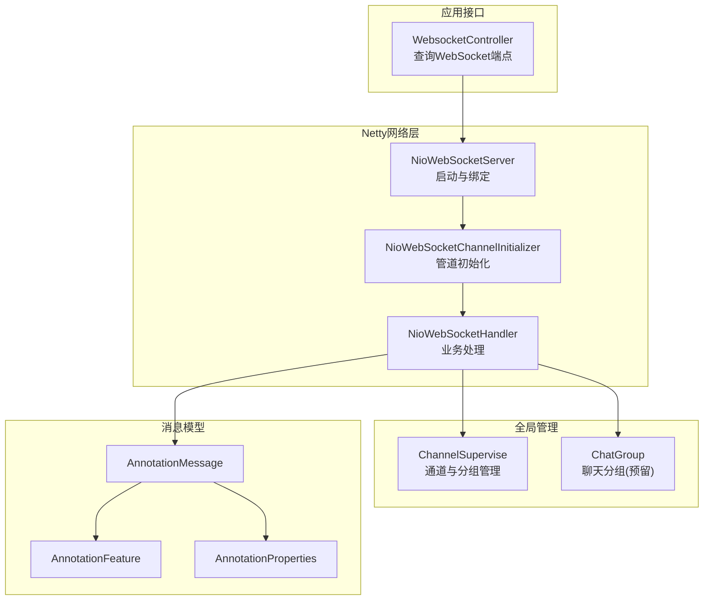
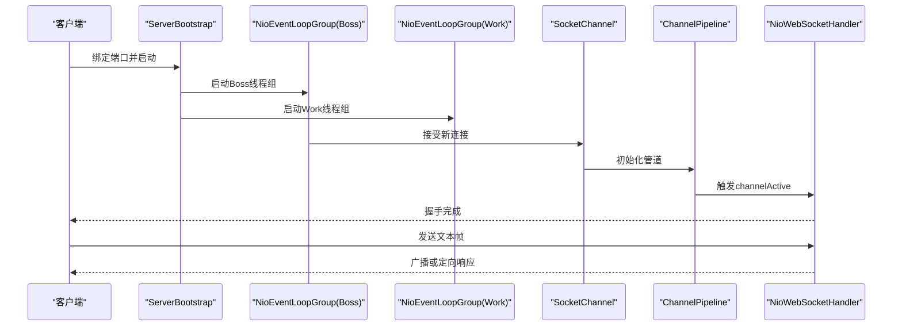
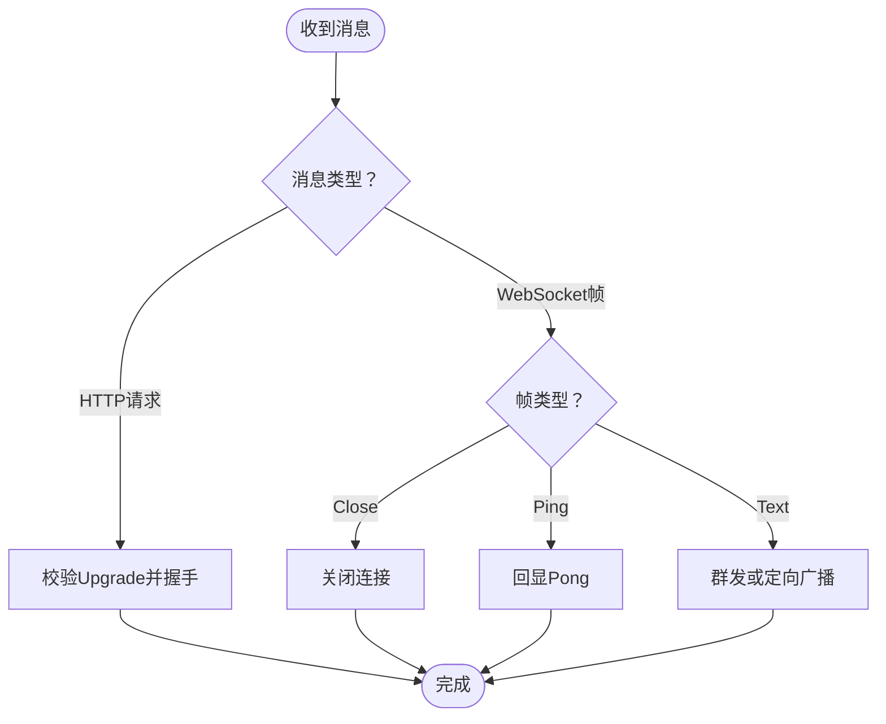
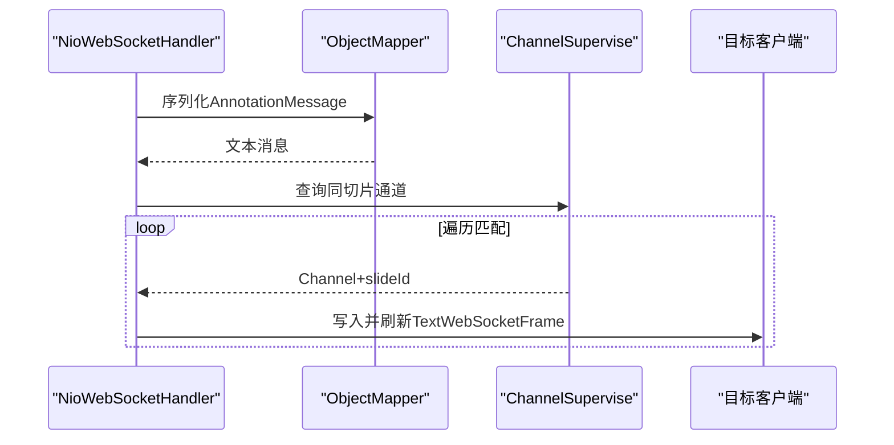
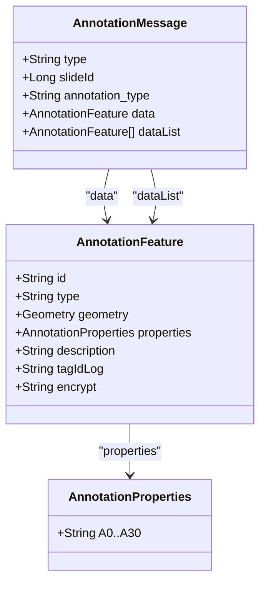
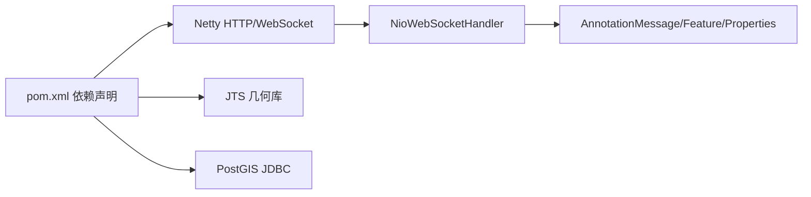

# WebSocket实时通信

<cite>
**本文引用的文件**
- [NioWebSocketServer.java](file://src/main/java/cn/staitech/annotation/netty/websocket/NioWebSocketServer.java)
- [NioWebSocketChannelInitializer.java](file://src/main/java/cn/staitech/annotation/netty/websocket/NioWebSocketChannelInitializer.java)
- [NioWebSocketHandler.java](file://src/main/java/cn/staitech/annotation/netty/websocket/NioWebSocketHandler.java)
- [ChannelSupervise.java](file://src/main/java/cn/staitech/annotation/netty/global/ChannelSupervise.java)
- [ChatGroup.java](file://src/main/java/cn/staitech/annotation/netty/global/ChatGroup.java)
- [AnnotationMessage.java](file://src/main/java/cn/staitech/annotation/netty/message/AnnotationMessage.java)
- [AnnotationFeature.java](file://src/main/java/cn/staitech/annotation/netty/message/AnnotationFeature.java)
- [AnnotationProperties.java](file://src/main/java/cn/staitech/annotation/netty/message/AnnotationProperties.java)
- [WebsocketController.java](file://src/main/java/cn/staitech/annotation/controller/WebsocketController.java)
- [bootstrap.yml](file://src/main/resources/bootstrap.yml)
- [pom.xml](file://pom.xml)
</cite>

## 目录
1. [引言](#引言)
2. [项目结构](#项目结构)
3. [核心组件](#核心组件)
4. [架构总览](#架构总览)
5. [组件详解](#组件详解)
6. [依赖关系分析](#依赖关系分析)
7. [性能与并发](#性能与并发)
8. [故障排查指南](#故障排查指南)
9. [结论](#结论)
10. [附录](#附录)

## 引言
本技术文档围绕医学图像标注系统的WebSocket实时通信子系统展开，重点解析基于Netty的高性能实现，涵盖NIO事件循环与线程模型、ChannelPipeline配置、消息编解码与连接生命周期管理；同时深入说明实时标注同步机制（消息广播、用户分组与状态同步）、并发连接处理能力（连接池、背压与资源限制），并提供性能优化建议（连接数控制、消息压缩、心跳机制）以及客户端集成、错误处理与调试技巧。

## 项目结构
该模块采用按功能域划分的组织方式，WebSocket相关代码集中在netty子包下，消息模型独立于网络层，便于扩展与测试；控制器提供对外的WebSocket端口查询接口，配合Spring Boot启动。

图示来源
- [NioWebSocketServer.java:1-44](file://src/main/java/cn/staitech/annotation/netty/websocket/NioWebSocketServer.java#L1-L44)
- [NioWebSocketChannelInitializer.java:1-30](file://src/main/java/cn/staitech/annotation/netty/websocket/NioWebSocketChannelInitializer.java#L1-L30)
- [NioWebSocketHandler.java:1-197](file://src/main/java/cn/staitech/annotation/netty/websocket/NioWebSocketHandler.java#L1-L197)
- [ChannelSupervise.java:1-45](file://src/main/java/cn/staitech/annotation/netty/global/ChannelSupervise.java#L1-L45)
- [ChatGroup.java:1-11](file://src/main/java/cn/staitech/annotation/netty/global/ChatGroup.java#L1-L11)
- [AnnotationMessage.java:1-28](file://src/main/java/cn/staitech/annotation/netty/message/AnnotationMessage.java#L1-L28)
- [AnnotationFeature.java:1-33](file://src/main/java/cn/staitech/annotation/netty/message/AnnotationFeature.java#L1-L33)
- [AnnotationProperties.java:1-75](file://src/main/java/cn/staitech/annotation/netty/message/AnnotationProperties.java#L1-L75)
- [WebsocketController.java:1-41](file://src/main/java/cn/staitech/annotation/controller/WebsocketController.java#L1-L41)

章节来源
- [NioWebSocketServer.java:1-44](file://src/main/java/cn/staitech/annotation/netty/websocket/NioWebSocketServer.java#L1-L44)
- [NioWebSocketChannelInitializer.java:1-30](file://src/main/java/cn/staitech/annotation/netty/websocket/NioWebSocketChannelInitializer.java#L1-L30)
- [NioWebSocketHandler.java:1-197](file://src/main/java/cn/staitech/annotation/netty/websocket/NioWebSocketHandler.java#L1-L197)
- [ChannelSupervise.java:1-45](file://src/main/java/cn/staitech/annotation/netty/global/ChannelSupervise.java#L1-L45)
- [ChatGroup.java:1-11](file://src/main/java/cn/staitech/annotation/netty/global/ChatGroup.java#L1-L11)
- [AnnotationMessage.java:1-28](file://src/main/java/cn/staitech/annotation/netty/message/AnnotationMessage.java#L1-L28)
- [AnnotationFeature.java:1-33](file://src/main/java/cn/staitech/annotation/netty/message/AnnotationFeature.java#L1-L33)
- [AnnotationProperties.java:1-75](file://src/main/java/cn/staitech/annotation/netty/message/AnnotationProperties.java#L1-L75)
- [WebsocketController.java:1-41](file://src/main/java/cn/staitech/annotation/controller/WebsocketController.java#L1-L41)

## 核心组件
- NioWebSocketServer：通过命令行启动器在应用启动时初始化NIO事件循环组，绑定端口并阻塞等待关闭。
- NioWebSocketChannelInitializer：构建ChannelPipeline，依次添加HTTP编解码、聚合器、分块写入与自定义业务处理器。
- NioWebSocketHandler：实现握手、消息收发、心跳、群发与按切片ID定向广播等逻辑。
- ChannelSupervise：维护在线通道集合、按切片ID映射通道，提供全量广播与单通道管理。
- ChatGroup：预留的聊天分组映射（当前未在WebSocket路径中使用）。
- AnnotationMessage/AnnotationFeature/AnnotationProperties：标注消息的数据模型，支持序列化为文本帧传输。
- WebsocketController：提供查询WebSocket端点的服务接口。

章节来源
- [NioWebSocketServer.java:14-41](file://src/main/java/cn/staitech/annotation/netty/websocket/NioWebSocketServer.java#L14-L41)
- [NioWebSocketChannelInitializer.java:13-28](file://src/main/java/cn/staitech/annotation/netty/websocket/NioWebSocketChannelInitializer.java#L13-L28)
- [NioWebSocketHandler.java:29-196](file://src/main/java/cn/staitech/annotation/netty/websocket/NioWebSocketHandler.java#L29-L196)
- [ChannelSupervise.java:17-44](file://src/main/java/cn/staitech/annotation/netty/global/ChannelSupervise.java#L17-L44)
- [ChatGroup.java:8-10](file://src/main/java/cn/staitech/annotation/netty/global/ChatGroup.java#L8-L10)
- [AnnotationMessage.java:14-27](file://src/main/java/cn/staitech/annotation/netty/message/AnnotationMessage.java#L14-L27)
- [AnnotationFeature.java:14-32](file://src/main/java/cn/staitech/annotation/netty/message/AnnotationFeature.java#L14-L32)
- [AnnotationProperties.java:12-74](file://src/main/java/cn/staitech/annotation/netty/message/AnnotationProperties.java#L12-L74)
- [WebsocketController.java:20-37](file://src/main/java/cn/staitech/annotation/controller/WebsocketController.java#L20-L37)

## 架构总览
WebSocket服务器采用经典的“主从多线程”模型：一个Boss线程组负责接受新连接，Worker线程组负责I/O读写。ChannelPipeline按职责拆分，HTTP编解码与聚合器用于完成WebSocket握手，随后由业务处理器接管消息流转。

图示来源
- [NioWebSocketServer.java:20-31](file://src/main/java/cn/staitech/annotation/netty/websocket/NioWebSocketServer.java#L20-L31)
- [NioWebSocketChannelInitializer.java:15-26](file://src/main/java/cn/staitech/annotation/netty/websocket/NioWebSocketChannelInitializer.java#L15-L26)
- [NioWebSocketHandler.java:108-121](file://src/main/java/cn/staitech/annotation/netty/websocket/NioWebSocketHandler.java#L108-L121)

## 组件详解

### Netty服务器与事件循环
- 事件循环组：Boss与Work各一个线程组，分别承担连接接受与I/O处理。
- 绑定与阻塞：启动后绑定端口并等待关闭信号，finally中优雅关闭。
- 端口来源：从配置文件读取netty.port。

章节来源
- [NioWebSocketServer.java:20-40](file://src/main/java/cn/staitech/annotation/netty/websocket/NioWebSocketServer.java#L20-L40)
- [bootstrap.yml:1-42](file://src/main/resources/bootstrap.yml#L1-L42)

### ChannelPipeline与编解码
- 日志处理器：便于调试与观测请求流。
- HTTP编解码器：支持HTTP升级为WebSocket。
- 聚合器：限制最大消息体大小，避免内存滥用。
- 分块写入：支持大对象的分块传输。
- 自定义业务处理器：承载握手、消息收发与广播逻辑。

章节来源
- [NioWebSocketChannelInitializer.java:15-26](file://src/main/java/cn/staitech/annotation/netty/websocket/NioWebSocketChannelInitializer.java#L15-L26)

### 连接生命周期与握手
- 握手：校验Upgrade头，构造Handshaker并完成握手；根据URI路径区分连接类型（如切片）并记录切片ID。
- 生命周期：channelActive时加入全局通道集合；channelInactive时移除并清理切片映射。
- 关闭与心跳：Close帧触发关闭，Ping帧自动回显Pong。

图示来源
- [NioWebSocketHandler.java:94-194](file://src/main/java/cn/staitech/annotation/netty/websocket/NioWebSocketHandler.java#L94-L194)

### 实时标注同步机制
- 群发：通过ChannelGroup对所有活跃连接广播。
- 定向广播：基于切片ID映射，仅向属于同一切片的连接发送消息。
- 消息模型：AnnotationMessage封装type、slideId、标注类型与数据，支持单条与列表两种形态。

图示来源
- [NioWebSocketHandler.java:38-68](file://src/main/java/cn/staitech/annotation/netty/websocket/NioWebSocketHandler.java#L38-L68)
- [ChannelSupervise.java:19-43](file://src/main/java/cn/staitech/annotation/netty/global/ChannelSupervise.java#L19-L43)
- [AnnotationMessage.java:14-27](file://src/main/java/cn/staitech/annotation/netty/message/AnnotationMessage.java#L14-L27)

### 消息模型与数据结构
- AnnotationMessage：包含消息类型、切片ID、标注类型、单条数据与数据列表字段。
- AnnotationFeature：包含几何体、属性、描述等字段，支持序列化传输。
- AnnotationProperties：大量键值对属性，承载标注元数据。

图示来源
- [AnnotationMessage.java:14-27](file://src/main/java/cn/staitech/annotation/netty/message/AnnotationMessage.java#L14-L27)
- [AnnotationFeature.java:14-32](file://src/main/java/cn/staitech/annotation/netty/message/AnnotationFeature.java#L14-L32)
- [AnnotationProperties.java:12-74](file://src/main/java/cn/staitech/annotation/netty/message/AnnotationProperties.java#L12-L74)

### 控制器与端点暴露
- 提供查询WebSocket端点的REST接口，结合本地IP与配置端口生成ws地址，便于前端集成。

章节来源
- [WebsocketController.java:20-37](file://src/main/java/cn/staitech/annotation/controller/WebsocketController.java#L20-L37)

## 依赖关系分析
- Netty依赖：使用HTTP编解码与WebSocket相关组件，版本在pom中声明。
- Spring生态：通过CommandLineRunner启动服务器，通过注解注入ObjectMapper与控制器。
- 外部库：JTS几何库用于几何表达，PostGIS JDBC用于数据库扩展。

图示来源
- [pom.xml:82-110](file://pom.xml#L82-L110)
- [NioWebSocketHandler.java:31-32](file://src/main/java/cn/staitech/annotation/netty/websocket/NioWebSocketHandler.java#L31-L32)
- [AnnotationMessage.java:14-27](file://src/main/java/cn/staitech/annotation/netty/message/AnnotationMessage.java#L14-L27)

章节来源
- [pom.xml:82-110](file://pom.xml#L82-L110)

## 性能与并发

### NIO事件循环与线程模型
- 主从多线程：Boss线程组仅处理连接接入，Work线程组处理I/O，降低锁竞争。
- 无阻塞I/O：基于Channel的异步读写，适合高并发场景。
- 线程数量：默认1个Boss与1个Work，可根据CPU核数与负载调优。

章节来源
- [NioWebSocketServer.java:22-23](file://src/main/java/cn/staitech/annotation/netty/websocket/NioWebSocketServer.java#L22-L23)

### ChannelPipeline与背压
- 聚合器限制消息大小，防止内存溢出。
- writeAndFlush异步写入，结合Netty的背压机制，避免生产者过快导致消费者积压。
- 建议：对高频标注消息进行批处理与合并，减少帧数量。

章节来源
- [NioWebSocketChannelInitializer.java:20-24](file://src/main/java/cn/staitech/annotation/netty/websocket/NioWebSocketChannelInitializer.java#L20-L24)
- [NioWebSocketHandler.java:133-135](file://src/main/java/cn/staitech/annotation/netty/websocket/NioWebSocketHandler.java#L133-L135)

### 广播与定向同步
- 全量广播：ChannelGroup高效批量写入。
- 切片定向：基于ConcurrentMap按slideId筛选，遍历代价与在线人数成正比。
- 优化建议：引入更细粒度的分组容器（如按项目/医生/任务）以降低遍历成本。

章节来源
- [ChannelSupervise.java:19-43](file://src/main/java/cn/staitech/annotation/netty/global/ChannelSupervise.java#L19-L43)
- [NioWebSocketHandler.java:56-65](file://src/main/java/cn/staitech/annotation/netty/websocket/NioWebSocketHandler.java#L56-L65)

### 连接数控制与资源限制
- 连接池：当前未实现连接池，建议在上层网关或反向代理层做限流与连接复用。
- 资源限制：聚合器上限、心跳检测、空闲连接清理可避免资源泄露。
- 心跳机制：服务端对Ping自动Pong，建议客户端定期发送Ping维持存活。

章节来源
- [NioWebSocketHandler.java:144-146](file://src/main/java/cn/staitech/annotation/netty/websocket/NioWebSocketHandler.java#L144-L146)

### 消息压缩与序列化
- 当前使用JSON序列化，建议在高吞吐场景启用GZIP压缩或二进制协议（如CBOR/ProtoBuf）以降低带宽。
- 对几何数据（JTS）可考虑压缩传输或简化几何精度。

章节来源
- [NioWebSocketHandler.java:43-54](file://src/main/java/cn/staitech/annotation/netty/websocket/NioWebSocketHandler.java#L43-L54)
- [AnnotationFeature.java:16-23](file://src/main/java/cn/staitech/annotation/netty/message/AnnotationFeature.java#L16-L23)

## 故障排查指南

### 常见问题定位
- 握手失败：检查Upgrade头与URI路径，确认工厂创建Handshaker是否成功。
- 消息无法接收：确认是否为Text帧，非文本帧会被拒绝。
- 广播无效：检查ChannelSupervise中的通道集合与切片映射是否正确更新。
- 序列化异常：关注ObjectMapper异常日志，排查消息模型字段合法性。

章节来源
- [NioWebSocketHandler.java:167-194](file://src/main/java/cn/staitech/annotation/netty/websocket/NioWebSocketHandler.java#L167-L194)
- [NioWebSocketHandler.java:148-152](file://src/main/java/cn/staitech/annotation/netty/websocket/NioWebSocketHandler.java#L148-L152)
- [NioWebSocketHandler.java:43-54](file://src/main/java/cn/staitech/annotation/netty/websocket/NioWebSocketHandler.java#L43-L54)

### 日志与调试
- 开启LoggingHandler以观察HTTP与WebSocket阶段的处理流程。
- 在开发环境适当提高日志级别，定位握手与消息收发瓶颈。

章节来源
- [NioWebSocketChannelInitializer.java:17-18](file://src/main/java/cn/staitech/annotation/netty/websocket/NioWebSocketChannelInitializer.java#L17-L18)

### 客户端集成要点
- 端点获取：通过WebsocketController提供的接口获取ws地址。
- 连接建立：遵循HTTP升级为WebSocket的握手流程，携带必要的头部。
- 心跳与重连：实现Ping/Pong与指数退避重连策略。

章节来源
- [WebsocketController.java:27-37](file://src/main/java/cn/staitech/annotation/controller/WebsocketController.java#L27-L37)
- [NioWebSocketHandler.java:175-190](file://src/main/java/cn/staitech/annotation/netty/websocket/NioWebSocketHandler.java#L175-L190)

## 结论
该WebSocket子系统以Netty为核心，实现了从握手、消息编解码到广播与定向同步的完整链路。通过合理的Pipeline配置与并发模型，满足医学图像标注的实时性需求。后续可在连接池、消息压缩、分组容器与资源治理方面进一步优化，以支撑更大规模的并发与更高吞吐。

## 附录

### 配置项参考
- netty.port：WebSocket监听端口（来自配置文件）
- 日志级别：可通过调整LoggingHandler级别辅助诊断

章节来源
- [bootstrap.yml:1-42](file://src/main/resources/bootstrap.yml#L1-L42)
- [NioWebSocketChannelInitializer.java:17-18](file://src/main/java/cn/staitech/annotation/netty/websocket/NioWebSocketChannelInitializer.java#L17-L18)