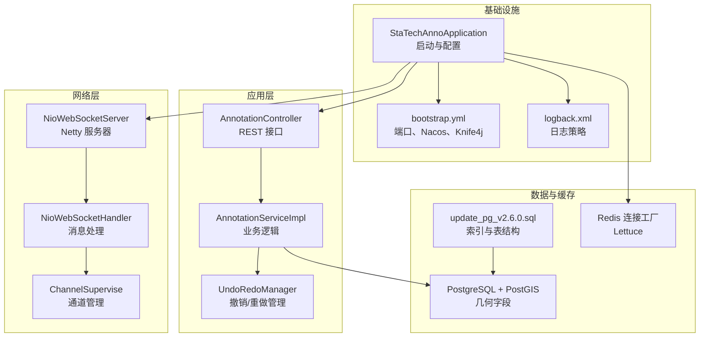
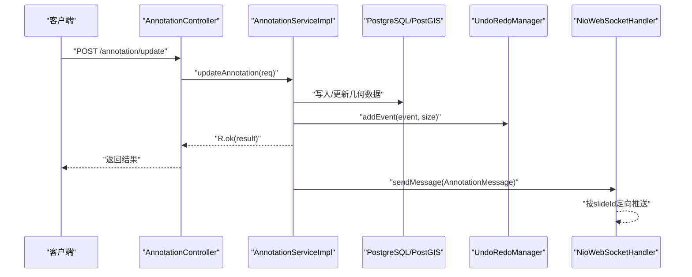
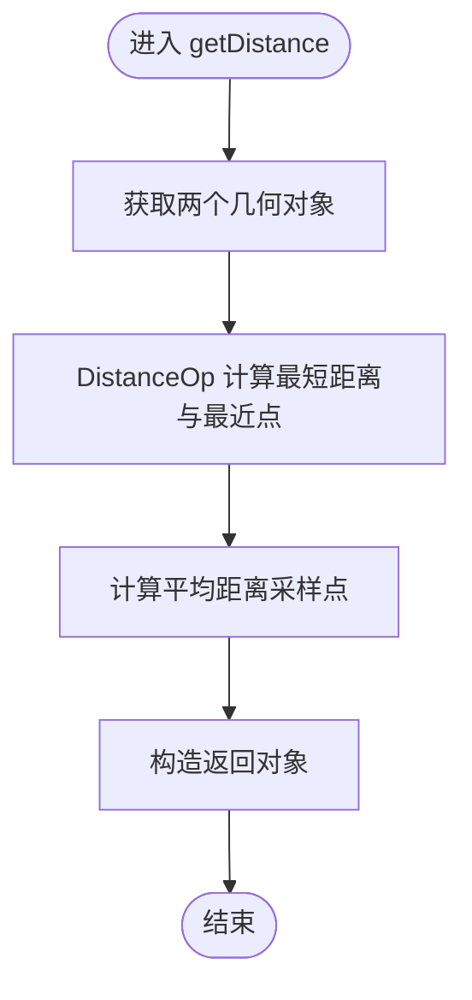
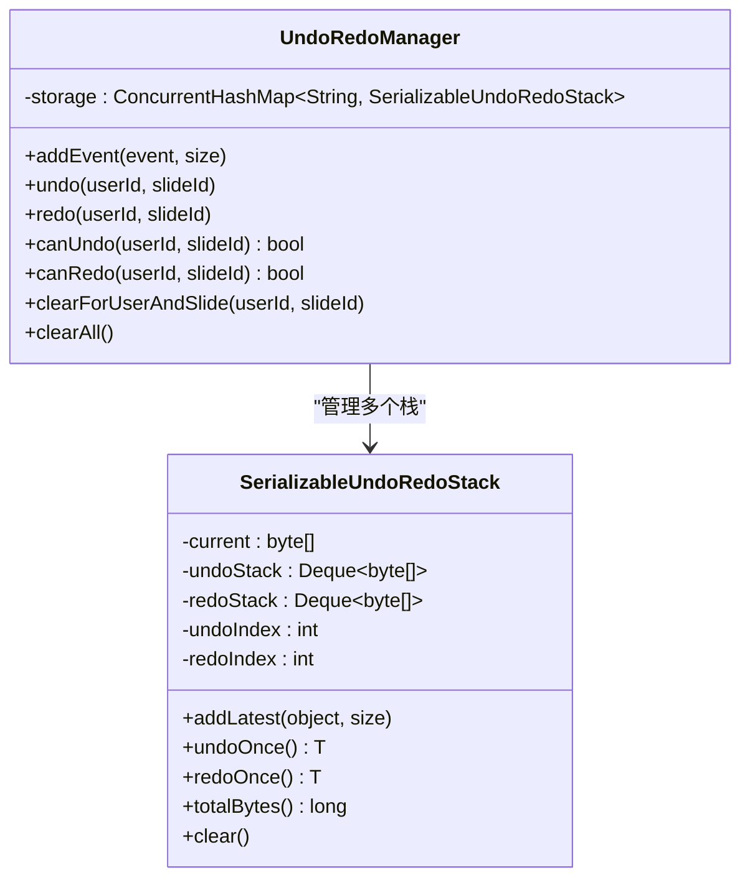
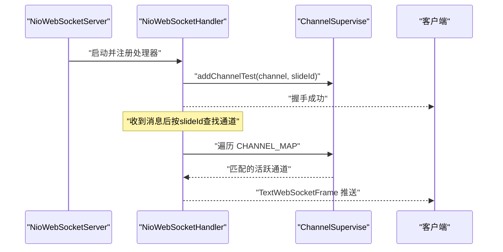
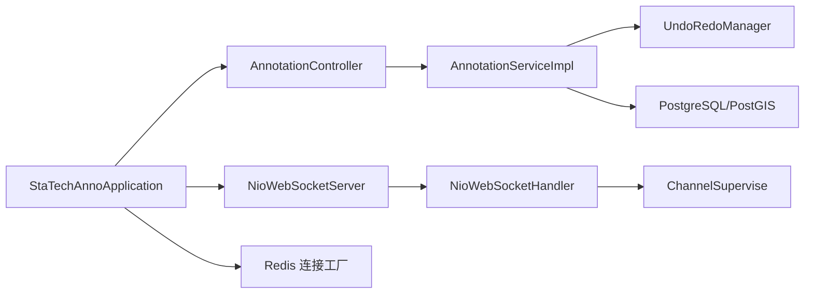

# 性能优化策略

<cite>
**本文引用的文件**
- [StaTechAnnoApplication.java](file://src/main/java/cn/staitech/annotation/StaTechAnnoApplication.java)
- [bootstrap.yml](file://src/main/resources/bootstrap.yml)
- [pom.xml](file://pom.xml)
- [InitializinConfig.java](file://src/main/java/cn/staitech/annotation/config/InitializinConfig.java)
- [NioWebSocketServer.java](file://src/main/java/cn/staitech/annotation/netty/websocket/NioWebSocketServer.java)
- [NioWebSocketHandler.java](file://src/main/java/cn/staitech/annotation/netty/websocket/NioWebSocketHandler.java)
- [ChannelSupervise.java](file://src/main/java/cn/staitech/annotation/netty/global/ChannelSupervise.java)
- [AnnotationController.java](file://src/main/java/cn/staitech/annotation/controller/AnnotationController.java)
- [AnnotationServiceImpl.java](file://src/main/java/cn/staitech/annotation/service/impl/AnnotationServiceImpl.java)
- [UndoRedoManager.java](file://src/main/java/cn/staitech/annotation/utils/annotation/UndoRedoManager.java)
- [SerializableUndoRedoStack.java](file://src/main/java/cn/staitech/annotation/utils/annotation/SerializableUndoRedoStack.java)
- [Constant.java](file://src/main/java/cn/staitech/annotation/constant/Constant.java)
- [logback.xml](file://src/main/resources/logback.xml)
- [update_pg_v2.6.0.sql](file://sql/update_pg_v2.6.0.sql)
- [AnnotationMapper.xml](file://src/main/resources/mapper/AnnotationMapper.xml)
</cite>

## 目录
1. [简介](#简介)
2. [项目结构](#项目结构)
3. [核心组件](#核心组件)
4. [架构总览](#架构总览)
5. [详细组件分析](#详细组件分析)
6. [依赖分析](#依赖分析)
7. [性能考虑](#性能考虑)
8. [故障排查指南](#故障排查指南)
9. [结论](#结论)
10. [附录](#附录)

## 简介
本文件面向医学图像标注系统，提供一套系统化的性能优化策略，覆盖性能瓶颈识别、内存与CPU监控、数据库查询优化、缓存设计与失效策略、并发与异步处理、内存管理最佳实践，以及面向系统管理员的监控指标、性能基准测试与容量规划建议。内容基于代码库的实际实现进行提炼与扩展，帮助在高并发、大数据几何运算场景下稳定提升系统吞吐与响应质量。

## 项目结构
系统采用Spring Boot + MyBatis Plus + Netty 的组合：
- 启动与配置：应用入口、Actuator、分页拦截器、国际化、Nacos配置与发现
- 控制层：标注接口控制器，提供增删改查、批量操作、撤销/重做等REST接口
- 业务层：标注服务实现，包含几何运算、批量处理、撤销/重做栈管理
- 网络层：Netty WebSocket服务与处理器，负责实时消息推送
- 缓存与连接：Redis连接工厂初始化，启用连接校验
- 数据层：PostgreSQL + PostGIS 几何字段，配套索引与迁移脚本

图表来源
- [StaTechAnnoApplication.java:1-51](file://src/main/java/cn/staitech/annotation/StaTechAnnoApplication.java#L1-L51)
- [AnnotationController.java:1-251](file://src/main/java/cn/staitech/annotation/controller/AnnotationController.java#L1-L251)
- [AnnotationServiceImpl.java:1-724](file://src/main/java/cn/staitech/annotation/service/impl/AnnotationServiceImpl.java#L1-L724)
- [NioWebSocketServer.java:1-44](file://src/main/java/cn/staitech/annotation/netty/websocket/NioWebSocketServer.java#L1-L44)
- [NioWebSocketHandler.java:1-197](file://src/main/java/cn/staitech/annotation/netty/websocket/NioWebSocketHandler.java#L1-L197)
- [ChannelSupervise.java:1-45](file://src/main/java/cn/staitech/annotation/netty/global/ChannelSupervise.java#L1-L45)
- [InitializinConfig.java:1-31](file://src/main/java/cn/staitech/annotation/config/InitializinConfig.java#L1-L31)
- [bootstrap.yml:1-42](file://src/main/resources/bootstrap.yml#L1-L42)
- [logback.xml:1-101](file://src/main/resources/logback.xml#L1-L101)
- [update_pg_v2.6.0.sql:1-245](file://sql/update_pg_v2.6.0.sql#L1-L245)

章节来源
- [StaTechAnnoApplication.java:1-51](file://src/main/java/cn/staitech/annotation/StaTechAnnoApplication.java#L1-L51)
- [bootstrap.yml:1-42](file://src/main/resources/bootstrap.yml#L1-L42)

## 核心组件
- 应用启动与配置
  - 启用异步、事务、MyBatis分页、国际化、Nacos发现与配置、Knife4j
  - 默认时区设置为亚洲/上海
- 控制器
  - 提供标注增删改、批量、合并预览、几何距离计算、撤销/重做等接口
- 服务实现
  - 几何运算（DistanceOp、union/difference）、批量处理、撤销/重做栈
- Netty WebSocket
  - 自定义事件循环组、通道管理、按切片ID定向推送
- 缓存与连接
  - Lettuce Redis连接工厂启用连接校验
- 数据层
  - PostgreSQL + PostGIS，几何字段与索引；迁移脚本定义索引

章节来源
- [AnnotationController.java:1-251](file://src/main/java/cn/staitech/annotation/controller/AnnotationController.java#L1-L251)
- [AnnotationServiceImpl.java:1-724](file://src/main/java/cn/staitech/annotation/service/impl/AnnotationServiceImpl.java#L1-L724)
- [NioWebSocketServer.java:1-44](file://src/main/java/cn/staitech/annotation/netty/websocket/NioWebSocketServer.java#L1-L44)
- [NioWebSocketHandler.java:1-197](file://src/main/java/cn/staitech/annotation/netty/websocket/NioWebSocketHandler.java#L1-L197)
- [ChannelSupervise.java:1-45](file://src/main/java/cn/staitech/annotation/netty/global/ChannelSupervise.java#L1-L45)
- [InitializinConfig.java:1-31](file://src/main/java/cn/staitech/annotation/config/InitializinConfig.java#L1-L31)
- [update_pg_v2.6.0.sql:1-245](file://sql/update_pg_v2.6.0.sql#L1-L245)

## 架构总览
系统通过REST接口接收标注操作请求，服务层完成几何计算与数据库写入，同时维护撤销/重做栈；Netty WebSocket负责向特定切片的客户端推送变更消息。Redis作为可选缓存层，连接工厂启用连接校验以保证稳定性。

图表来源
- [AnnotationController.java:90-110](file://src/main/java/cn/staitech/annotation/controller/AnnotationController.java#L90-L110)
- [AnnotationServiceImpl.java:329-440](file://src/main/java/cn/staitech/annotation/service/impl/AnnotationServiceImpl.java#L329-L440)
- [UndoRedoManager.java:42-61](file://src/main/java/cn/staitech/annotation/utils/annotation/UndoRedoManager.java#L42-L61)
- [NioWebSocketHandler.java:38-68](file://src/main/java/cn/staitech/annotation/netty/websocket/NioWebSocketHandler.java#L38-L68)

## 详细组件分析

### 组件A：标注服务与几何运算
- 关键职责
  - 几何距离计算、轮廓合并预览、几何运算（并/差）、批量处理、撤销/重做
  - 与远程服务交互以生成标签ID与日志
- 性能关注点
  - JTS DistanceOp与多点采样可能带来O(n*m)复杂度
  - 大面积极值计算与长度计算需注意精度与单位换算
  - 批量操作中逐条处理与事务边界
- 优化建议
  - 对频繁几何运算引入缓存（见“缓存策略”）
  - 对批量操作使用批处理与分页，减少事务跨度
  - 对采样点数进行上限控制，避免极端几何导致的高复杂度

图表来源
- [AnnotationServiceImpl.java:140-181](file://src/main/java/cn/staitech/annotation/service/impl/AnnotationServiceImpl.java#L140-L181)

章节来源
- [AnnotationServiceImpl.java:140-181](file://src/main/java/cn/staitech/annotation/service/impl/AnnotationServiceImpl.java#L140-L181)
- [Constant.java:30-31](file://src/main/java/cn/staitech/annotation/constant/Constant.java#L30-L31)

### 组件B：撤销/重做栈（内存序列化）
- 设计要点
  - 基于ConcurrentHashMap按用户+切片维度隔离栈
  - 使用自定义可序列化栈，保存当前状态与undo/redo字节数组
  - 定时清理全量历史，避免内存膨胀
- 性能影响
  - 序列化/反序列化成本随状态大小增长
  - 内存占用与历史深度成正比
- 优化建议
  - 限制历史深度（当前使用常量），结合可用内存阈值动态调整
  - 对大体量状态采用增量快照或压缩策略
  - 定期GC与内存估算，必要时清理过期用户切片栈

图表来源
- [UndoRedoManager.java:1-97](file://src/main/java/cn/staitech/annotation/utils/annotation/UndoRedoManager.java#L1-L97)
- [SerializableUndoRedoStack.java:1-246](file://src/main/java/cn/staitech/annotation/utils/annotation/SerializableUndoRedoStack.java#L1-L246)

章节来源
- [UndoRedoManager.java:1-97](file://src/main/java/cn/staitech/annotation/utils/annotation/UndoRedoManager.java#L1-L97)
- [SerializableUndoRedoStack.java:1-246](file://src/main/java/cn/staitech/annotation/utils/annotation/SerializableUndoRedoStack.java#L1-L246)

### 组件C：Netty WebSocket 实时推送
- 设计要点
  - 单端口监听，按URI区分切片类型与目标slideId
  - 使用ChannelSupervise维护通道与slideId映射，定向推送
- 性能影响
  - 广播与定向推送均涉及序列化与写缓冲
  - 大量通道时需关注写队列与背压
- 优化建议
  - 对推送消息进行聚合（如批量合并），降低序列化次数
  - 限制单切片并发通道数量，避免广播风暴
  - 结合Netty背压与线程模型调优

图表来源
- [NioWebSocketServer.java:1-44](file://src/main/java/cn/staitech/annotation/netty/websocket/NioWebSocketServer.java#L1-L44)
- [NioWebSocketHandler.java:1-197](file://src/main/java/cn/staitech/annotation/netty/websocket/NioWebSocketHandler.java#L1-L197)
- [ChannelSupervise.java:1-45](file://src/main/java/cn/staitech/annotation/netty/global/ChannelSupervise.java#L1-L45)

章节来源
- [NioWebSocketServer.java:1-44](file://src/main/java/cn/staitech/annotation/netty/websocket/NioWebSocketServer.java#L1-L44)
- [NioWebSocketHandler.java:1-197](file://src/main/java/cn/staitech/annotation/netty/websocket/NioWebSocketHandler.java#L1-L197)
- [ChannelSupervise.java:1-45](file://src/main/java/cn/staitech/annotation/netty/global/ChannelSupervise.java#L1-L45)

### 组件D：数据库与索引
- 表结构与索引
  - fr_annotation：geometry字段、annotation_type、slide_id索引
  - fr_measure：geometry字段、slide_id、location_type、measure_full_name索引
- 查询优化建议
  - 使用PostGIS函数对geometry字段建立GiST索引（已具备）
  - 针对高频查询条件（slide_id、annotation_type、location_type）评估复合索引
  - 分页查询配合LIMIT/OFFSET，避免一次性拉取海量几何

章节来源
- [update_pg_v2.6.0.sql:20-24](file://sql/update_pg_v2.6.0.sql#L20-L24)
- [update_pg_v2.6.0.sql:136-138](file://sql/update_pg_v2.6.0.sql#L136-L138)

## 依赖分析
- 外部依赖
  - Spring Cloud Alibaba（Nacos发现与配置）
  - Spring Boot Actuator（健康检查与指标暴露）
  - Netty（WebSocket服务器）
  - PostGIS（几何类型与函数）
  - Knife4j（接口文档）
- 内部耦合
  - 控制器依赖服务实现
  - 服务实现依赖远程服务、WebSocket处理器、撤销/重做管理器
  - 应用启动配置贯穿全局（异步、事务、MyBatis分页）

图表来源
- [StaTechAnnoApplication.java:1-51](file://src/main/java/cn/staitech/annotation/StaTechAnnoApplication.java#L1-L51)
- [AnnotationController.java:1-251](file://src/main/java/cn/staitech/annotation/controller/AnnotationController.java#L1-L251)
- [AnnotationServiceImpl.java:1-724](file://src/main/java/cn/staitech/annotation/service/impl/AnnotationServiceImpl.java#L1-L724)
- [NioWebSocketServer.java:1-44](file://src/main/java/cn/staitech/annotation/netty/websocket/NioWebSocketServer.java#L1-L44)
- [NioWebSocketHandler.java:1-197](file://src/main/java/cn/staitech/annotation/netty/websocket/NioWebSocketHandler.java#L1-L197)
- [ChannelSupervise.java:1-45](file://src/main/java/cn/staitech/annotation/netty/global/ChannelSupervise.java#L1-L45)
- [InitializinConfig.java:1-31](file://src/main/java/cn/staitech/annotation/config/InitializinConfig.java#L1-L31)

章节来源
- [pom.xml:19-134](file://pom.xml#L19-L134)

## 性能考虑

### 1. 性能瓶颈识别方法
- 内存使用分析
  - 观察撤销/重做栈内存占用（totalBytes估算），结合JVM堆使用率
  - Netty通道与消息缓冲区大小，避免堆积
- CPU负载监控
  - JTS几何运算（DistanceOp、union/difference）的耗时占比
  - WebSocket序列化与广播写入的CPU消耗
- 数据库查询优化
  - EXPLAIN ANALYZE 分析高频查询（按slide_id、annotation_type、location_type）
  - PostGIS空间函数的索引利用情况
  - 分页与LIMIT策略对内存与CPU的影响

章节来源
- [SerializableUndoRedoStack.java:61-70](file://src/main/java/cn/staitech/annotation/utils/annotation/SerializableUndoRedoStack.java#L61-L70)
- [NioWebSocketHandler.java:38-68](file://src/main/java/cn/staitech/annotation/netty/websocket/NioWebSocketHandler.java#L38-L68)
- [update_pg_v2.6.0.sql:20-24](file://sql/update_pg_v2.6.0.sql#L20-L24)

### 2. 缓存策略设计与实现
- Redis集成
  - 已启用Lettuce连接工厂并开启连接校验，确保连接可用性
  - 建议在热点查询（如按slideId批量标注列表）引入本地缓存（ConcurrentHashMap）与Redis双层缓存
- 本地缓存
  - 按slideId维度缓存标注列表与标签元数据，设置TTL与LFU淘汰
- 缓存失效机制
  - 写操作（新增/更新/删除）主动失效对应slideId缓存
  - 定时清理过期缓存，避免长期驻留

章节来源
- [InitializinConfig.java:23-28](file://src/main/java/cn/staitech/annotation/config/InitializinConfig.java#L23-L28)
- [AnnotationController.java:140-153](file://src/main/java/cn/staitech/annotation/controller/AnnotationController.java#L140-L153)

### 3. 数据库性能优化技术
- 索引优化
  - 已有annotation_type、slide_id、location_type、measure_full_name等索引
  - 建议针对高频过滤条件组合建立复合索引（如slide_id+annotation_type）
- 查询计划分析
  - 使用EXPLAIN ANALYZE对比优化前后执行计划
  - 关注Nested Loop、Hash Join、Seq Scan与Index Scan的选择
- 连接池配置
  - 建议在生产环境配置连接池大小、超时与空闲回收策略，避免连接争用

章节来源
- [update_pg_v2.6.0.sql:20-24](file://sql/update_pg_v2.6.0.sql#L20-L24)
- [update_pg_v2.6.0.sql:136-138](file://sql/update_pg_v2.6.0.sql#L136-L138)

### 4. 并发处理优化方案
- 线程池配置
  - 启用异步（@EnableAsync），为耗时任务（如远程服务调用、几何计算）配置独立线程池
- 异步处理
  - 将WebSocket推送与撤销/重做栈序列化放入异步线程，避免阻塞主线程
- 资源竞争避免
  - 撤销/重做栈使用ConcurrentHashMap隔离用户+切片维度
  - Netty事件循环组分离boss与worker，避免I/O阻塞

章节来源
- [StaTechAnnoApplication.java:31-33](file://src/main/java/cn/staitech/annotation/StaTechAnnoApplication.java#L31-L33)
- [UndoRedoManager.java:21-37](file://src/main/java/cn/staitech/annotation/utils/annotation/UndoRedoManager.java#L21-L37)
- [NioWebSocketServer.java:22-23](file://src/main/java/cn/staitech/annotation/netty/websocket/NioWebSocketServer.java#L22-L23)

### 5. 内存管理最佳实践
- 对象池化
  - JTS Geometry对象复用（如GeometryFactory），避免频繁创建
- 垃圾回收调优
  - 设置合适的堆大小与GC策略，观察Full GC频率
- 内存泄漏检测
  - 定期检查撤销/重做栈内存占用与历史深度
  - Netty通道集合与消息缓冲区的泄漏排查

章节来源
- [AnnotationServiceImpl.java:62-113](file://src/main/java/cn/staitech/annotation/service/impl/AnnotationServiceImpl.java#L62-L113)
- [SerializableUndoRedoStack.java:230-243](file://src/main/java/cn/staitech/annotation/utils/annotation/SerializableUndoRedoStack.java#L230-L243)

### 6. 监控指标配置、基准测试与容量规划
- 监控指标
  - Actuator暴露JVM、HTTP、业务指标，结合Prometheus/Grafana
  - 关键指标：请求延迟、错误率、队列长度、连接数、GC时间
- 性能基准测试
  - 几何运算：不同复杂度的Polygon/LineString集合，测量DistanceOp与union/difference耗时
  - 并发场景：多用户同时标注、批量操作、WebSocket推送
- 容量规划
  - 基于峰值QPS与P99延迟，估算CPU、内存、连接池与数据库连接数
  - Netty线程数与事件循环组规模，结合CPU核数与I/O特性

章节来源
- [bootstrap.yml:38-41](file://src/main/resources/bootstrap.yml#L38-L41)
- [logback.xml:1-101](file://src/main/resources/logback.xml#L1-L101)

## 故障排查指南
- WebSocket推送异常
  - 检查通道是否活跃、是否按slideId正确绑定
  - 查看序列化异常与写缓冲溢出
- 撤销/重做失败
  - 检查序列化/反序列化异常与内存估算不足导致的历史栈清理
- 数据库慢查询
  - 使用EXPLAIN ANALYZE定位未命中索引的查询
  - 调整WHERE条件顺序与LIMIT策略
- Redis连接问题
  - 确认Lettuce连接工厂校验已启用，检查网络连通性与密码配置

章节来源
- [NioWebSocketHandler.java:44-54](file://src/main/java/cn/staitech/annotation/netty/websocket/NioWebSocketHandler.java#L44-L54)
- [UndoRedoManager.java:89-94](file://src/main/java/cn/staitech/annotation/utils/annotation/UndoRedoManager.java#L89-L94)
- [InitializinConfig.java:23-28](file://src/main/java/cn/staitech/annotation/config/InitializinConfig.java#L23-L28)
- [update_pg_v2.6.0.sql:20-24](file://sql/update_pg_v2.6.0.sql#L20-L24)

## 结论
通过识别内存、CPU与数据库瓶颈，结合缓存、并发与内存管理优化，系统可在高并发与复杂几何运算场景下保持稳定与高性能。建议优先实施索引优化与查询计划分析，配合Redis双层缓存与异步处理，持续监控关键指标并进行容量规划。

## 附录
- 常量与配置参考
  - 图像分辨率与单位换算常量
  - 撤销/重做历史深度常量
  - Netty端口读取（由配置文件注入）

章节来源
- [Constant.java:30-61](file://src/main/java/cn/staitech/annotation/constant/Constant.java#L30-L61)
- [NioWebSocketServer.java:16-17](file://src/main/java/cn/staitech/annotation/netty/websocket/NioWebSocketServer.java#L16-L17)
- [bootstrap.yml:1-42](file://src/main/resources/bootstrap.yml#L1-L42)