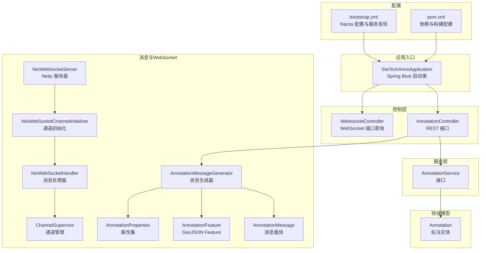
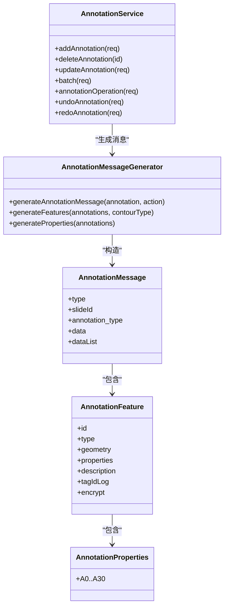
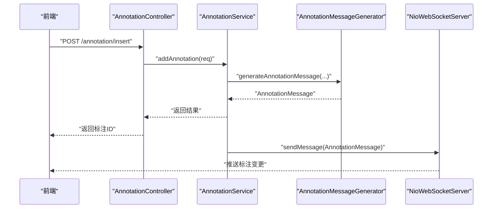
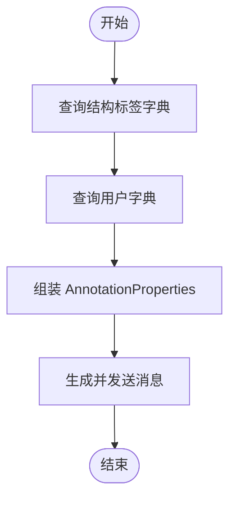
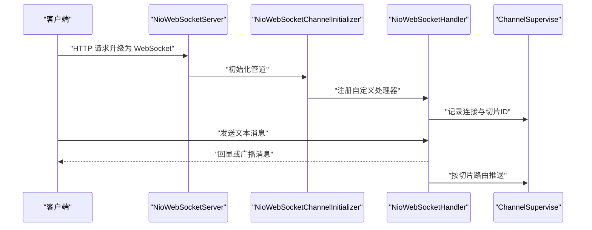
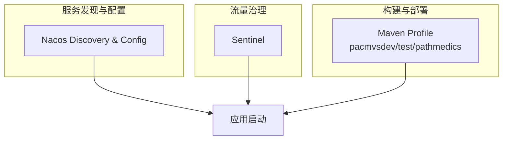
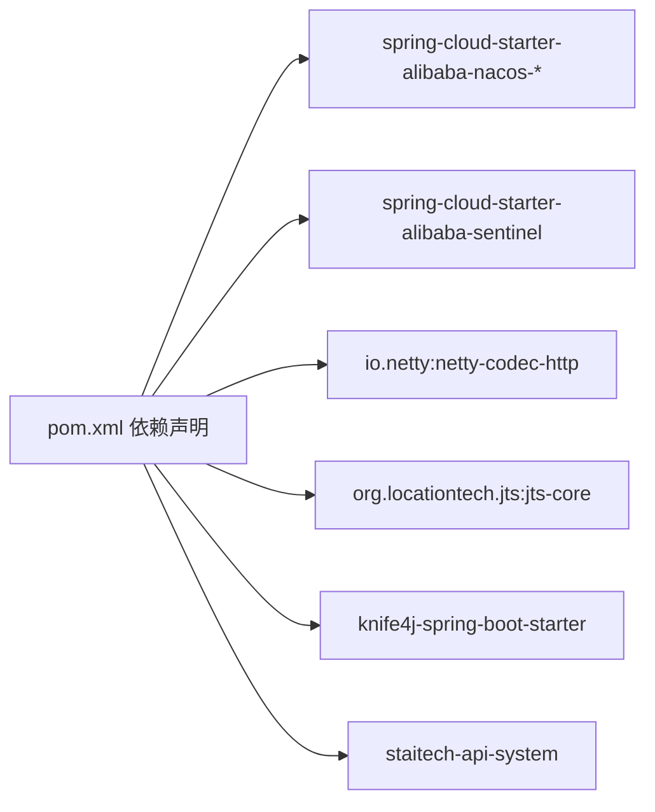

# 扩展开发指南

<cite>
**本文引用的文件**
- [StaTechAnnoApplication.java](file://src/main/java/cn/staitech/annotation/StaTechAnnoApplication.java)
- [AnnotationController.java](file://src/main/java/cn/staitech/annotation/controller/AnnotationController.java)
- [WebsocketController.java](file://src/main/java/cn/staitech/annotation/controller/WebsocketController.java)
- [AnnotationService.java](file://src/main/java/cn/staitech/annotation/service/AnnotationService.java)
- [Annotation.java](file://src/main/java/cn/staitech/annotation/domain/Annotation.java)
- [AnnotationMessage.java](file://src/main/java/cn/staitech/annotation/netty/message/AnnotationMessage.java)
- [AnnotationFeature.java](file://src/main/java/cn/staitech/annotation/netty/message/AnnotationFeature.java)
- [AnnotationProperties.java](file://src/main/java/cn/staitech/annotation/netty/message/AnnotationProperties.java)
- [AnnotationMessageGenerator.java](file://src/main/java/cn/staitech/annotation/utils/annotation/AnnotationMessageGenerator.java)
- [NioWebSocketServer.java](file://src/main/java/cn/staitech/annotation/netty/websocket/NioWebSocketServer.java)
- [NioWebSocketHandler.java](file://src/main/java/cn/staitech/annotation/netty/websocket/NioWebSocketHandler.java)
- [NioWebSocketChannelInitializer.java](file://src/main/java/cn/staitech/annotation/netty/websocket/NioWebSocketChannelInitializer.java)
- [ChannelSupervise.java](file://src/main/java/cn/staitech/annotation/netty/global/ChannelSupervise.java)
- [bootstrap.yml](file://src/main/resources/bootstrap.yml)
- [pom.xml](file://pom.xml)
</cite>

## 目录
1. [引言](#引言)
2. [项目结构](#项目结构)
3. [核心组件](#核心组件)
4. [架构总览](#架构总览)
5. [详细组件分析](#详细组件分析)
6. [依赖分析](#依赖分析)
7. [性能考虑](#性能考虑)
8. [故障排查指南](#故障排查指南)
9. [结论](#结论)
10. [附录](#附录)

## 引言
本指南面向需要在医学图像标注系统上进行扩展开发的工程师，围绕以下目标展开：
- 插件架构与扩展点：系统如何通过接口与消息机制实现可扩展性
- 自定义标注类型：从数据模型、业务逻辑到消息推送的全流程
- 第三方系统集成：远程服务调用、数据同步与认证授权
- WebSocket 扩展：自定义消息类型、处理器扩展与连接管理
- 微服务扩展策略：服务发现、配置管理与熔断降级
- 开发流程、测试与部署：模板、最佳实践与常见问题

## 项目结构
系统采用分层架构与模块化组织，核心目录与职责如下：
- controller：对外暴露REST接口，负责请求入口与审计日志
- service：业务逻辑层，定义服务接口与实现
- domain：数据模型（MyBatis实体）
- netty：基于Netty的WebSocket服务端与消息编解码
- utils：工具类与消息生成器
- resources：配置文件、国际化资源与XML映射



图表来源
- [StaTechAnnoApplication.java:1-51](file://src/main/java/cn/staitech/annotation/StaTechAnnoApplication.java#L1-L51)
- [AnnotationController.java:1-251](file://src/main/java/cn/staitech/annotation/controller/AnnotationController.java#L1-L251)
- [WebsocketController.java:1-41](file://src/main/java/cn/staitech/annotation/controller/WebsocketController.java#L1-L41)
- [AnnotationService.java:1-44](file://src/main/java/cn/staitech/annotation/service/AnnotationService.java#L1-L44)
- [Annotation.java:1-187](file://src/main/java/cn/staitech/annotation/domain/Annotation.java#L1-L187)
- [AnnotationMessage.java:1-28](file://src/main/java/cn/staitech/annotation/netty/message/AnnotationMessage.java#L1-L28)
- [AnnotationFeature.java:1-33](file://src/main/java/cn/staitech/annotation/netty/message/AnnotationFeature.java#L1-L33)
- [AnnotationProperties.java:1-75](file://src/main/java/cn/staitech/annotation/netty/message/AnnotationProperties.java#L1-L75)
- [AnnotationMessageGenerator.java:1-349](file://src/main/java/cn/staitech/annotation/utils/annotation/AnnotationMessageGenerator.java#L1-L349)
- [NioWebSocketServer.java:1-44](file://src/main/java/cn/staitech/annotation/netty/websocket/NioWebSocketServer.java#L1-L44)
- [NioWebSocketChannelInitializer.java:1-30](file://src/main/java/cn/staitech/annotation/netty/websocket/NioWebSocketChannelInitializer.java#L1-L30)
- [NioWebSocketHandler.java:1-197](file://src/main/java/cn/staitech/annotation/netty/websocket/NioWebSocketHandler.java#L1-L197)
- [ChannelSupervise.java:1-45](file://src/main/java/cn/staitech/annotation/netty/global/ChannelSupervise.java#L1-L45)
- [bootstrap.yml:1-42](file://src/main/resources/bootstrap.yml#L1-L42)
- [pom.xml:1-265](file://pom.xml#L1-L265)

章节来源
- [StaTechAnnoApplication.java:1-51](file://src/main/java/cn/staitech/annotation/StaTechAnnoApplication.java#L1-L51)
- [bootstrap.yml:1-42](file://src/main/resources/bootstrap.yml#L1-L42)
- [pom.xml:1-265](file://pom.xml#L1-L265)

## 核心组件
- 应用启动与配置
  - 启动类启用服务发现、异步、事务、MyBatis分页等能力，并扫描Mapper包
  - 配置文件启用Knife4j文档、Nacos服务发现与配置中心
- 控制层
  - 标注控制器提供新增、删除、更新、批量、距离计算、合并预览、GeoJSON导出、撤销/重做等接口
  - WebSocket控制器提供动态端口查询接口
- 服务层
  - 定义标注增删改查、批量操作、几何运算、撤销/重做等接口
- 领域模型
  - 标注实体包含几何字段、标签、类型、归属切片等核心属性
- 消息与WebSocket
  - 消息载体、Feature与属性集构成标准GeoJSON风格的消息结构
  - Netty服务器、初始化器与处理器实现WebSocket握手、心跳、消息广播与按切片路由

章节来源
- [AnnotationController.java:1-251](file://src/main/java/cn/staitech/annotation/controller/AnnotationController.java#L1-L251)
- [WebsocketController.java:1-41](file://src/main/java/cn/staitech/annotation/controller/WebsocketController.java#L1-L41)
- [AnnotationService.java:1-44](file://src/main/java/cn/staitech/annotation/service/AnnotationService.java#L1-L44)
- [Annotation.java:1-187](file://src/main/java/cn/staitech/annotation/domain/Annotation.java#L1-L187)
- [AnnotationMessage.java:1-28](file://src/main/java/cn/staitech/annotation/netty/message/AnnotationMessage.java#L1-L28)
- [AnnotationFeature.java:1-33](file://src/main/java/cn/staitech/annotation/netty/message/AnnotationFeature.java#L1-L33)
- [AnnotationProperties.java:1-75](file://src/main/java/cn/staitech/annotation/netty/message/AnnotationProperties.java#L1-L75)
- [NioWebSocketServer.java:1-44](file://src/main/java/cn/staitech/annotation/netty/websocket/NioWebSocketServer.java#L1-L44)
- [NioWebSocketHandler.java:1-197](file://src/main/java/cn/staitech/annotation/netty/websocket/NioWebSocketHandler.java#L1-L197)

## 架构总览
系统采用“HTTP REST + Netty WebSocket”的混合架构，结合Nacos实现服务发现与配置中心，Sentinel实现流量治理。

```mermaid
graph TB
CLIENT["前端/客户端"]
API["AnnotationController<br/>HTTP REST"]
SVC["AnnotationService<br/>业务逻辑"]
DB["数据库<br/>MyBatis ORM"]
WS["NioWebSocketServer<br/>Netty 服务器"]
HANDLER["NioWebSocketHandler<br/>消息处理"]
GEN["AnnotationMessageGenerator<br/>消息生成器"]
CLIENT --> API
API --> SVC
SVC --> DB
SVC --> GEN
GEN --> WS
WS --> HANDLER
CLIENT <- --> WS
```

图表来源
- [AnnotationController.java:1-251](file://src/main/java/cn/staitech/annotation/controller/AnnotationController.java#L1-L251)
- [AnnotationService.java:1-44](file://src/main/java/cn/staitech/annotation/service/AnnotationService.java#L1-L44)
- [AnnotationMessageGenerator.java:1-349](file://src/main/java/cn/staitech/annotation/utils/annotation/AnnotationMessageGenerator.java#L1-L349)
- [NioWebSocketServer.java:1-44](file://src/main/java/cn/staitech/annotation/netty/websocket/NioWebSocketServer.java#L1-L44)
- [NioWebSocketHandler.java:1-197](file://src/main/java/cn/staitech/annotation/netty/websocket/NioWebSocketHandler.java#L1-L197)

## 详细组件分析

### 插件架构与扩展点设计
- 接口驱动的服务层
  - 通过IService扩展的标注服务接口，定义统一的业务契约，便于替换实现或注入新功能
- 消息生成器的扩展点
  - 消息生成器集中封装了标签查询、用户映射、属性拼装与加密标记等逻辑，是扩展标注属性与消息内容的关键入口
- 外部服务调用
  - 通过远程服务接口访问系统标签与用户信息，形成“消息生成器”对系统侧数据的扩展依赖



图表来源
- [AnnotationService.java:1-44](file://src/main/java/cn/staitech/annotation/service/AnnotationService.java#L1-L44)
- [AnnotationMessageGenerator.java:1-349](file://src/main/java/cn/staitech/annotation/utils/annotation/AnnotationMessageGenerator.java#L1-L349)
- [AnnotationMessage.java:1-28](file://src/main/java/cn/staitech/annotation/netty/message/AnnotationMessage.java#L1-L28)
- [AnnotationFeature.java:1-33](file://src/main/java/cn/staitech/annotation/netty/message/AnnotationFeature.java#L1-L33)
- [AnnotationProperties.java:1-75](file://src/main/java/cn/staitech/annotation/netty/message/AnnotationProperties.java#L1-L75)

章节来源
- [AnnotationService.java:1-44](file://src/main/java/cn/staitech/annotation/service/AnnotationService.java#L1-L44)
- [AnnotationMessageGenerator.java:1-349](file://src/main/java/cn/staitech/annotation/utils/annotation/AnnotationMessageGenerator.java#L1-L349)

### 自定义标注类型的开发流程
- 数据模型扩展
  - 在领域模型中增加必要的字段（如新的几何类型、属性字段），并确保与数据库映射一致
  - 参考现有实体的注解与序列化策略，保持一致性
- 业务逻辑实现
  - 在服务接口中新增对应的方法签名，实现具体业务逻辑（如新增、更新、批量处理）
  - 在消息生成器中扩展属性拼装与消息体构造，保证前后端一致
- UI 组件集成
  - 通过REST接口与WebSocket消息推送完成数据展示与实时交互
  - 确保消息类型与属性命名与前端约定一致



图表来源
- [AnnotationController.java:1-251](file://src/main/java/cn/staitech/annotation/controller/AnnotationController.java#L1-L251)
- [AnnotationService.java:1-44](file://src/main/java/cn/staitech/annotation/service/AnnotationService.java#L1-L44)
- [AnnotationMessageGenerator.java:1-349](file://src/main/java/cn/staitech/annotation/utils/annotation/AnnotationMessageGenerator.java#L1-L349)
- [NioWebSocketServer.java:1-44](file://src/main/java/cn/staitech/annotation/netty/websocket/NioWebSocketServer.java#L1-L44)

章节来源
- [Annotation.java:1-187](file://src/main/java/cn/staitech/annotation/domain/Annotation.java#L1-L187)
- [AnnotationController.java:1-251](file://src/main/java/cn/staitech/annotation/controller/AnnotationController.java#L1-L251)
- [AnnotationMessageGenerator.java:1-349](file://src/main/java/cn/staitech/annotation/utils/annotation/AnnotationMessageGenerator.java#L1-L349)

### 第三方系统集成方案
- API 扩展
  - 通过远程服务接口访问系统侧标签与用户信息，实现跨模块数据共享
- 数据同步
  - 在消息生成器中拉取标签与用户字典，减少重复查询，提升性能
- 认证授权
  - 结合安全工具类与审计注解，确保接口调用与响应加密符合规范



图表来源
- [AnnotationMessageGenerator.java:1-349](file://src/main/java/cn/staitech/annotation/utils/annotation/AnnotationMessageGenerator.java#L1-L349)

章节来源
- [AnnotationMessageGenerator.java:1-349](file://src/main/java/cn/staitech/annotation/utils/annotation/AnnotationMessageGenerator.java#L1-L349)

### WebSocket 扩展开发指南
- 自定义消息类型
  - 新增消息载体与Feature/Properties结构，遵循现有命名与字段约定
- 处理器扩展
  - 在处理器中新增对新消息类型的解析与路由逻辑，确保只处理文本帧
- 连接管理
  - 使用通道管理器维护按切片维度的连接映射，实现精准推送



图表来源
- [NioWebSocketServer.java:1-44](file://src/main/java/cn/staitech/annotation/netty/websocket/NioWebSocketServer.java#L1-L44)
- [NioWebSocketChannelInitializer.java:1-30](file://src/main/java/cn/staitech/annotation/netty/websocket/NioWebSocketChannelInitializer.java#L1-L30)
- [NioWebSocketHandler.java:1-197](file://src/main/java/cn/staitech/annotation/netty/websocket/NioWebSocketHandler.java#L1-L197)
- [ChannelSupervise.java:1-45](file://src/main/java/cn/staitech/annotation/netty/global/ChannelSupervise.java#L1-L45)

章节来源
- [AnnotationMessage.java:1-28](file://src/main/java/cn/staitech/annotation/netty/message/AnnotationMessage.java#L1-L28)
- [AnnotationFeature.java:1-33](file://src/main/java/cn/staitech/annotation/netty/message/AnnotationFeature.java#L1-L33)
- [AnnotationProperties.java:1-75](file://src/main/java/cn/staitech/annotation/netty/message/AnnotationProperties.java#L1-L75)
- [NioWebSocketHandler.java:1-197](file://src/main/java/cn/staitech/annotation/netty/websocket/NioWebSocketHandler.java#L1-L197)
- [ChannelSupervise.java:1-45](file://src/main/java/cn/staitech/annotation/netty/global/ChannelSupervise.java#L1-L45)

### 微服务架构下的扩展策略
- 服务发现与配置
  - 通过Nacos实现服务注册与配置中心，支持多环境切换
- 流量治理
  - 引入Sentinel实现限流、熔断与降级，保障系统稳定性
- 依赖与构建
  - Maven统一管理依赖与资源打包，支持不同环境Profile



图表来源
- [bootstrap.yml:1-42](file://src/main/resources/bootstrap.yml#L1-L42)
- [pom.xml:1-265](file://pom.xml#L1-L265)
- [StaTechAnnoApplication.java:1-51](file://src/main/java/cn/staitech/annotation/StaTechAnnoApplication.java#L1-L51)

章节来源
- [bootstrap.yml:1-42](file://src/main/resources/bootstrap.yml#L1-L42)
- [pom.xml:1-265](file://pom.xml#L1-L265)

## 依赖分析
- 外部依赖
  - Spring Cloud Alibaba：Nacos服务发现与配置、Sentinel流量治理
  - Netty：WebSocket服务端实现
  - JTS：几何计算与PostGIS JDBC
  - Knife4j：接口文档增强
- 内部模块
  - system-api：远程标签与用户查询
  - common-*：通用安全、Redis、核心能力



图表来源
- [pom.xml:1-265](file://pom.xml#L1-L265)

章节来源
- [pom.xml:1-265](file://pom.xml#L1-L265)

## 性能考虑
- 分页与事务
  - MyBatis Plus分页内核与事务管理确保大批量数据处理的稳定性
- 几何计算
  - JTS几何库提供高性能的空间运算能力，建议在批量处理时避免不必要的重复计算
- WebSocket 广播
  - 使用通道组进行广播，按切片路由减少无效推送
- 缓存与字典
  - 标签与用户字典在消息生成阶段一次性拉取，降低远程调用次数

## 故障排查指南
- WebSocket 连接问题
  - 检查端口配置与服务器启动日志，确认握手与心跳处理逻辑
  - 核对通道管理器中的切片映射，确保消息按目标切片推送
- 消息序列化失败
  - 核对消息载体字段与Jackson序列化配置，关注空值与异常分支
- 远程服务调用异常
  - 检查远程服务接口返回码与异常信息，定位标签/用户查询失败原因
- 接口审计与加密
  - 关注审计注解与响应加密开关，确保敏感数据合规

章节来源
- [NioWebSocketHandler.java:1-197](file://src/main/java/cn/staitech/annotation/netty/websocket/NioWebSocketHandler.java#L1-L197)
- [ChannelSupervise.java:1-45](file://src/main/java/cn/staitech/annotation/netty/global/ChannelSupervise.java#L1-L45)
- [AnnotationMessageGenerator.java:1-349](file://src/main/java/cn/staitech/annotation/utils/annotation/AnnotationMessageGenerator.java#L1-L349)

## 结论
本系统通过清晰的分层架构、接口化的服务层与标准化的消息结构，提供了良好的扩展基础。开发者可在不破坏现有契约的前提下，通过消息生成器扩展标注属性、通过服务层扩展业务逻辑、通过WebSocket扩展消息类型与推送策略，并借助Nacos与Sentinel实现微服务环境下的稳定运行。

## 附录
- 开发流程建议
  - 新增标注类型：先完善领域模型与Mapper，再实现服务方法，最后扩展消息生成器与WebSocket推送
  - 接口测试：优先使用Knife4j文档进行接口验证，再补充单元测试
  - 部署策略：使用Maven Profile区分环境，结合Nacos配置中心动态调整参数
- 最佳实践
  - 保持消息结构与字段命名一致性，避免破坏前端解析
  - 对远程调用进行超时与重试策略设计
  - 在高并发场景下，优先使用按切片路由与批量处理
- 常见问题
  - WebSocket无法连接：检查端口与握手URI，确认Nacos服务注册状态
  - 消息未推送：确认通道映射与目标切片ID匹配
  - 标签/用户信息缺失：检查远程服务可用性与返回码