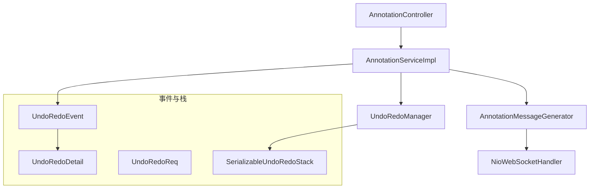
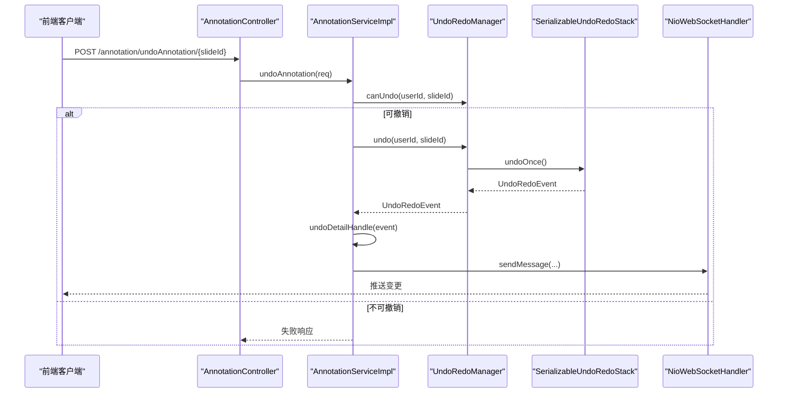
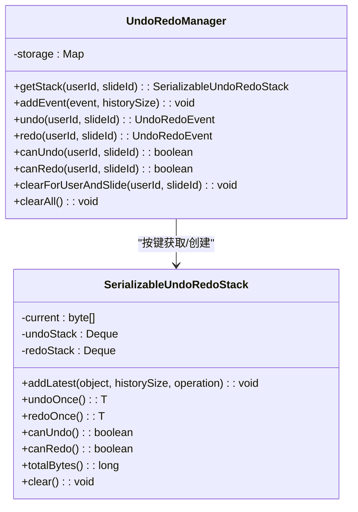
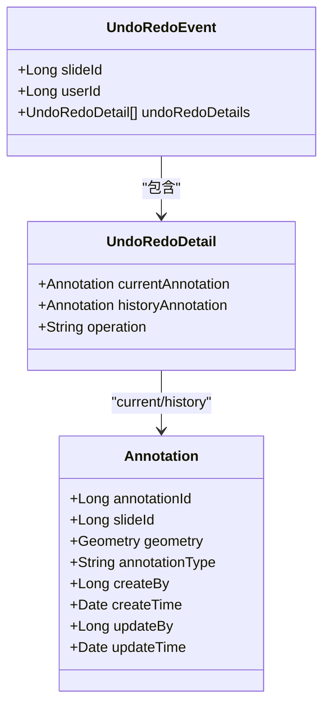
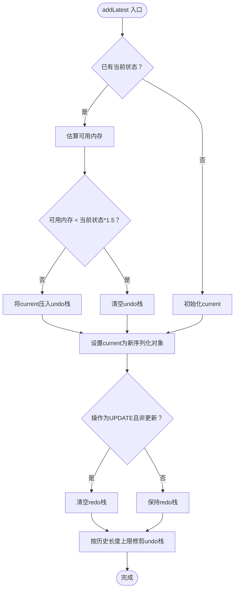
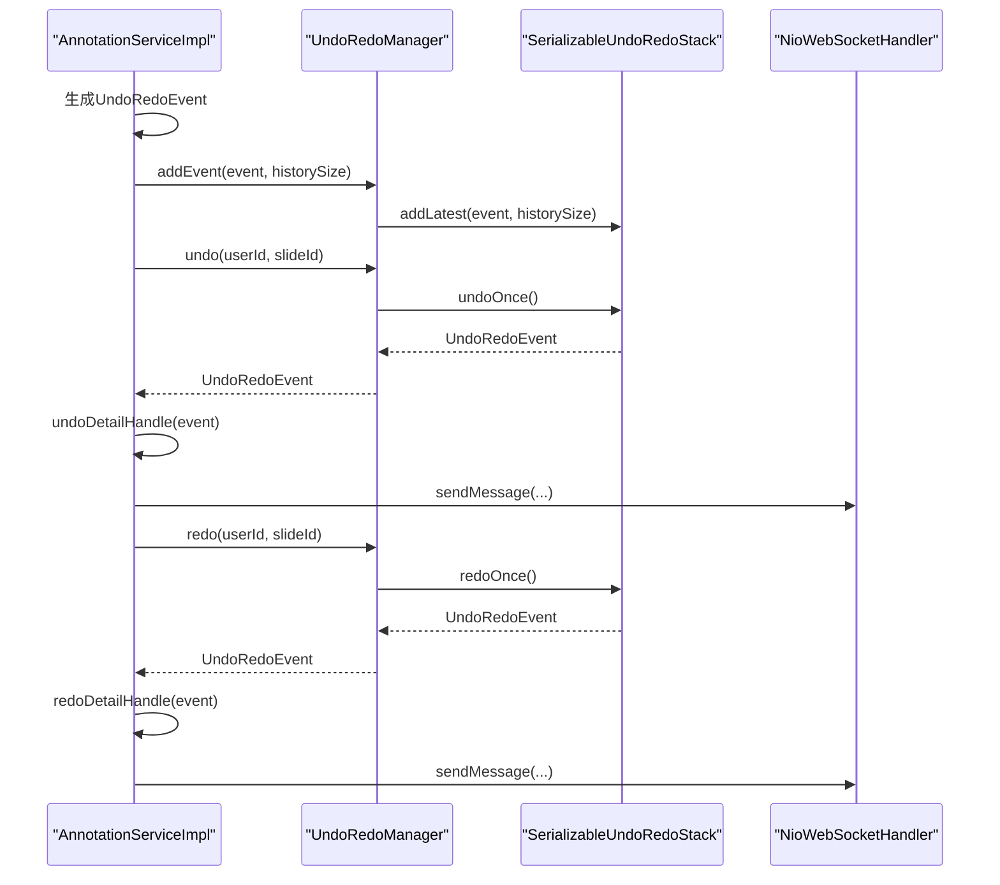
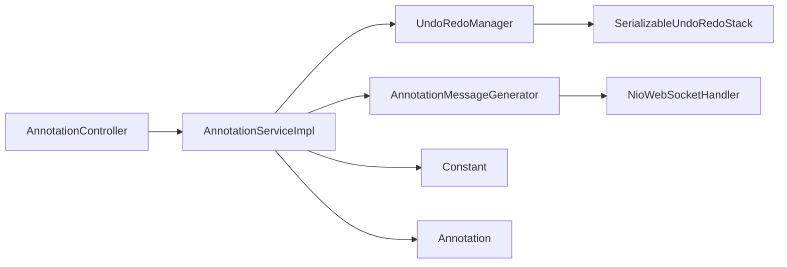

# 撤销重做机制

<cite>
**本文引用的文件**
- [UndoRedoEvent.java](file://src/main/java/cn/staitech/annotation/utils/annotation/UndoRedoEvent.java)
- [UndoRedoDetail.java](file://src/main/java/cn/staitech/annotation/utils/annotation/UndoRedoDetail.java)
- [UndoRedoReq.java](file://src/main/java/cn/staitech/annotation/utils/annotation/UndoRedoReq.java)
- [UndoRedoManager.java](file://src/main/java/cn/staitech/annotation/utils/annotation/UndoRedoManager.java)
- [SerializableUndoRedoStack.java](file://src/main/java/cn/staitech/annotation/utils/annotation/SerializableUndoRedoStack.java)
- [Annotation.java](file://src/main/java/cn/staitech/annotation/domain/Annotation.java)
- [Constant.java](file://src/main/java/cn/staitech/annotation/constant/Constant.java)
- [AnnotationServiceImpl.java](file://src/main/java/cn/staitech/annotation/service/impl/AnnotationServiceImpl.java)
- [AnnotationController.java](file://src/main/java/cn/staitech/annotation/controller/AnnotationController.java)
- [AnnotationMessageGenerator.java](file://src/main/java/cn/staitech/annotation/utils/annotation/AnnotationMessageGenerator.java)
- [NioWebSocketHandler.java](file://src/main/java/cn/staitech/annotation/netty/websocket/NioWebSocketHandler.java)
- [bootstrap.yml](file://src/main/resources/bootstrap.yml)
</cite>

## 目录
1. [简介](#简介)
2. [项目结构](#项目结构)
3. [核心组件](#核心组件)
4. [架构总览](#架构总览)
5. [组件详解](#组件详解)
6. [依赖关系分析](#依赖关系分析)
7. [性能与内存特性](#性能与内存特性)
8. [故障排查指南](#故障排查指南)
9. [结论](#结论)
10. [附录：扩展与调优指南](#附录扩展与调优指南)

## 简介
本技术文档围绕医学图像标注系统的“撤销/重做”机制展开，系统采用基于用户ID与切片ID的双键存储架构，结合线程安全容器与事件驱动设计，实现高并发下的可靠状态管理。文档重点覆盖：
- 双键存储与ConcurrentHashMap的线程安全与内存管理
- UndoRedoEvent事件模型、序列化与历史栈管理
- 并发控制、锁机制与性能优化
- 定时清理与内存泄漏防护
- 自定义事件类型、历史记录配置与性能调优
- 高级架构演进与故障排查建议

## 项目结构
与撤销重做机制直接相关的模块与文件如下：
- 事件与栈：UndoRedoEvent、UndoRedoDetail、UndoRedoReq、SerializableUndoRedoStack
- 管理器：UndoRedoManager（双键存储、定时清理）
- 业务服务：AnnotationServiceImpl（事件产生、撤销/重做执行）
- 控制器：AnnotationController（对外暴露撤销/重做接口）
- 消息推送：AnnotationMessageGenerator、NioWebSocketHandler（变更通知）
- 常量：Constant（历史栈大小等配置）

图表来源
- [UndoRedoEvent.java:1-29](file://src/main/java/cn/staitech/annotation/utils/annotation/UndoRedoEvent.java#L1-L29)
- [UndoRedoDetail.java:1-30](file://src/main/java/cn/staitech/annotation/utils/annotation/UndoRedoDetail.java#L1-L30)
- [UndoRedoReq.java:1-18](file://src/main/java/cn/staitech/annotation/utils/annotation/UndoRedoReq.java#L1-L18)
- [SerializableUndoRedoStack.java:1-246](file://src/main/java/cn/staitech/annotation/utils/annotation/SerializableUndoRedoStack.java#L1-L246)
- [UndoRedoManager.java:1-97](file://src/main/java/cn/staitech/annotation/utils/annotation/UndoRedoManager.java#L1-L97)
- [AnnotationController.java:1-251](file://src/main/java/cn/staitech/annotation/controller/AnnotationController.java#L1-L251)
- [AnnotationServiceImpl.java:1-724](file://src/main/java/cn/staitech/annotation/service/impl/AnnotationServiceImpl.java#L1-L724)
- [AnnotationMessageGenerator.java:1-349](file://src/main/java/cn/staitech/annotation/utils/annotation/AnnotationMessageGenerator.java#L1-L349)
- [NioWebSocketHandler.java:1-197](file://src/main/java/cn/staitech/annotation/netty/websocket/NioWebSocketHandler.java#L1-L197)

章节来源
- [AnnotationController.java:226-248](file://src/main/java/cn/staitech/annotation/controller/AnnotationController.java#L226-L248)
- [AnnotationServiceImpl.java:677-717](file://src/main/java/cn/staitech/annotation/service/impl/AnnotationServiceImpl.java#L677-L717)
- [UndoRedoManager.java:1-97](file://src/main/java/cn/staitech/annotation/utils/annotation/UndoRedoManager.java#L1-L97)
- [SerializableUndoRedoStack.java:1-246](file://src/main/java/cn/staitech/annotation/utils/annotation/SerializableUndoRedoStack.java#L1-L246)

## 核心组件
- UndoRedoEvent：撤销/重做事件载体，包含用户ID、切片ID与事件明细列表
- UndoRedoDetail：单条事件明细，记录当前/历史标注及操作类型
- UndoRedoReq：撤销/重做请求载体，包含用户ID与切片ID
- SerializableUndoRedoStack：可序列化的撤销/重做栈，维护当前状态与撤销/重做历史
- UndoRedoManager：双键存储管理器，基于ConcurrentHashMap按“userId:slideId”组织栈
- AnnotationServiceImpl：业务层负责在标注变更时构造事件并入栈，同时执行撤销/重做
- AnnotationController：对外提供撤销/重做接口
- AnnotationMessageGenerator/NioWebSocketHandler：变更后通过WebSocket广播消息

章节来源
- [UndoRedoEvent.java:19-28](file://src/main/java/cn/staitech/annotation/utils/annotation/UndoRedoEvent.java#L19-L28)
- [UndoRedoDetail.java:19-29](file://src/main/java/cn/staitech/annotation/utils/annotation/UndoRedoDetail.java#L19-L29)
- [UndoRedoReq.java:14-17](file://src/main/java/cn/staitech/annotation/utils/annotation/UndoRedoReq.java#L14-L17)
- [SerializableUndoRedoStack.java:18-36](file://src/main/java/cn/staitech/annotation/utils/annotation/SerializableUndoRedoStack.java#L18-L36)
- [UndoRedoManager.java:21-37](file://src/main/java/cn/staitech/annotation/utils/annotation/UndoRedoManager.java#L21-L37)
- [AnnotationServiceImpl.java:224-228](file://src/main/java/cn/staitech/annotation/service/impl/AnnotationServiceImpl.java#L224-L228)
- [AnnotationController.java:226-248](file://src/main/java/cn/staitech/annotation/controller/AnnotationController.java#L226-L248)

## 架构总览
系统采用事件驱动架构：标注变更时生成UndoRedoEvent并入栈；撤销/重做时从栈顶取出事件并执行对应业务操作；完成后通过WebSocket向同一切片的客户端推送变更消息。

图表来源
- [AnnotationController.java:226-230](file://src/main/java/cn/staitech/annotation/controller/AnnotationController.java#L226-L230)
- [AnnotationServiceImpl.java:677-688](file://src/main/java/cn/staitech/annotation/service/impl/AnnotationServiceImpl.java#L677-L688)
- [UndoRedoManager.java:50-53](file://src/main/java/cn/staitech/annotation/utils/annotation/UndoRedoManager.java#L50-L53)
- [SerializableUndoRedoStack.java:113-135](file://src/main/java/cn/staitech/annotation/utils/annotation/SerializableUndoRedoStack.java#L113-L135)
- [NioWebSocketHandler.java:38-68](file://src/main/java/cn/staitech/annotation/netty/websocket/NioWebSocketHandler.java#L38-L68)

## 组件详解

### 双键存储与线程安全（UndoRedoManager）
- 存储结构：ConcurrentHashMap<String, SerializableUndoRedoStack<UndoRedoEvent>>
- 键规则：userId:slideId
- 初始化策略：computeIfAbsent懒加载，避免空栈访问
- 清理策略：每日午夜定时清空所有历史记录，防止内存泄漏

图表来源
- [UndoRedoManager.java:19-97](file://src/main/java/cn/staitech/annotation/utils/annotation/UndoRedoManager.java#L19-L97)
- [SerializableUndoRedoStack.java:18-36](file://src/main/java/cn/staitech/annotation/utils/annotation/SerializableUndoRedoStack.java#L18-L36)

章节来源
- [UndoRedoManager.java:21-37](file://src/main/java/cn/staitech/annotation/utils/annotation/UndoRedoManager.java#L21-L37)
- [UndoRedoManager.java:89-94](file://src/main/java/cn/staitech/annotation/utils/annotation/UndoRedoManager.java#L89-L94)

### 事件模型与序列化（UndoRedoEvent/UndoRedoDetail）
- UndoRedoEvent：携带slideId、userId与UndoRedoDetail列表
- UndoRedoDetail：记录当前/历史标注与操作类型（新增/更新/删除）
- AnnotationServiceImpl在各标注操作后构建事件并入栈

图表来源
- [UndoRedoEvent.java:23-27](file://src/main/java/cn/staitech/annotation/utils/annotation/UndoRedoEvent.java#L23-L27)
- [UndoRedoDetail.java:22-27](file://src/main/java/cn/staitech/annotation/utils/annotation/UndoRedoDetail.java#L22-L27)
- [Annotation.java:25-110](file://src/main/java/cn/staitech/annotation/domain/Annotation.java#L25-L110)

章节来源
- [AnnotationServiceImpl.java:224-228](file://src/main/java/cn/staitech/annotation/service/impl/AnnotationServiceImpl.java#L224-L228)
- [AnnotationServiceImpl.java:285-289](file://src/main/java/cn/staitech/annotation/service/impl/AnnotationServiceImpl.java#L285-L289)
- [AnnotationServiceImpl.java:390-394](file://src/main/java/cn/staitech/annotation/service/impl/AnnotationServiceImpl.java#L390-L394)

### 历史栈管理与并发控制（SerializableUndoRedoStack）
- 结构：current + undoStack + redoStack，三段式状态机
- 并发控制：所有公共方法均使用synchronized，保证栈操作原子性
- 内存管理：
  - addLatest在入栈前估算可用内存，低内存时清空undoStack
  - 提供totalBytes统计当前占用，便于监控
- 序列化：使用Java序列化将对象转为byte[]，支持跨进程/持久化场景（注释提示存储方案待优化）

图表来源
- [SerializableUndoRedoStack.java:144-173](file://src/main/java/cn/staitech/annotation/utils/annotation/SerializableUndoRedoStack.java#L144-L173)

章节来源
- [SerializableUndoRedoStack.java:61-70](file://src/main/java/cn/staitech/annotation/utils/annotation/SerializableUndoRedoStack.java#L61-L70)
- [SerializableUndoRedoStack.java:144-173](file://src/main/java/cn/staitech/annotation/utils/annotation/SerializableUndoRedoStack.java#L144-L173)

### 撤销/重做执行流程（AnnotationServiceImpl）
- 生成事件：在新增/删除/更新/合并等操作后，构造UndoRedoEvent并入栈
- 撤销/重做：根据事件明细逐条执行对应业务操作（新增/删除/更新）
- 状态检查：先检查canUndo/canRedo，再执行
- 广播通知：变更后通过WebSocket向同一切片的客户端推送消息

图表来源
- [AnnotationServiceImpl.java:224-228](file://src/main/java/cn/staitech/annotation/service/impl/AnnotationServiceImpl.java#L224-L228)
- [AnnotationServiceImpl.java:625-649](file://src/main/java/cn/staitech/annotation/service/impl/AnnotationServiceImpl.java#L625-L649)
- [AnnotationServiceImpl.java:651-675](file://src/main/java/cn/staitech/annotation/service/impl/AnnotationServiceImpl.java#L651-L675)
- [UndoRedoManager.java:42-61](file://src/main/java/cn/staitech/annotation/utils/annotation/UndoRedoManager.java#L42-L61)

章节来源
- [AnnotationServiceImpl.java:677-717](file://src/main/java/cn/staitech/annotation/service/impl/AnnotationServiceImpl.java#L677-L717)
- [AnnotationMessageGenerator.java:40-50](file://src/main/java/cn/staitech/annotation/utils/annotation/AnnotationMessageGenerator.java#L40-L50)
- [NioWebSocketHandler.java:38-68](file://src/main/java/cn/staitech/annotation/netty/websocket/NioWebSocketHandler.java#L38-L68)

## 依赖关系分析
- AnnotationController依赖AnnotationServiceImpl
- AnnotationServiceImpl依赖UndoRedoManager与WebSocket消息生成器
- UndoRedoManager依赖SerializableUndoRedoStack
- UndoRedoEvent/UndoRedoDetail依赖Annotation领域对象
- Constant提供历史栈大小等配置

图表来源
- [AnnotationController.java:45-248](file://src/main/java/cn/staitech/annotation/controller/AnnotationController.java#L45-L248)
- [AnnotationServiceImpl.java:49-60](file://src/main/java/cn/staitech/annotation/service/impl/AnnotationServiceImpl.java#L49-L60)
- [UndoRedoManager.java:22-36](file://src/main/java/cn/staitech/annotation/utils/annotation/UndoRedoManager.java#L22-L36)
- [SerializableUndoRedoStack.java:18-36](file://src/main/java/cn/staitech/annotation/utils/annotation/SerializableUndoRedoStack.java#L18-L36)
- [Constant.java:61-61](file://src/main/java/cn/staitech/annotation/constant/Constant.java#L61-L61)

章节来源
- [AnnotationController.java:1-251](file://src/main/java/cn/staitech/annotation/controller/AnnotationController.java#L1-L251)
- [AnnotationServiceImpl.java:1-724](file://src/main/java/cn/staitech/annotation/service/impl/AnnotationServiceImpl.java#L1-L724)
- [Constant.java:1-80](file://src/main/java/cn/staitech/annotation/constant/Constant.java#L1-L80)

## 性能与内存特性
- 线程安全：UndoRedoManager使用ConcurrentHashMap，getStack与computeIfAbsent保证并发安全；栈内操作使用synchronized确保原子性
- 内存管理：
  - addLatest在内存紧张时主动清空undo栈，避免OOM
  - totalBytes提供内存占用统计
  - 定时清理：午夜清空所有历史，防止长期运行内存膨胀
- 序列化成本：每次状态变更都会序列化对象，建议控制历史深度与事件粒度，避免频繁大对象序列化

章节来源
- [UndoRedoManager.java:22-36](file://src/main/java/cn/staitech/annotation/utils/annotation/UndoRedoManager.java#L22-L36)
- [SerializableUndoRedoStack.java:151-158](file://src/main/java/cn/staitech/annotation/utils/annotation/SerializableUndoRedoStack.java#L151-L158)
- [SerializableUndoRedoStack.java:61-70](file://src/main/java/cn/staitech/annotation/utils/annotation/SerializableUndoRedoStack.java#L61-L70)
- [UndoRedoManager.java:90-94](file://src/main/java/cn/staitech/annotation/utils/annotation/UndoRedoManager.java#L90-L94)

## 故障排查指南
- 撤销/重做不可用
  - 检查canUndo/canRedo状态，确认历史栈是否为空
  - 章节来源: [AnnotationServiceImpl.java:677-717](file://src/main/java/cn/staitech/annotation/service/impl/AnnotationServiceImpl.java#L677-L717)
- 序列化/反序列化失败
  - 查看日志中“Failed to deserialize state”错误，确认事件对象可序列化且类加载器一致
  - 章节来源: [SerializableUndoRedoStack.java:100-105](file://src/main/java/cn/staitech/annotation/utils/annotation/SerializableUndoRedoStack.java#L100-L105)
- WebSocket未收到变更
  - 确认通道映射与slideId绑定正确，消息序列化无异常
  - 章节来源: [NioWebSocketHandler.java:56-67](file://src/main/java/cn/staitech/annotation/netty/websocket/NioWebSocketHandler.java#L56-L67)
- 内存占用过高
  - 检查历史栈深度与事件大小，必要时降低历史长度或减少事件粒度
  - 章节来源: [Constant.java:61-61](file://src/main/java/cn/staitech/annotation/constant/Constant.java#L61-L61)

## 结论
该撤销重做机制通过双键存储与线程安全容器实现高并发下的可靠状态管理，配合事件驱动与WebSocket广播，满足医学图像标注场景下的交互需求。系统在内存管理与定时清理方面具备基础防护能力，建议在生产环境中结合监控指标持续优化历史深度与事件粒度，以平衡功能完整性与性能表现。

## 附录：扩展与调优指南

### 自定义事件类型
- 扩展UndoRedoDetail以支持更多操作类型（如“合并/裁剪”），并在业务层构造对应事件
- 在UndoRedoEvent中增加字段以承载更丰富的上下文信息
- 章节来源: [UndoRedoDetail.java:19-29](file://src/main/java/cn/staitech/annotation/utils/annotation/UndoRedoDetail.java#L19-L29), [UndoRedoEvent.java:19-28](file://src/main/java/cn/staitech/annotation/utils/annotation/UndoRedoEvent.java#L19-L28)

### 历史记录配置
- 调整历史栈大小：通过Constant.UNDO_REDO_STACK_SIZE控制最大历史条目数
- 章节来源: [Constant.java:61-61](file://src/main/java/cn/staitech/annotation/constant/Constant.java#L61-L61), [AnnotationServiceImpl.java:227-227](file://src/main/java/cn/staitech/annotation/service/impl/AnnotationServiceImpl.java#L227-L227)

### 并发与性能优化
- 减少序列化频率：将多个小操作合并为批量事件，降低序列化次数
- 控制事件粒度：避免在事件中携带过大的几何对象，必要时仅携带标识与增量
- 监控内存：定期检查totalBytes，结合JVM GC策略评估内存压力
- 章节来源: [SerializableUndoRedoStack.java:61-70](file://src/main/java/cn/staitech/annotation/utils/annotation/SerializableUndoRedoStack.java#L61-L70), [SerializableUndoRedoStack.java:144-173](file://src/main/java/cn/staitech/annotation/utils/annotation/SerializableUndoRedoStack.java#L144-L173)

### 定时清理策略
- 午夜清理：清空所有历史，适合长时间运行环境
- 按用户/切片清理：在用户退出或切片切换时清理，减少内存占用
- 章节来源: [UndoRedoManager.java:89-94](file://src/main/java/cn/staitech/annotation/utils/annotation/UndoRedoManager.java#L89-L94), [UndoRedoManager.java:82-85](file://src/main/java/cn/staitech/annotation/utils/annotation/UndoRedoManager.java#L82-L85)

### 架构演进建议
- 存储方案演进：当前注释提示“存储方案待优化”，可考虑引入压缩、分页或外部缓存（Redis）以降低内存压力
- 事件幂等：在撤销/重做执行时增加幂等校验，避免重复应用同一事件
- 异步化：对大规模批量操作采用异步队列，减轻主线程压力
- 章节来源: [SerializableUndoRedoStack.java:13-13](file://src/main/java/cn/staitech/annotation/utils/annotation/SerializableUndoRedoStack.java#L13-L13)