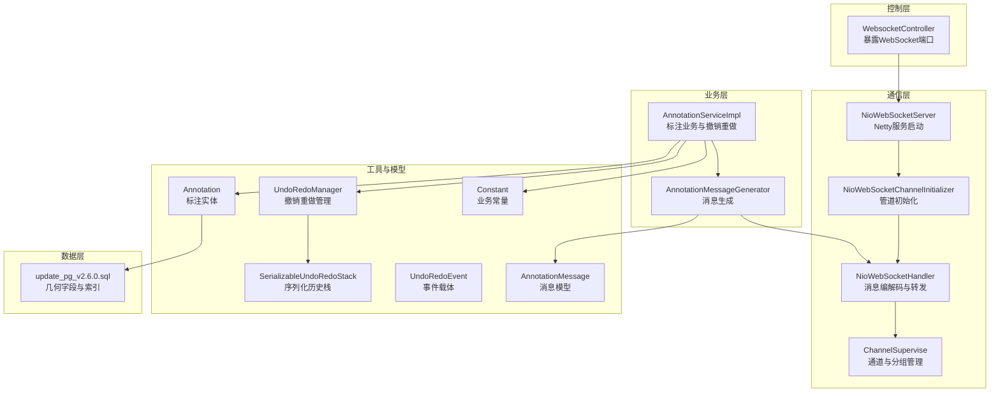
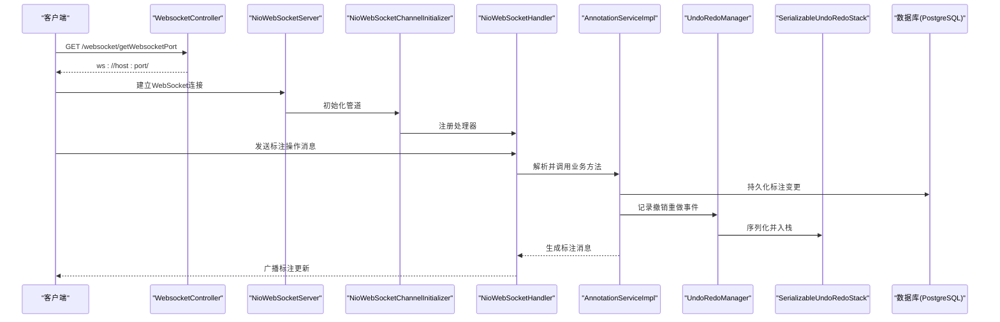
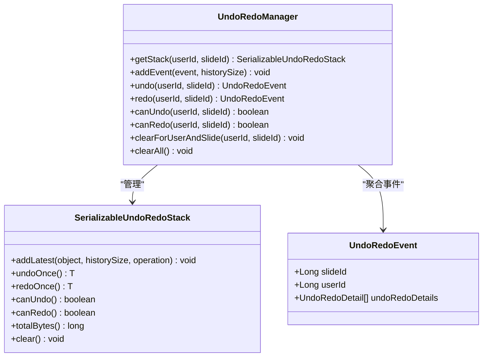
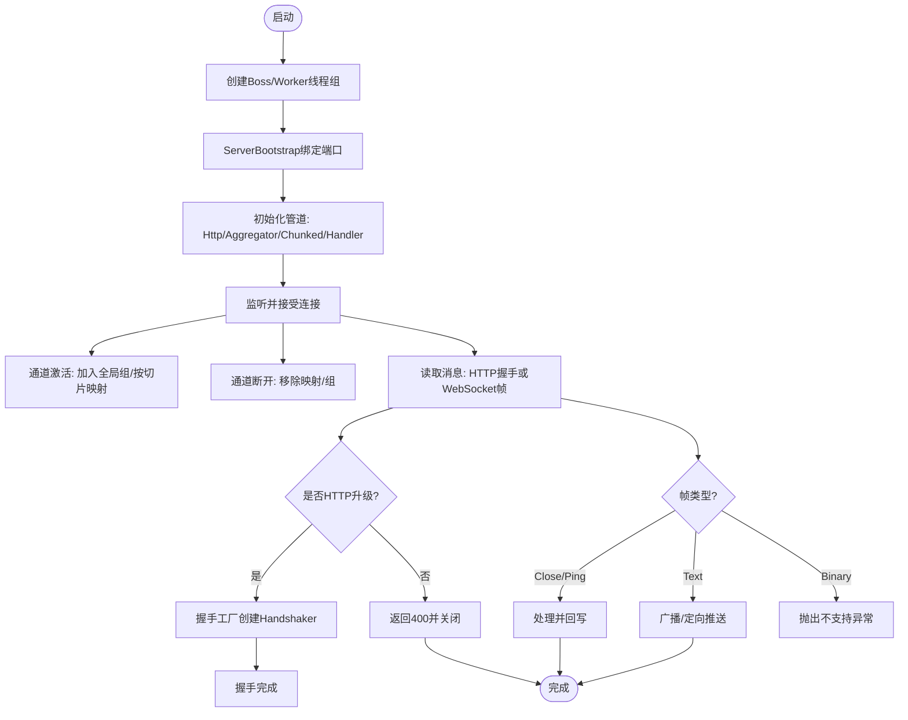
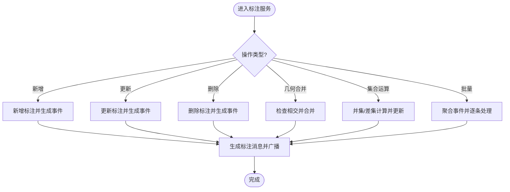
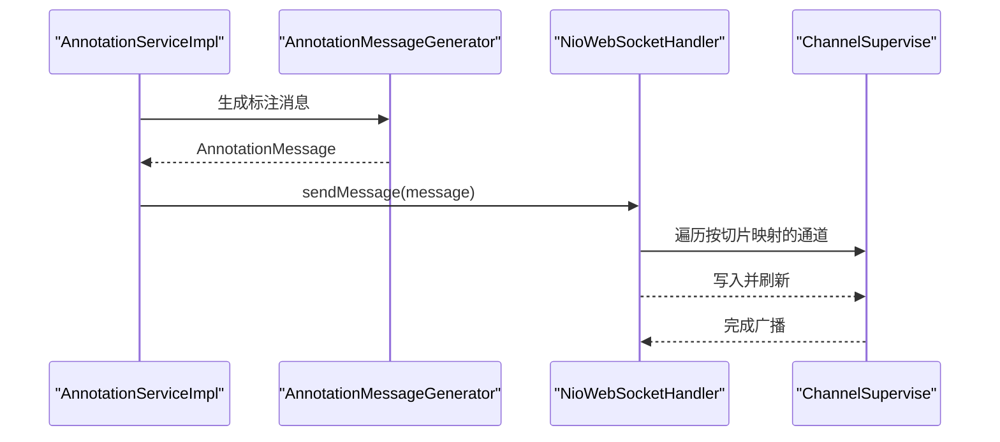
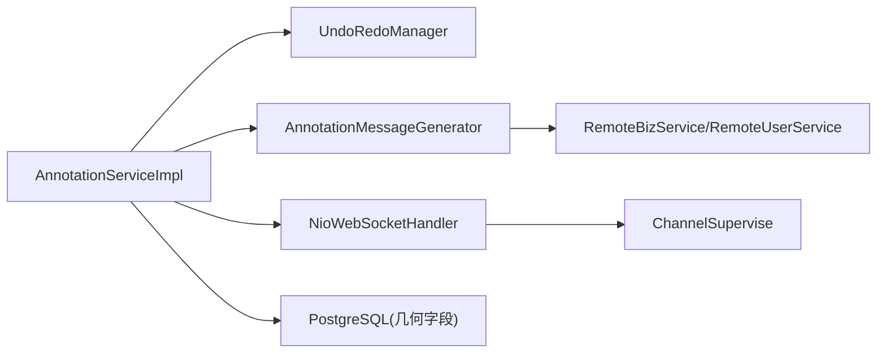

# 高级主题

<cite>
**本文引用的文件**
- [NioWebSocketServer.java](file://src/main/java/cn/staitech/annotation/netty/websocket/NioWebSocketServer.java)
- [NioWebSocketChannelInitializer.java](file://src/main/java/cn/staitech/annotation/netty/websocket/NioWebSocketChannelInitializer.java)
- [NioWebSocketHandler.java](file://src/main/java/cn/staitech/annotation/netty/websocket/NioWebSocketHandler.java)
- [ChannelSupervise.java](file://src/main/java/cn/staitech/annotation/netty/global/ChannelSupervise.java)
- [WebsocketController.java](file://src/main/java/cn/staitech/annotation/controller/WebsocketController.java)
- [AnnotationServiceImpl.java](file://src/main/java/cn/staitech/annotation/service/impl/AnnotationServiceImpl.java)
- [UndoRedoManager.java](file://src/main/java/cn/staitech/annotation/utils/annotation/UndoRedoManager.java)
- [SerializableUndoRedoStack.java](file://src/main/java/cn/staitech/annotation/utils/annotation/SerializableUndoRedoStack.java)
- [UndoRedoEvent.java](file://src/main/java/cn/staitech/annotation/utils/annotation/UndoRedoEvent.java)
- [AnnotationMessageGenerator.java](file://src/main/java/cn/staitech/annotation/utils/annotation/AnnotationMessageGenerator.java)
- [AnnotationMessage.java](file://src/main/java/cn/staitech/annotation/netty/message/AnnotationMessage.java)
- [Annotation.java](file://src/main/java/cn/staitech/annotation/domain/Annotation.java)
- [Constant.java](file://src/main/java/cn/staitech/annotation/constant/Constant.java)
- [AIAnnotationAddReq.java](file://src/main/java/cn/staitech/annotation/vo/anno/AIAnnotationAddReq.java)
- [bootstrap.yml](file://src/main/resources/bootstrap.yml)
- [update_pg_v2.6.0.sql](file://sql/update_pg_v2.6.0.sql)
</cite>

## 目录
1. [简介](#简介)
2. [项目结构](#项目结构)
3. [核心组件](#核心组件)
4. [架构总览](#架构总览)
5. [详细组件分析](#详细组件分析)
6. [依赖分析](#依赖分析)
7. [性能考量](#性能考量)
8. [故障排查指南](#故障排查指南)
9. [结论](#结论)
10. [附录](#附录)

## 简介
本高级主题文档面向高级开发者，聚焦于医学图像标注系统的深层设计与实现细节，覆盖以下关键领域：
- 撤销重做机制的事件驱动架构与历史状态管理
- Netty WebSocket服务器的高性能实现与并发处理机制
- AI辅助标注的集成方案与自动化处理流程
- 性能优化策略、内存管理与并发控制最佳实践
- 扩展开发指南：插件系统、自定义扩展点与第三方集成方法
- 系统优化、故障排查与架构演进的专业指导

## 项目结构
系统采用分层与功能域结合的组织方式：
- 控制层：REST控制器负责HTTP接口与WebSocket端口暴露
- 业务层：标注服务实现标注增删改、几何运算、批量处理与撤销重做
- 通信层：Netty WebSocket提供低延迟、高并发的实时消息通道
- 工具与模型：撤销重做栈、消息生成器、领域模型与常量配置
- 数据层：MyBatis Mapper与PostgreSQL几何字段支撑标注数据持久化

图表来源
- [NioWebSocketServer.java:1-44](file://src/main/java/cn/staitech/annotation/netty/websocket/NioWebSocketServer.java#L1-L44)
- [NioWebSocketChannelInitializer.java:1-30](file://src/main/java/cn/staitech/annotation/netty/websocket/NioWebSocketChannelInitializer.java#L1-L30)
- [NioWebSocketHandler.java:1-197](file://src/main/java/cn/staitech/annotation/netty/websocket/NioWebSocketHandler.java#L1-L197)
- [ChannelSupervise.java:1-45](file://src/main/java/cn/staitech/annotation/netty/global/ChannelSupervise.java#L1-L45)
- [WebsocketController.java:1-41](file://src/main/java/cn/staitech/annotation/controller/WebsocketController.java#L1-L41)
- [AnnotationServiceImpl.java:1-724](file://src/main/java/cn/staitech/annotation/service/impl/AnnotationServiceImpl.java#L1-L724)
- [UndoRedoManager.java:1-97](file://src/main/java/cn/staitech/annotation/utils/annotation/UndoRedoManager.java#L1-L97)
- [SerializableUndoRedoStack.java:1-246](file://src/main/java/cn/staitech/annotation/utils/annotation/SerializableUndoRedoStack.java#L1-L246)
- [UndoRedoEvent.java:1-29](file://src/main/java/cn/staitech/annotation/utils/annotation/UndoRedoEvent.java#L1-L29)
- [AnnotationMessageGenerator.java:1-349](file://src/main/java/cn/staitech/annotation/utils/annotation/AnnotationMessageGenerator.java#L1-L349)
- [AnnotationMessage.java:1-28](file://src/main/java/cn/staitech/annotation/netty/message/AnnotationMessage.java#L1-L28)
- [Annotation.java:1-187](file://src/main/java/cn/staitech/annotation/domain/Annotation.java#L1-L187)
- [Constant.java:1-80](file://src/main/java/cn/staitech/annotation/constant/Constant.java#L1-L80)
- [update_pg_v2.6.0.sql:1-245](file://sql/update_pg_v2.6.0.sql#L1-L245)

章节来源
- [bootstrap.yml:1-42](file://src/main/resources/bootstrap.yml#L1-L42)

## 核心组件
- Netty WebSocket服务器：基于NIO事件循环组，提供高性能、低延迟的WebSocket服务
- 撤销重做管理器：按用户与切片维度隔离的历史栈，支持序列化状态保存与定时清理
- 标注服务：封装标注增删改、几何运算、批量处理与撤销重做回放
- 消息生成器：将标注实体转换为WebSocket消息，支持脏器标签与结构标签映射
- 数据模型与常量：统一标注实体、消息模型与业务常量，支撑几何计算与消息协议

章节来源
- [NioWebSocketServer.java:1-44](file://src/main/java/cn/staitech/annotation/netty/websocket/NioWebSocketServer.java#L1-L44)
- [UndoRedoManager.java:1-97](file://src/main/java/cn/staitech/annotation/utils/annotation/UndoRedoManager.java#L1-L97)
- [AnnotationServiceImpl.java:1-724](file://src/main/java/cn/staitech/annotation/service/impl/AnnotationServiceImpl.java#L1-L724)
- [AnnotationMessageGenerator.java:1-349](file://src/main/java/cn/staitech/annotation/utils/annotation/AnnotationMessageGenerator.java#L1-L349)
- [Annotation.java:1-187](file://src/main/java/cn/staitech/annotation/domain/Annotation.java#L1-L187)
- [Constant.java:1-80](file://src/main/java/cn/staitech/annotation/constant/Constant.java#L1-L80)

## 架构总览
系统采用“HTTP/WS入口 + Netty实时通道 + 业务服务 + 撤销重做 + 数据持久化”的分层架构。WebSocket负责标注变更的实时广播，业务服务负责几何计算与状态变更，撤销重做通过序列化历史栈保障一致性。

图表来源
- [WebsocketController.java:1-41](file://src/main/java/cn/staitech/annotation/controller/WebsocketController.java#L1-L41)
- [NioWebSocketServer.java:1-44](file://src/main/java/cn/staitech/annotation/netty/websocket/NioWebSocketServer.java#L1-L44)
- [NioWebSocketChannelInitializer.java:1-30](file://src/main/java/cn/staitech/annotation/netty/websocket/NioWebSocketChannelInitializer.java#L1-L30)
- [NioWebSocketHandler.java:1-197](file://src/main/java/cn/staitech/annotation/netty/websocket/NioWebSocketHandler.java#L1-L197)
- [AnnotationServiceImpl.java:1-724](file://src/main/java/cn/staitech/annotation/service/impl/AnnotationServiceImpl.java#L1-L724)
- [UndoRedoManager.java:1-97](file://src/main/java/cn/staitech/annotation/utils/annotation/UndoRedoManager.java#L1-L97)
- [SerializableUndoRedoStack.java:1-246](file://src/main/java/cn/staitech/annotation/utils/annotation/SerializableUndoRedoStack.java#L1-L246)

## 详细组件分析

### 撤销重做机制：事件驱动与历史状态管理
- 设计要点
  - 以“用户ID+切片ID”为维度隔离撤销重做空间，避免跨用户/跨切片污染
  - 使用序列化历史栈，将事件对象序列化为字节流，降低内存占用与GC压力
  - 提供撤销/重做、批量事件聚合、定时清理与容量限制
- 关键流程
  - 事件产生：标注增删改时构建UndoRedoEvent并入栈
  - 撤销/重做：从历史栈弹出并回放对应操作
  - 内存与容量：根据可用内存阈值动态清理，限制历史深度
- 复杂度与性能
  - 入栈/出栈为O(1)，序列化/反序列化成本与事件大小相关
  - 并发安全：通过同步块与ConcurrentHashMap保证线程安全

图表来源
- [UndoRedoManager.java:1-97](file://src/main/java/cn/staitech/annotation/utils/annotation/UndoRedoManager.java#L1-L97)
- [SerializableUndoRedoStack.java:1-246](file://src/main/java/cn/staitech/annotation/utils/annotation/SerializableUndoRedoStack.java#L1-L246)
- [UndoRedoEvent.java:1-29](file://src/main/java/cn/staitech/annotation/utils/annotation/UndoRedoEvent.java#L1-L29)

章节来源
- [UndoRedoManager.java:1-97](file://src/main/java/cn/staitech/annotation/utils/annotation/UndoRedoManager.java#L1-L97)
- [SerializableUndoRedoStack.java:1-246](file://src/main/java/cn/staitech/annotation/utils/annotation/SerializableUndoRedoStack.java#L1-L246)
- [UndoRedoEvent.java:1-29](file://src/main/java/cn/staitech/annotation/utils/annotation/UndoRedoEvent.java#L1-L29)
- [Constant.java:60-62](file://src/main/java/cn/staitech/annotation/constant/Constant.java#L60-L62)

### Netty WebSocket服务器：高性能与并发处理
- 实现原理
  - 单Boss多Worker线程模型，分离接受与处理阶段，最大化并发吞吐
  - 管道装配：HttpServerCodec + HttpObjectAggregator + ChunkedWriteHandler + 自定义处理器
  - 通道管理：全局通道组与按切片ID的通道映射，支持广播与定向推送
- 并发控制
  - 通道生命周期回调：加入/断开连接时维护通道集合
  - 文本帧处理：支持Ping/Pong心跳与消息回显
  - 异步写：flush策略减少阻塞
- 可靠性
  - 握手工厂校验与版本响应
  - 错误请求直接返回HTTP 400并关闭连接

图表来源
- [NioWebSocketServer.java:1-44](file://src/main/java/cn/staitech/annotation/netty/websocket/NioWebSocketServer.java#L1-L44)
- [NioWebSocketChannelInitializer.java:1-30](file://src/main/java/cn/staitech/annotation/netty/websocket/NioWebSocketChannelInitializer.java#L1-L30)
- [NioWebSocketHandler.java:1-197](file://src/main/java/cn/staitech/annotation/netty/websocket/NioWebSocketHandler.java#L1-L197)
- [ChannelSupervise.java:1-45](file://src/main/java/cn/staitech/annotation/netty/global/ChannelSupervise.java#L1-L45)

章节来源
- [NioWebSocketServer.java:1-44](file://src/main/java/cn/staitech/annotation/netty/websocket/NioWebSocketServer.java#L1-L44)
- [NioWebSocketChannelInitializer.java:1-30](file://src/main/java/cn/staitech/annotation/netty/websocket/NioWebSocketChannelInitializer.java#L1-L30)
- [NioWebSocketHandler.java:1-197](file://src/main/java/cn/staitech/annotation/netty/websocket/NioWebSocketHandler.java#L1-L197)
- [ChannelSupervise.java:1-45](file://src/main/java/cn/staitech/annotation/netty/global/ChannelSupervise.java#L1-L45)

### 标注服务：几何运算与批量处理
- 几何运算
  - 采样点与平均距离：对几何对象进行等距采样并计算平均距离
  - 合并预览：仅当几何相交时合并，否则抛出规则异常
  - 集合运算：支持并集与差集，更新面积/周长并持久化
- 批量处理
  - 聚合多个标注操作为单一事件，减少网络与持久化开销
  - 细粒度异常处理：单条失败不影响整体批处理
- 撤销重做回放
  - 将事件中的历史快照回放到数据库，确保状态一致

图表来源
- [AnnotationServiceImpl.java:1-724](file://src/main/java/cn/staitech/annotation/service/impl/AnnotationServiceImpl.java#L1-L724)
- [AnnotationMessageGenerator.java:1-349](file://src/main/java/cn/staitech/annotation/utils/annotation/AnnotationMessageGenerator.java#L1-L349)
- [NioWebSocketHandler.java:1-197](file://src/main/java/cn/staitech/annotation/netty/websocket/NioWebSocketHandler.java#L1-L197)

章节来源
- [AnnotationServiceImpl.java:1-724](file://src/main/java/cn/staitech/annotation/service/impl/AnnotationServiceImpl.java#L1-L724)

### 消息生成与广播：标注变更的实时传播
- 消息生成
  - 将标注实体转换为AnnotationMessage，包含类型、切片ID与特征数据
  - 支持脏器标签与结构标签映射，补充颜色、名称等属性
- 广播策略
  - 按切片ID定向推送，避免无关通道接收
  - 使用全局通道组实现全量广播

图表来源
- [AnnotationMessageGenerator.java:1-349](file://src/main/java/cn/staitech/annotation/utils/annotation/AnnotationMessageGenerator.java#L1-L349)
- [AnnotationMessage.java:1-28](file://src/main/java/cn/staitech/annotation/netty/message/AnnotationMessage.java#L1-L28)
- [NioWebSocketHandler.java:1-197](file://src/main/java/cn/staitech/annotation/netty/websocket/NioWebSocketHandler.java#L1-L197)
- [ChannelSupervise.java:1-45](file://src/main/java/cn/staitech/annotation/netty/global/ChannelSupervise.java#L1-L45)

章节来源
- [AnnotationMessageGenerator.java:1-349](file://src/main/java/cn/staitech/annotation/utils/annotation/AnnotationMessageGenerator.java#L1-L349)
- [AnnotationMessage.java:1-28](file://src/main/java/cn/staitech/annotation/netty/message/AnnotationMessage.java#L1-L28)
- [NioWebSocketHandler.java:1-197](file://src/main/java/cn/staitech/annotation/netty/websocket/NioWebSocketHandler.java#L1-L197)
- [ChannelSupervise.java:1-45](file://src/main/java/cn/staitech/annotation/netty/global/ChannelSupervise.java#L1-L45)

### AI辅助标注：集成方案与自动化流程
- 请求模型
  - AIAnnotationAddReq：包含标签ID、几何、切片ID、标注类型等字段
- 集成路径
  - 业务层可扩展AI标注新增接口，复用消息生成与WebSocket广播
  - 与远程业务服务对接，查询标签与用户信息，生成完整消息
- 自动化建议
  - 基于几何一致性与标签语义进行预检
  - 批量导入时聚合事件，降低广播与持久化压力

章节来源
- [AIAnnotationAddReq.java:1-118](file://src/main/java/cn/staitech/annotation/vo/anno/AIAnnotationAddReq.java#L1-L118)
- [AnnotationMessageGenerator.java:1-349](file://src/main/java/cn/staitech/annotation/utils/annotation/AnnotationMessageGenerator.java#L1-L349)

## 依赖分析
- 组件耦合
  - AnnotationServiceImpl依赖UndoRedoManager与WebSocket处理器，形成事件驱动闭环
  - 消息生成器依赖远程服务查询标签与用户，增强消息完整性
- 外部依赖
  - Netty提供高性能网络框架
  - PostgreSQL几何类型与索引支撑标注数据存储与查询
- 循环依赖
  - 未发现直接循环依赖；各模块职责清晰，通过接口与消息解耦

图表来源
- [AnnotationServiceImpl.java:1-724](file://src/main/java/cn/staitech/annotation/service/impl/AnnotationServiceImpl.java#L1-L724)
- [UndoRedoManager.java:1-97](file://src/main/java/cn/staitech/annotation/utils/annotation/UndoRedoManager.java#L1-L97)
- [AnnotationMessageGenerator.java:1-349](file://src/main/java/cn/staitech/annotation/utils/annotation/AnnotationMessageGenerator.java#L1-L349)
- [NioWebSocketHandler.java:1-197](file://src/main/java/cn/staitech/annotation/netty/websocket/NioWebSocketHandler.java#L1-L197)
- [ChannelSupervise.java:1-45](file://src/main/java/cn/staitech/annotation/netty/global/ChannelSupervise.java#L1-L45)
- [update_pg_v2.6.0.sql:1-245](file://sql/update_pg_v2.6.0.sql#L1-L245)

章节来源
- [AnnotationServiceImpl.java:1-724](file://src/main/java/cn/staitech/annotation/service/impl/AnnotationServiceImpl.java#L1-L724)
- [AnnotationMessageGenerator.java:1-349](file://src/main/java/cn/staitech/annotation/utils/annotation/AnnotationMessageGenerator.java#L1-L349)
- [update_pg_v2.6.0.sql:1-245](file://sql/update_pg_v2.6.0.sql#L1-L245)

## 性能考量
- Netty层面
  - 使用单Boss多Worker线程模型，合理设置线程数与背压
  - 管道聚合器与分块写入提升大消息传输效率
  - 心跳Ping/Pong维持长连接稳定性
- 撤销重做
  - 历史深度限制与定时清理避免内存膨胀
  - 序列化大小估算与可用内存阈值动态调整
- 几何计算
  - 采样点数量与几何复杂度权衡，避免过度计算
  - 批量处理减少网络往返与事务开销
- 数据库
  - 几何字段与索引优化查询性能
  - 事务边界明确，避免长事务锁竞争

[本节为通用性能指导，不直接分析具体文件]

## 故障排查指南
- WebSocket连接问题
  - 检查端口配置与防火墙策略
  - 观察握手工厂与版本响应，确认客户端协议兼容
- 消息广播异常
  - 核对按切片映射的通道是否存在与活跃
  - 关注序列化异常与未知类型帧
- 撤销重做失败
  - 查看序列化/反序列化日志，确认类加载器与版本兼容
  - 检查历史栈容量与定时清理任务
- 几何运算错误
  - 校验输入几何合法性与相交条件
  - 关注异常提示与日志定位

章节来源
- [NioWebSocketHandler.java:1-197](file://src/main/java/cn/staitech/annotation/netty/websocket/NioWebSocketHandler.java#L1-L197)
- [SerializableUndoRedoStack.java:1-246](file://src/main/java/cn/staitech/annotation/utils/annotation/SerializableUndoRedoStack.java#L1-L246)
- [AnnotationServiceImpl.java:1-724](file://src/main/java/cn/staitech/annotation/service/impl/AnnotationServiceImpl.java#L1-L724)

## 结论
本系统通过Netty实现高性能实时通信，结合事件驱动的撤销重做机制与严谨的几何计算，构建了稳定可靠的医学图像标注平台。面向未来，可在AI标注自动化、消息压缩与更细粒度的并发控制方面持续优化，同时完善扩展点与第三方集成能力，支撑更大规模的协作场景。

[本节为总结性内容，不直接分析具体文件]

## 附录
- 扩展开发指南
  - 插件系统：通过SPI或配置注册新消息类型与处理器
  - 自定义扩展点：在AnnotationMessageGenerator中扩展属性映射
  - 第三方集成：通过RemoteBizService与RemoteUserService对接外部系统
- 配置参考
  - 端口与环境：bootstrap.yml
  - 数据库：update_pg_v2.6.0.sql

章节来源
- [bootstrap.yml:1-42](file://src/main/resources/bootstrap.yml#L1-L42)
- [update_pg_v2.6.0.sql:1-245](file://sql/update_pg_v2.6.0.sql#L1-L245)